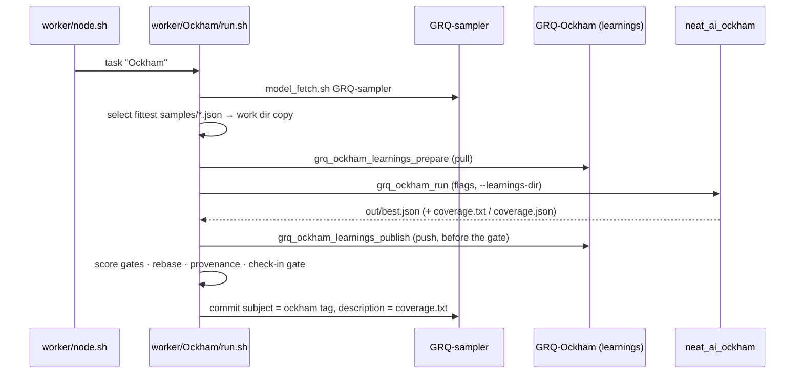

## Summary

Adds `docs/grq-integration.md` — a read-only audit of how the GRQ fleet actually
drives Ockham today — and links it from the README's repository-layout section.
No code in `ockham/src/` changed. Closes #34.

The audit was written against `stSoftwareAU/GRQ` `Develop` at commit `6ad319f`
(2026-08-30) and covers the six areas #34 asked for: invocation, the full flag
vector, the shared learnings cache, the check-in path, the commit message, and a
surface-contract table of what GRQ reads out of Ockham. Every claim names the
GRQ file and function it came from. A short section also records the island
variant (`worker/shared/island_ockham.sh`), because it shares `grq_ockham_run`
and the learnings helpers but bypasses the whole GRQ-sampler commit path.

**Two corrections to the issue's premises**, both flagged in the doc — an audit
records what is true now, not what was true when it was scheduled:

- **The commit is no longer subject-only.** GRQ `#4525` wired the description:
  `grq_ockham_read_coverage` reads `coverage.txt` from Ockham's `--output-dir`
  and `grq_ockham_git_commit` issues `git commit -m "<subject>" -m "<coverage>"`.
  The doc still states plainly that the `ockham` tag is the **subject**, and
  records the description as it exists today plus the no-op path (absent or
  blank `coverage.txt` → the byte-identical subject-only commit).
- **Exit code 2 does not come from the binary.** `worker/Ockham/run.sh` treats
  rc 2 from `grq_ockham_run` as a clean budget skip, but that rc is generated
  inside the helper by `grq_ockham_timeout_seconds`. The binary's own
  `ExitCode::from(2)` (`ockham/src/main.rs`, config-validation failure) is
  reported as `neat_ai_ockham exited 2` and mapped to helper rc 1 — a fault, not
  a skip.

One audit finding worth flagging for the rest of #33: **GRQ never passes
`--ordering`, `--ordering-random-quota` or `--unchecked-first`.** Ockham's own
defaults therefore decide, and `OckhamConfig::unchecked_first_enabled`
(`ockham/src/config.rs`) makes unchecked-first follow `--learnings-dir` — so in
production it is on whenever the shared cache is reachable and off when it is
not.

## Evidence

Documentation-only change; there is no web interface or runtime surface to
screenshot. Verification was by reading the cited GRQ sources directly
(`git show origin/Develop:worker/Ockham/run.sh`,
`worker/shared/ockham.sh`, `worker/shared/ockham_learnings.sh`,
`worker/shared/island_ockham.sh`, plus `validate_for_checkin.sh`,
`creature_provenance_guard.sh`, `candidate_path.sh`, `rebase_message.sh` and
`worker/node.sh`) against this repo's `ockham/src/tags.rs`, `coverage.rs`,
`config.rs`, `run.rs` and `main.rs`.

The integration the doc audits, end to end:

Quality gate: every check in `./quality.sh` passes — bash syntax, shellcheck,
the neat-core version gate, `markdownlint-cli2` (0 issues over 13 files),
`actionlint`, `cargo deny check`, `cargo fmt --check`, `cargo clippy -D
warnings`, `cargo test --workspace --all-features` and `cargo doc` — **except**
the codespell preflight, which exits 1 with `spell-check: codespell is not
installed`. The container has no `pip`, no `pipx` and no unprivileged `apt-get`,
so the tool could not be installed in this run; CI runs it for real.

## Acceptance Criteria

- **met** — `docs/grq-integration.md` exists and covers all six areas —
  evidence: `docs/grq-integration.md` sections 1–6 (invocation, flags, learnings
  cache, check-in path, commit message, surface contract).
- **met** — every claim cites the GRQ file and function it came from — evidence:
  `docs/grq-integration.md`, e.g. `worker/shared/ockham.sh::grq_ockham_read_message`,
  `worker/shared/ockham_learnings.sh::grq_ockham_learnings_publish`,
  `worker/shared/creature_provenance_guard.sh::grq_creature_guard_checkin_lineage`;
  the audited GRQ commit (`6ad319f`) is named at the top so the whole doc is
  re-verifiable.
- **partial** — the doc states plainly that the `ockham` tag is the commit
  **subject** and that no description is currently assembled — evidence:
  `docs/grq-integration.md` section 5 states the subject claim verbatim — reason:
  the second half is no longer true; GRQ `#4525` assembles a description from
  `coverage.txt`, so the doc records that instead, under an explicit
  "Correction to the premise of this audit's issue" heading. Documenting a
  closed gap as still open would have made the audit wrong on the day it landed.
- **met** — `README.md` links the new doc — evidence: `README.md`, Repository
  layout section — the `docs/` tree entry plus a paragraph linking
  `docs/grq-integration.md`.
- **partial** — `./quality.sh` passes — evidence: all other checks pass (see
  Evidence above) — reason: the codespell preflight fails on a missing
  `codespell` binary that cannot be installed in this container; nothing in this
  diff was skipped by any other gate.

## Test Plan

No tests added or modified — the change is documentation only and adds no
runtime surface (`ockham/src/` is untouched, as #34 requires). The existing
suite was run unchanged and passes: `cargo test --workspace --all-features --
--test-threads=2`, all suites green including `real_scorer`. `markdownlint-cli2`
covers the two Markdown files this PR touches.
