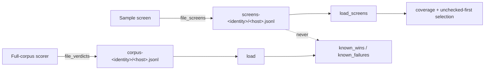

# Record screen-level tries per hidden-neuron UUID

## Summary

`ockham/src/learnings.rs` stored only full-corpus verdicts, so nothing could
say which hidden neurons had been *looked at*. This adds a separate screen-try
record — a coverage fact, never a prune verdict — that coverage reporting and
unchecked-first selection will read. Closes #35.

- `SCREENS_FORMAT_VERSION`, `ScreenOutcomeKind` (`Winner` | `Loser`) and
  `Screened`, kept deliberately separate from `Learning` so a screen can never
  be mistaken for a verdict.
- `LearningsStore::screens_dir()` / `screens_host_path()` /
  `load_screens()` / `append_screen()`, writing to the **sibling**
  `<root>/screens-<identity>/<host>.jsonl` — outside `corpus-<identity>/`, so a
  corrupt or oversized screen log cannot break verdict loading.
- `file_screens(store, uuids, known)` mirroring `file_verdicts`: a write
  failure logs via `crate::log::warn` and returns a reduced count rather than
  erroring, because a cache fault must never fail a run.
- Pure query helpers: `latest_screen_by_uuid` (newest wins, same `>=` tie rule
  as `latest_by_uuid`), `screened_uuids` (screened and still present) and
  `oldest_screened_first` (still-present UUIDs by latest screen time, oldest
  first; equal times broken by uuid so the order is deterministic across
  hosts).
- The JSONL read/append loop is now shared by both stores (`load_jsonl` /
  `append_jsonl`), so unknown-version skipping and loud-on-corruption
  behaviour stay identical for verdicts and screens.

`Outcome`, `known_wins`, `known_failures` and the verdict file layout are
unchanged. Nothing in the run loop calls this yet — wiring, and the coverage
percentage, are separate sub-issues.

## Evidence

Backend-only change with no web interface, so no screenshot applies. Evidence
is the test suite plus the local gate.

Where a record lands, and who is allowed to read it:



Local run of the gate (`./quality.sh`), all checks green except `codespell`,
which is not installed in this container and could not be installed (no `pip`,
`pipx` or `sudo`); CI runs it for real:

```text
shellcheck: all scripts passed
advisories ok, bans ok, licenses ok, sources ok   # cargo deny
markdownlint-cli2 Summary: 0 issues in 0 files
cargo fmt --all -- --check                         # clean
cargo clippy --workspace --all-targets --all-features -- -D warnings   # clean
cargo test --workspace --all-features -- --test-threads=2
    test result: ok. 96 passed; 0 failed
    test result: ok. 11 passed; 0 failed
    test result: ok. 9 passed; 0 failed
    test result: ok. 10 passed; 0 failed
    test result: ok. 1 passed; 0 failed
RUSTDOCFLAGS="-D warnings" cargo doc --workspace --no-deps --all-features   # clean
```

## Test Plan

Tests added in `ockham/src/learnings.rs` (all call real functions and assert on
returned values or on-disk state):

- `screens_round_trip_through_the_store` — `Screened` survives
  `append_screen` → `load_screens`.
- `screens_live_outside_the_verdict_directory` — `screens_dir()` is not inside
  `corpus_dir()`, and `load()` on a store holding only screens returns zero
  `Learning`s.
- `a_screened_uuid_is_neither_a_known_win_nor_a_known_failure` — the required
  regression test: two filed screens leave `known_wins` and `known_failures`
  empty.
- `unknown_version_screen_lines_are_skipped` — a hand-written line with
  `version = SCREENS_FORMAT_VERSION + 1` is dropped by the loader.
- `file_screens_warns_and_reduces_the_count_on_a_write_failure` — with the
  store root blocked by a regular file, `file_screens` returns `0`, appends
  nothing to `known`, and warns instead of erroring.
- `latest_screen_per_uuid_wins`, `screened_uuids_are_limited_to_still_present_neurons`,
  `oldest_screened_uuid_comes_first`, `loading_screens_from_an_absent_store_is_empty`
  — the query helpers and the empty-store path.

Existing verdict tests (`wins_still_in_creature_are_preferred`,
`fresh_failures_are_skipped_stale_ones_are_not`, `latest_verdict_wins`,
`replay_cap_zero_means_all_still_present`, `store_round_trips_appended_records`)
are unmodified and still pass, covering the shared `load_jsonl` / `append_jsonl`
refactor.
