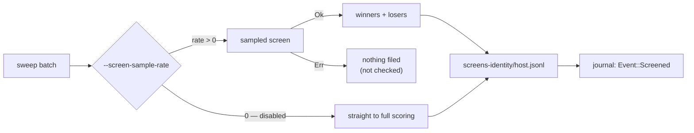

# Run loop: file a screen record for every candidate screened (Issue #36)

## Summary

Issue #35 added the screen-record store; nothing wrote to it. The run loop now
files one screen-coverage record per candidate that was actually scored, so the
coverage figures Issue #33 wants are backed by durable, fleet-shared data.
Closes #36.

- **Winners and losers both filed.** On `Ok(screen)` every scored candidate —
  `screen.winners` and `screen.losers` — is filed to
  `screens-<identity>/<host>.jsonl`. Losers are the bulk of coverage.
- **Kind carried through.** `ScreenOutcome::losers` was `Vec<String>` (UUIDs
  only) and is now `Vec<ScreenedLoser>` (`uuid` + `kind`), the smallest change
  that lets a screen record's `kind` match the verdict store without giving
  `screen_batch` a second responsibility. The losing candidate creature is still
  dropped — nothing downstream scores it again.
- **Screening off is still coverage.** With `--screen-sample-rate 0` candidates
  go straight to full scoring; each is filed, so coverage does not silently
  freeze when screening is disabled.
- **A failed screen files nothing.** Those candidates were never checked.
- **Loaded once at startup**, beside the existing `LearningsStore::load()`
  block, into a `Vec<Screened>` the loop extends as it files. The record count
  is logged the same way verdicts are.
- **Journalled per batch** via a new `Event::Screened { batch, screened }`
  sibling variant, so a run's coverage is reconstructable offline. A sibling
  rather than a field on `Event::Screen` because coverage is also filed when
  screening is off, and `screenCalls` must keep counting only real sampled
  scorer calls. `report.rs` totals it as `screened`.
- A learnings/screens IO fault stays a warning — `file_screens` warns and skips,
  exactly like the verdict cache.

Out of scope and untouched: selection order, coverage percentages, and
`file_verdicts`.

## Evidence

Backend/CLI change with no web interface, so there is no screenshot; the
integration tests below are the evidence.



`./quality.sh` was run in the foreground. Every check passes except the
`codespell` preflight, which cannot run in this container — the image has no
`pip`/`pipx` and `python3 -m ensurepip` reports
`No module named ensurepip`, so `codespell` is not installable here. CI runs
that job for real. All other gates were run individually and pass:

```text
shellcheck: all scripts passed
neat-core 0.10.6 matches handled baseline 0.10.6
markdownlint-cli2: 0 issues in 0 files
cargo deny check: advisories ok, bans ok, licenses ok, sources ok
cargo fmt --all -- --check: clean
cargo clippy --workspace --all-targets --all-features -D warnings: clean
cargo test --workspace --all-features: 102 + 11 + 9 + 10 + 1 passed, 0 failed
cargo doc --workspace --no-deps --all-features (RUSTDOCFLAGS=-D warnings): clean
```

## Test Plan

Added in `ockham/src/run.rs`:

- `every_screened_candidate_is_filed_across_two_batches` — four hidden neurons,
  `--candidates 2`, two batches: the union of screened UUIDs equals both
  batches' candidates (`h_a`…`h_d`), exactly four records with no duplicates,
  all filed as losers with the `identity` kind, two `screened` journal records,
  and `report.screened == 4`.
- `screening_disabled_still_files_a_record_for_every_candidate` —
  `screen_sample_rate: None` still files both UUIDs; the journal carries no
  `screen` record (no sampled scorer call) and `report.screen_calls == 0` while
  `report.screened == 2`.
- `a_failed_screen_files_no_screen_records` — a scorer that fails only sampled
  calls: the run survives (warning, then `stop_reason == "scorer-failures"`),
  the screens directory is never created, and no `screened` journal record is
  written.
- `omitted_learnings_dir_files_no_screen_records` — with no `--learnings-dir`,
  no `screens-*` or `learnings` directory appears anywhere.

Added/updated elsewhere:

- `ockham/src/sweep.rs::sample_losers_are_not_returned_as_winners` — asserts the
  widened `losers` carry both uuid and `CandidateKind`.
- `ockham/src/report.rs::screen_coverage_records_are_totalled_without_inflating_scorer_calls`
  — `screened` totals across batches while `screenCalls` counts scorer calls
  only.
- `ockham/src/report.rs::a_journal_written_before_issue_36_parses_with_no_screen_coverage`
  — a hand-written pre-change journal (start/batch/screen/full/stop) still
  parses, with `screened == 0`.
- `ockham/src/baseline.rs` fake scorer gained `fail_sample_with` so a screen
  failure can be provoked without failing the baseline.
