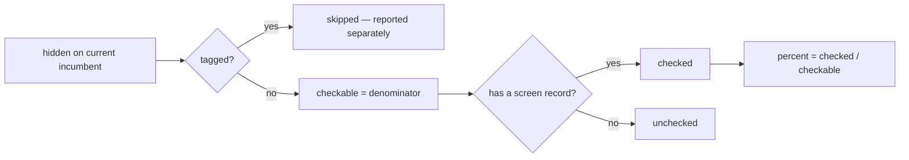
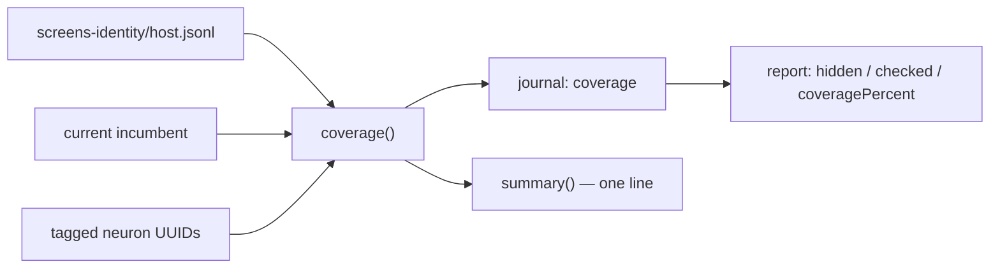

# 🪒 Screening coverage over the current incumbent (Issue #37)

## Summary

Adds `ockham/src/coverage.rs` — one pure function and one struct that answer
"how far has Ockham got through this creature?", so the `ockham` tag, the commit
description and `--report` can never disagree. Closes #37.

- `Coverage { hidden, tagged, checkable, checked, cut }` with `percent()` and
  `summary()`.
- `coverage(creature, tagged, screens, cut)` counts over the **current**
  incumbent: screen records for UUIDs no longer on the creature are ignored
  entirely, duplicate records for one uuid count once, and tagged
  (GRQ-provenance) neurons leave the denominator and are reported separately —
  counting them would cap coverage below 100% forever.
- `percent()` returns `0.0` when `checkable == 0` (no divide by zero) and never
  exceeds 100.
- `summary()` renders `checked X of Y hidden (Z%), N cut`, appending
  `, N tagged skipped` only when neurons are tagged. `Y` is `checkable`, so the
  `X of Y` figures always agree with the percentage — the same denominator #39's
  compact `checked X/Y (Z%)` tag clause will use.

Two supporting changes make the `Report` fields the issue asks for real rather
than permanently `None`:

- `journal.rs` gains an optional `coverage` record.
- `run.rs` journals exactly one such record at the end of the loop, **only when
  a learnings dir is configured** — without the screen store there is no
  coverage state, and `checked: 0` would be a lie rather than a measurement.
- `report.rs` exposes `hidden`, `checked` and `coveragePercent` folded from the
  last coverage record read, with the percentage computed by `Coverage` so there
  is still exactly one calculation.

Out of scope, as the issue states: emitting the summary into the tag (#39) or
the commit description / `coverage.txt` (#40), and selection order (#38).

## Evidence

Backend/CLI change with no web interface, so no screenshot applies. Evidence is
the test suite.

```text
$ cargo test --workspace --all-features -- --test-threads=2
running 116 tests
test result: ok. 116 passed; 0 failed; 0 ignored; 0 measured; 0 filtered out
```

How the denominator is derived:



Where the figures flow:



### Quality gate

`./quality.sh` cannot complete in this container: it requires `codespell`, and
the image has no `pip`, `pip3`, `pipx` or `ensurepip`, so codespell cannot be
installed. That step is unrelated to this change and CI runs it for real. Every
other check in `quality.sh` was run in the foreground and passed:

- `bash -n` on all scripts, `shellcheck -x -s bash` — passed;
- neat-core version gate — `0.10.6` matches the handled baseline;
- `markdownlint-cli2` — 0 issues in 8 files;
- `cargo deny check` — advisories ok, bans ok, licenses ok, sources ok;
- `cargo fmt --all -- --check` — clean;
- `cargo clippy --workspace --all-targets --all-features -D warnings` — clean;
- `cargo test --workspace --all-features` — 116 + 31 tests passed;
- `RUSTDOCFLAGS="-D warnings" cargo doc --workspace --no-deps` — clean.

## Test Plan

New tests in `ockham/src/coverage.rs`:

- `tagged_neurons_leave_the_denominator_and_are_reported_separately` — the
  issue's fixed figures: 10 hidden, 2 tagged, 3 screened → `checkable == 8`,
  `checked == 3`, `percent() == 37.5`.
- `screens_for_departed_uuids_raise_neither_checked_nor_hidden`.
- `a_uuid_screened_many_times_counts_once`.
- `a_screened_tagged_uuid_never_counts_as_checked`.
- `newly_evolved_neurons_lower_the_percentage` — carries the documenting comment
  that this is intended behaviour, so a future "fix" cannot reverse the decision
  unnoticed.
- `nothing_checkable_yields_zero_percent_without_panicking`.
- `percent_never_exceeds_one_hundred`.
- `summary_omits_the_tagged_clause_when_nothing_is_tagged` /
  `summary_appends_the_tagged_clause_when_neurons_are_skipped`.
- `a_creature_with_no_hidden_neurons_is_complete_and_empty`.

New tests in `ockham/src/report.rs`:

- `the_last_coverage_record_becomes_the_reported_progress` — the latest snapshot
  wins, and the JSON carries `coveragePercent`.
- `a_journal_with_no_coverage_record_reports_no_coverage` — absent, not `0%`.
- `a_journal_written_before_issue_36_parses_with_no_screen_coverage` — extended
  with assertions that a pre-change journal still parses and reports no
  coverage.

New tests in `ockham/src/run.rs`:

- `the_run_journals_coverage_over_the_final_incumbent` — a real run with a
  learnings dir reaches the report as `hidden 4`, `checked 2`, `50.0%`.
- `a_run_without_a_learnings_dir_journals_no_coverage`.
