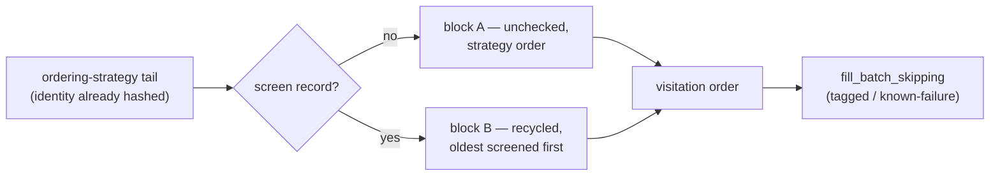

# Sweep: unchecked-first candidate selection, recycling oldest-screened

## Summary

Every run used to rebuild a fresh permutation of every hidden UUID from
`(seed, ordering, random_quota)`, so independent runs re-screened the same
neurons by chance and fleet coverage crawled. This adds a selection-time
partition one layer **above** the eight `Ordering` strategies — coverage is
per-fleet state, while a strategy must stay reproducible from
`(--seed, --ordering, --ordering-random-quota)` alone. Closes #38.

- `Sweep::prefer_unchecked(&screened, &oldest_first)` reorders the
  still-unvisited tail into two blocks: **A** never-screened UUIDs in
  ordering-strategy order, then **B** already-screened UUIDs oldest-screened
  first (`learnings::oldest_screened_first`, #35). It is a partition, not a
  filter — the tail stays a permutation of the same UUIDs, so a run that
  exhausts block A recycles the stalest neurons instead of stopping.
- `permutation_identity` is still hashed **before** the reorder, so #11's
  strategy comparisons are not invalidated. `Sweep` and the `start` journal
  record both carry `unchecked_first`, making a run reconstructable.
- `--unchecked-first[=true|false]` defaults **on** with `--learnings-dir` and
  **off** without it (no store, no coverage state, nothing to prefer), and is
  reported in `ConfigReport`.
- `run.rs` reuses the #36 startup screen load, applies the reorder to the
  opening sweep and to each post-accept restart, and logs
  `coverage: N unchecked first, M already screened deferred`.

Out of scope, and untouched: no new `Ordering` variant, no change to
`fill_batch_skipping`'s tagged / known-failure skips (they still apply on top),
no coverage-percentage reporting.

## Evidence

Backend/CLI change with no web interface, so there is no screenshot to capture;
the evidence is the test suite plus the CLI contract below.



`cargo test --workspace --all-features -- --test-threads=2`: 127 lib + 31
integration tests pass. `cargo fmt --check`, `cargo clippy --workspace
--all-targets --all-features -D warnings`, `cargo deny check`,
`markdownlint-cli2`, `actionlint` and `cargo doc -D warnings` all pass.

`./quality.sh` stops early in this container at the codespell preflight —
`codespell` is not installed and no `pip`/`pipx` is available to install it
(`spell-check: codespell is not installed.`). Every subsequent stage was run
individually and passes, and CI runs codespell for real.

CLI contract:

```text
--unchecked-first[=<UNCHECKED_FIRST>]
    Screen never-checked neurons before re-screening the stalest ones.
    Defaults to on with `--learnings-dir` and off without it
    [possible values: true, false]
```

## Test Plan

`ockham/src/sweep.rs`:

- `prefer_unchecked_is_a_permutation_under_every_ordering_and_quota` — the
  property test the issue names, across all eight `Ordering` strategies × four
  quotas: same multiset, no loss, no duplicates.
- `unchecked_keep_strategy_order_and_screened_recycle_oldest_first` — block A
  keeps the strategy's relative order; block B is oldest-screened first.
- `an_empty_screen_set_leaves_the_order_unchanged` — cold or absent cache is
  byte-identical to today's order, for every strategy and quota.
- `the_same_inputs_reproduce_the_same_coverage_driven_order` — determinism for
  a fixed `(seed, ordering, quota, screen set)`.
- `the_permutation_identity_predates_the_coverage_reorder` — the identity still
  matches a freshly built sweep after the tail moves.
- `a_fully_screened_creature_still_visits_every_neuron` — block A empty, sweep
  visits all six in stalest-first order; no run is starved.
- `already_visited_uuids_are_left_alone` — the visited prefix does not move and
  visited UUIDs are not re-queued into the tail.

`ockham/src/config.rs`:

- `unchecked_first_follows_the_learnings_dir_by_default` — on with
  `--learnings-dir`, off without, in both the config and `ConfigReport`.
- `an_explicit_unchecked_first_flag_overrides_the_default` — the flag wins
  either way.

`ockham/src/run.rs`:

- `the_run_screens_never_checked_neurons_before_stale_ones` — with `h_a`/`h_b`
  pre-screened, the single batch screens `h_c`/`h_d`; the journal records
  `unchecked_first: true`.
- `unchecked_first_off_keeps_the_seeded_permutation` — with the flag off, the
  batch matches `ordering::random_order(creature, seed)` exactly.
