# Report screening coverage in the 🪒 Ockham commit subject

## Summary

The `ockham` creature tag is used verbatim as the GRQ-sampler commit subject, so
it is the one line the fleet skims. It now carries the screening coverage
computed in #37, in the compact `checked X/Y (Z%)` form, on **both** origin
branches of `ockham_progress_message` (`search` and the replay branches):

```text
🪒 Ockham · search bundle · 3 accepts / 41 batches · score: 0.512345 (+1.20e-4) · checked 1204/4971 (24.2%)
🪒 Ockham · replay-bundle · 8 cuts · score: 0.393928 (+2.54e-5) · checked 1204/4971 (24.2%)
```

Coverage is optional. `OckhamProgress` gained `coverage: Option<Coverage>`
(`Coverage` is `Copy`, so `OckhamProgress` stays `Copy`), and with no
`--learnings-dir` there is no coverage state: the clause is omitted entirely
rather than rendering a dishonest `0/0 (0.0%)`. `run.rs` threads the screen
records into `apply_local_win`, which counts coverage over the creature it is
about to publish — so the tag and the end-of-run coverage journal agree.

The compact form is deliberate: `Coverage::summary()`'s fuller wording
(`checked X of Y hidden (Z%), N cut, M tagged skipped`) belongs in the commit
description, not a subject line that is already long.

Closes #39.

## Evidence

Backend/CLI change with no web surface, so no screenshot. The tag is a string
written into `best.json`; the evidence is the test suite plus the real value a
run produces.

An end-to-end `establish_run` with a learnings dir and one accepted cut writes:

```text
🪒 Ockham · search individual · 1 accepts / 1 batches · score: 0.800000 (+3.00e-1) · checked 1/3 (33.3%)
```

Four hidden neurons, one cut, three checkable remaining, one of them screened.

```mermaid
flowchart LR
    S[screens-*.jsonl<br/>coverage records] --> A[apply_local_win]
    C[win.creature<br/>after retain_neurons] --> A
    T[meta.neuron_tags<br/>tagged UUIDs] --> A
    A -->|Some when a screen store exists| COV[coverage&#40;&#41;]
    COV --> P[OckhamProgress.coverage]
    P --> M[ockham_progress_message]
    M --> TAG[ockham tag → GRQ commit subject]
    A -->|None without --learnings-dir| M
```



`./quality.sh` passes every gate except `codespell`, which is **not installed in
this container** (`spell-check: codespell is not installed.` — no `pip`/`pipx`
available to install it). The remaining gates were run individually and all
pass: shellcheck, neat-core version gate, markdownlint-cli2 (0 issues),
`cargo deny check` (advisories/bans/licenses/sources ok), `cargo fmt --check`,
`cargo clippy --workspace --all-targets --all-features -D warnings`,
`cargo test --workspace --all-features` (167 tests, 0 failures) and
`RUSTDOCFLAGS="-D warnings" cargo doc`. CI runs codespell for real.

## Test Plan

New tests in `ockham/src/tags.rs`:

- `absent_coverage_leaves_the_search_message_exactly_as_it_was` and
  `absent_coverage_leaves_the_replay_message_exactly_as_it_was` — exact-string
  assertions that the message is byte-identical to today's when coverage is
  `None` (the highest-risk regression: an empty clause or `0/0 (0.0%)` leaking
  into the tag).
- `search_carries_the_compact_coverage_clause` and
  `replay_carries_the_same_compact_coverage_clause` — the clause appears on both
  origin branches; the replay test also asserts the `🪒 Ockham` prefix, the
  score and the `(+delta)` clause survive, so GRQ's razor-prefix check keeps
  working.
- `the_clause_is_compact_rather_than_the_full_summary` — the subject uses the
  compact form, not `Coverage::summary()`.
- `nothing_checkable_still_renders_an_honest_clause_when_coverage_exists` —
  `0/0 (0.0%)` is correct when coverage genuinely exists and nothing is
  checkable, and it must not panic.
- `stamped_acceptance_puts_coverage_in_the_ockham_tag` — `stamp_acceptance`
  writes the clause into the `ockham` tag, not just into the message helper.

New tests in `ockham/src/run.rs` (end-to-end through `establish_run`):

- `an_accept_stamps_coverage_into_the_ockham_tag` — with a learnings dir, the
  `ockham` tag in the written `best.json` carries a `· checked` clause with the
  checkable hidden count as the denominator.
- `an_accept_without_a_learnings_dir_leaves_the_tag_coverage_free` — with no
  screen store, the tag contains no `checked` clause at all.

Existing `tags.rs` tests are unchanged apart from the mandatory
`coverage: None` field in their `OckhamProgress` literals; all their assertions
are untouched.
