# Emit a coverage block for the GRQ-sampler commit description

## Summary

The `ockham` tag is one crowded line, so "how many neurons have been checked,
and have they earnt their keep?" belongs in the commit **description**. Ockham
now *produces* that description here, in the public repo; GRQ only has to paste
it (its companion issue).

On the normal completion path a run with `--learnings-dir` writes two files into
`--output-dir`, beside `best.json`:

- `coverage.txt` — the rendered, line-oriented block, ready for `git commit`;
- `coverage.json` — the same figures as the serialised `Coverage` struct, so
  nothing downstream has to parse prose.

```text
🪒 Ockham neuron screening coverage
checked:   1204 of 4971 hidden (24.2%)
cut:       7 this run
unchecked: 3767 remaining (~38 runs at 100/run)
skipped:   42 tagged (GRQ provenance, never pruned)
```

Both files are written only when coverage exists: no `--learnings-dir` means no
screen store, no coverage state, and neither file — absent rather than a
misleading `0/0`. A write fault warns and the run still completes, matching the
learnings-cache rule: reporting must never cost a verified prune.

The runs-remaining clause divides `unchecked` by the configured `--candidates`
batch size and is **omitted** — never `inf`/`NaN` — when that batch size is zero
or coverage is already complete. The `skipped:` line is omitted when nothing is
tagged. `report` now carries every figure of the block (`tagged`, `checkable`,
`unchecked`, `cut` join the existing `hidden`, `checked`, `coveragePercent`).

Closes #40.

## Evidence

Backend/CLI change with no web surface, so no screenshot. The deliverable is two
files on disk; the evidence is the test suite, which asserts the exact bytes.

`the_run_writes_the_coverage_description_and_json_beside_best_json` runs
`establish_run` end to end over four hidden neurons with `--candidates 2` and one
batch, then asserts the written `coverage.txt` is exactly
`format!("{}\n", cov.description(2))` for the `Coverage` deserialised from the
written `coverage.json` — text and JSON cannot drift apart:

```text
🪒 Ockham neuron screening coverage
checked:   2 of 4 hidden (50.0%)
cut:       0 this run
unchecked: 2 remaining (~1 run at 2/run)
```



```mermaid
flowchart LR
    L{"--learnings-dir set?"} -->|no| N["no screen store<br/>neither file written"]
    L -->|yes| C["coverage&#40;&#41; over the final incumbent"]
    C --> J["journal: coverage record"]
    C --> W["coverage::write_files"]
    W -->|Ok| T["coverage.txt — description block"]
    W -->|Ok| S["coverage.json — Coverage struct"]
    W -->|Err| G["log::warn — the run still completes"]
    T --> Q["GRQ: git commit description"]
    S --> Q
```

`./quality.sh` passes every gate except `codespell`, which is **not installed in
this container** (`spell-check: codespell is not installed.` — no `pip`/`pipx`
available to install it). The remaining gates were run individually and all
pass: bash syntax, shellcheck, the neat-core version gate, markdownlint-cli2
(0 issues), `cargo deny check` (advisories/bans/licenses/sources ok),
`cargo fmt --all --check`, `cargo clippy --workspace --all-targets
--all-features -D warnings`, `cargo test --workspace --all-features` (180 tests,
0 failures) and `RUSTDOCFLAGS="-D warnings" cargo doc`. CI runs codespell for
real.

## Acceptance Criteria

- **met** — `coverage.txt` and `coverage.json` are written to the output dir
  when a learnings dir is configured, and not written when it is not — evidence:
  `ockham/src/run.rs::the_run_writes_the_coverage_description_and_json_beside_best_json`
  and `ockham/src/run.rs::a_run_without_a_learnings_dir_writes_no_coverage_files`.
- **met** — `coverage.json` deserialises back into `Coverage` — evidence:
  `ockham/src/coverage.rs::both_files_are_written_and_the_json_deserialises_back_into_coverage`
  (round-trips the struct) and the run-level test above, which deserialises the
  file the binary wrote.
- **met** — the description block is stable and line-oriented; a test asserts
  the exact rendering for a fixed `Coverage` — evidence:
  `ockham/src/coverage.rs::the_description_block_renders_exactly_as_grq_will_paste_it`.
- **met** — the runs-remaining clause is omitted rather than showing
  `inf`/`NaN` when `--candidates` is 0 or coverage is complete — evidence:
  `ockham/src/coverage.rs::a_zero_batch_size_drops_the_runs_clause_rather_than_rendering_inf`
  and `::complete_coverage_drops_the_runs_clause_because_nothing_is_left`.
- **met** — neither file's absence fails a run; a write error is a warning —
  evidence: `ockham/src/run.rs::a_blocked_coverage_write_warns_rather_than_failing_the_run`.
- **met** — README documents both files as the GRQ-facing contract — evidence:
  `README.md` "The GRQ commit-description contract" section plus the two new
  rows in the Outputs table.
- **met** — `./quality.sh` passes — evidence: every gate above, except the
  `codespell` preflight, which cannot run in this container (no `pip`/`pipx`);
  CI runs it.
- **partial** — scope item 4 also asks for the contract in
  `docs/grq-integration.md` — evidence: `README.md` carries the contract —
  reason: that file is the deliverable of #34, which is still open, so there is
  nothing to extend; creating a stub here would collide with it.
- **unrequested** — `report` gained `tagged`, `checkable`, `unchecked` and `cut`
  — reason: scope item 3 asks for "the figures in the `--report` output", and
  the report previously carried only three of the block's figures.

## Test Plan

New tests in `ockham/src/coverage.rs`:

- `the_description_block_renders_exactly_as_grq_will_paste_it` — byte-exact
  rendering of the issue's fleet-scale example; this is the drift guard for the
  format GRQ pastes.
- `the_description_omits_the_skipped_line_when_nothing_is_tagged` — no
  `skipped:` line without tagged neurons.
- `a_zero_batch_size_drops_the_runs_clause_rather_than_rendering_inf` — the
  divide-by-zero case drops the clause and renders no `inf`/`NaN`.
- `complete_coverage_drops_the_runs_clause_because_nothing_is_left` — exact
  rendering when coverage is complete.
- `the_last_remaining_run_is_singular` — `~1 run`, not `~1 runs`.
- `more_records_than_checkable_neurons_never_renders_a_negative_remainder` —
  `unchecked()` saturates when stale records outnumber checkable neurons.
- `both_files_are_written_and_the_json_deserialises_back_into_coverage` — the
  machine-readable half of the contract round-trips.
- `a_blocked_write_returns_an_error_naming_the_file` — a blocked write fails
  loud with the file name, so the caller's warning is actionable.

New tests in `ockham/src/run.rs` (end to end through `establish_run`):

- `the_run_writes_the_coverage_description_and_json_beside_best_json` — both
  files land in the output dir beside `best.json`, and the text is exactly the
  rendering of the figures in the JSON.
- `a_run_without_a_learnings_dir_writes_no_coverage_files` — neither file exists
  without a screen store.
- `a_blocked_coverage_write_warns_rather_than_failing_the_run` — a directory
  squatting on `coverage.txt` makes the write fail; the run still completes and
  still journals its `coverage` record.

New tests in `ockham/src/report.rs`:

- `the_report_carries_the_whole_coverage_block_not_just_the_percentage` — the
  new figures reach the report and its JSON.
- `a_journal_with_no_coverage_record_reports_no_block_figures` — absent, not
  zero, without a coverage record.

No existing test was modified or removed.
