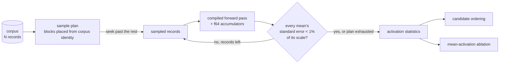

# 🪒 perf: sample the corpus for hidden-neuron activation statistics

## Summary

The hidden-neuron activation scan streamed **every** record of the corpus at
startup and again after every accepted win — roughly six minutes of a 2700 s
budget on the reported 2,268,709-record corpus. Those statistics only ever
*propose* candidates (the scorer accepts), so they do not need full-corpus
precision.

Ockham now samples the corpus instead:

- `corpus::for_each_selected_chunk` visits only chosen ranges of the global
  record index space and **seeks over the rest**, so skipped records cost
  neither IO nor inference. `for_each_chunk` is now a thin wrapper over it, and
  a callback may return `ControlFlow::Break` to stop early.
- `stats::SampleSpec` plans evenly-spread contiguous blocks — one per stratum,
  each placed inside its stratum by a SplitMix64 generator seeded from the
  corpus identity, so the sample is reproducible per `(incumbent, corpus, spec)`
  and does not alias with a periodic corpus.
- The scan stops early once every neuron's mean has a standard error below 1 %
  of that neuron's own activation scale (`max(std_dev, mean_abs)`), after a
  minimum sample.
- The workspace cache key gains the sample spec and `STATS_FORMAT_VERSION` is
  bumped to `2`, so a sampled scan can never be served a full-corpus entry or
  the reverse.
- `--stats-sample-records` (default `100000`, `0` = exhaustive scan) is wired
  through both the startup scan and the post-accept `refresh` path.
- The `streamed != corpus.record_count` consistency check is relaxed to the
  planned sample count, and still fails loud when the scan visits fewer records
  than planned without converging, or visits none of a non-empty corpus.

Freed time flows to the existing wall-clock budget (more batches);
`--candidates` is unchanged.

Closes #44.

## Evidence

Backend/CLI change — no web interface to screenshot. Evidence is the benchmark
plus the test suite.

### Before / after benchmark

`cargo run --release --example activation_stats_bench` — 500,000 records over
five `.bin` files, 16 inputs, 256 fully-connected TANH hidden neurons. "Before"
is the exhaustive scan (`SampleSpec::full()`, the pre-#44 behaviour); "after" is
the shipped default (`SampleSpec::default()`).

| Run | Scan | Records | Time | Throughput |
|---|---|---:|---:|---:|
| 1 | full (before) | 500,000 | 1.209 s | 413,625 rec/s |
| 1 | sampled (after) | 20,480 | 0.050 s | 411,222 rec/s |
| 2 | full (before) | 500,000 | 1.212 s | 412,553 rec/s |
| 2 | sampled (after) | 20,480 | 0.053 s | 389,049 rec/s |

**Speed-up 24.3× / 23.0×.** Accuracy cost across all 256 hidden neurons:
worst `|Δmean|` = `1.150e-4`, worst `|Δmean_abs|` = `1.224e-4`.

Per-record throughput is unchanged — the win is entirely in records not
visited, so the sampled scan is `O(sample)` while the old one was `O(corpus)`.
On the issue's 2.27M-record corpus that ratio grows to roughly 100× (the sample
stays ~20k records while the full scan grows with the corpus).

### Data flow

### Behaviour change worth a reviewer's eye

A creature with **no hidden neurons** is no longer scanned at all — there is
nothing to measure, so streaming the corpus could only produce an empty result
more slowly. The existing assertion in
`ockham/src/run.rs::baseline_gate_writes_workspace_and_does_not_prune` therefore
moves from `record_count == 2` to `record_count == 0` (with
`corpus_record_count == 2` recorded alongside). No test was removed or disabled.

Sampled `min` / `max` are extreme-value statistics and are the most weakened by
sampling, so the `narrow-range` ordering signal is noisier. That is the trade
the issue accepts: an ordering only decides which neuron is tested sooner, and
every candidate still faces the sampled screen and the full authoritative
scorer.

## Test Plan

New tests (all call real functions and assert on results):

- `corpus::tests::selected_ranges_visit_only_the_requested_records_across_files`
  — ranges are honoured exactly, including one straddling a file boundary and
  one clipped at the end of the corpus.
- `corpus::tests::an_empty_plan_visits_nothing_and_a_full_plan_matches_for_each_chunk`
- `corpus::tests::out_of_order_or_overlapping_ranges_are_rejected` — a bad plan
  fails loud instead of double-counting records.
- `corpus::tests::breaking_stops_the_scan_early`
- `stats::tests::sampling_visits_a_fraction_of_the_corpus_and_still_tracks_the_full_mean`
  — a 1-in-5 sample stays within 5 % of a standard deviation of the exhaustive
  mean.
- `stats::tests::the_sample_plan_is_deterministic_ascending_and_capped` — same
  corpus ⇒ same plan; ascending, non-overlapping, records genuinely skipped; a
  cap at or above the corpus size degrades to the exhaustive scan.
- `stats::tests::a_cap_below_the_block_size_still_caps_the_scan`
- `stats::tests::adaptive_stopping_ends_a_constant_neuron_scan_early` — a
  constant neuron converges at the floor; a moving one does not.
- `stats::tests::a_full_scan_cache_entry_is_never_served_to_a_sampled_scan`
- `stats::tests::a_creature_without_hidden_neurons_is_not_scanned_at_all`
- `config::tests::the_activation_scan_samples_by_default_and_zero_restores_the_full_scan`
- `cli.rs::stats_sample_records_bounds_the_activation_scan_and_zero_restores_the_full_one`
  — end-to-end through the binary: the flag bounds the reported
  `activation.recordCount`, and `0` restores the full 4,000-record scan.

Modified: `run::tests::baseline_gate_writes_workspace_and_does_not_prune` (the
no-hidden-neuron assertion documented above); the `ActivationStats` fixtures in
`ordering.rs`, `promote.rs` and `sweep.rs` gained the new fields.

Gate: `cargo fmt --check`, `cargo clippy --workspace --all-targets
--all-features -D warnings`, `cargo deny check`, `cargo test --workspace
--all-features` (192 tests, 0 failed), `cargo doc` with `RUSTDOCFLAGS=-D
warnings` and `markdownlint-cli2` all pass. `./quality.sh` cannot complete its
`codespell` preflight in this container — `codespell` is not installed and there
is no `pip`/`ensurepip` to install it — so that one step was skipped locally and
runs for real in CI; every other step of `quality.sh` was run and passed.
