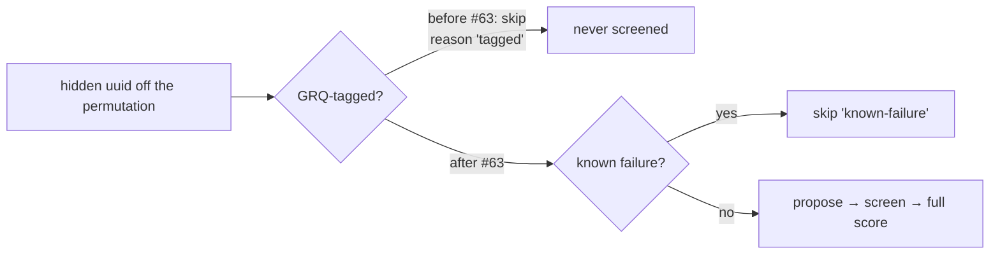

# Ockham screening: stop exempting GRQ-tagged hidden neurons from the prune pool

## Summary

Ockham refused to even try removing a hidden neuron that carried GRQ-provenance
tags: `Sweep::fill_batch_skipping` filed a `SweepSkip { reason: "tagged" }`
instead of proposing a candidate, and the replay stage filtered tagged UUIDs
out. On the fleet incumbent that exempted more than half the creature from the
razor. #63 reverses the #26 defensive call — provenance records where a neuron
came from, it is not evidence that it earns its place.

- `fill_batch_skipping` and the `"tagged"` skip reason are gone. The body
  collapsed back into `fill_batch_avoiding` (known failures plus the reasons
  proposing a candidate reports for itself); `fill_batch` is unchanged.
- The replay stage no longer filters tagged UUIDs, and the
  `replay: leaving N tagged neuron(s) untouched (GRQ #4216)` line is gone.
- `run.rs` still computes the tagged set from `meta.neuron_tags` for coverage
  and the check-in tag — it is simply no longer passed to selection.
- `README.md` lines 66 and 836 no longer claim tagged neurons are skipped.
- Output neurons stay exempt, unchanged: only `neuron_type == "hidden"` neurons
  ever enter a `Sweep`.

Closes #73.

### Rollout order (unchanged from the issue)

Merging this is safe; **deploying** it before the guard-relaxation child of #63
is not — with the strict guard still on the fleet, an Ockham run that cuts a
tagged neuron loses its whole check-in and GRQ logs it as a skipped check-in,
not a failure. Grep the first host's Ockham worker log for `[provenance-guard]`
before the fleet follows.

## Evidence

Backend/CLI change with no web interface, so there is no screenshot to capture.
The evidence is the test suite and the gates below.

Red-then-green check on the two run-level tests: with the tagged filters
temporarily restored in `run.rs`, both new tests fail
(`replay_cuts_a_confirmed_win_on_a_tagged_neuron` stops with `max-accepts`
rather than `replay-accepts`; the search test reports
`checked 0 of 0 hidden … 1 tagged skipped`). With this diff they pass.

Gate results on this branch:

- `cargo fmt --all -- --check` — clean.
- `cargo clippy --workspace --all-targets --all-features -D warnings …` — clean.
- `cargo test --workspace --all-features -- --test-threads=2` — 208 + 11 + 10 +
  10 + 1 passing, 0 failed.
- `RUSTDOCFLAGS="-D warnings" cargo doc --workspace --no-deps --all-features` —
  clean.
- `cargo deny check` — advisories, bans, licences, sources all ok.
- `markdownlint-cli2`, `actionlint`, `shellcheck`,
  `scripts/check-neat-core-version.sh` — clean.
- `./quality.sh` — stops at its codespell preflight: `codespell is not
  installed` in this container and there is no `pip`/`pipx` to install it. Every
  gate the script runs after that preflight was run directly and passes (list
  above); CI runs codespell for real.

## Acceptance Criteria

<!-- vibe-spec-review inputs="diff+issue-body" -->

- **met** — `fill_batch_skipping`'s `tagged` parameter and the `"tagged"` skip
  reason no longer exist anywhere in the crate — evidence: `ockham/src/sweep.rs`
  (`fill_batch_avoiding`, only `"known-failure"` remains) — reviewer: met
- **met** — a test builds a creature whose hidden neurons are all tagged and
  asserts the batch is full of candidates rather than skips — evidence:
  `ockham/src/sweep.rs::every_hidden_neuron_is_a_candidate_even_when_all_are_tagged`
  — reviewer: met
- **met** — a run-level test asserts a tagged hidden neuron whose removal
  improves the score is proposed, screened and accepted — evidence:
  `ockham/src/run.rs::a_tagged_hidden_neuron_that_improves_the_score_is_proposed_screened_and_accepted`
  — reviewer: met
- **met** — a test asserts output neurons are still never proposed — evidence:
  `ockham/src/sweep.rs::output_neurons_are_never_proposed` — reviewer: met
- **met** — a test asserts that after a tagged neuron is cut,
  `CreatureMeta::serialize_with` writes no `tags` entry for it and the surviving
  tagged neurons keep theirs byte-for-byte — evidence:
  `ockham/src/tags.rs::a_cut_tagged_neuron_leaves_no_tags_entry_and_the_survivors_keep_theirs`
  — reviewer: met
- **met** — the replay stage no longer filters tagged UUIDs, with a test
  covering a confirmed win on a tagged uuid — evidence: `ockham/src/run.rs`
  replay filter and
  `ockham/src/run.rs::replay_cuts_a_confirmed_win_on_a_tagged_neuron` —
  reviewer: met
- **met** — `README.md:66` and `README.md:836` no longer claim tagged neurons
  are skipped — evidence: `README.md:66`, `README.md:836` — reviewer: met, with
  the note that stale claims survive elsewhere — reason: the reviewer's other
  hits (`README.md:373/379/392/422`) are coverage-denominator wording the issue
  puts out of scope; the one selection claim it named that was in scope,
  `ockham/src/coverage.rs`'s module doc, is corrected in this diff.
  `docs/grq-integration.md:370` describes GRQ's guard, which is unchanged and
  is exactly what the rollout note is about.
- **partial** — `./quality.sh` passes — evidence: gate list under **Evidence** —
  reviewer: partial — reason: the script aborts at its codespell preflight
  because codespell cannot be installed in this container (no `pip`/`pipx`); the
  gates after it were run directly and pass.
- **unrequested** — `ockham/src/coverage.rs` module doc reworded — evidence:
  `ockham/src/coverage.rs:11` — reason: it asserted "Ockham never proposes a
  GRQ-provenance neuron as a prune candidate (Issue #26)", which this change
  makes false; the coverage *behaviour* is untouched and still belongs to the
  coverage child of #63.
- **unrequested** — the `skipped:` line's parenthetical changed from
  "(GRQ provenance, never pruned)" to "(GRQ provenance, outside the
  denominator)", with the README example and the two tests asserting the block
  — evidence: `ockham/src/coverage.rs:124` — reason: that string ships into
  every GRQ sampler commit description, so leaving it would paste a claim this
  change makes false; the figures and the denominator are untouched.
- **unrequested** — README coverage-section wording and its mermaid node, and
  the `docs/population-entry.md` field-log sentence — evidence:
  `README.md:373`, `docs/population-entry.md:90` — reason: both stated that
  Ockham never proposes a tagged neuron. Wording only; no coverage figure moves.

## Standards Review

<!-- vibe-standards-review inputs="diff+CONTRIBUTING.md" -->

This repo has no `CODING-STANDARDS.md`; the reviewer was given the diff plus
`CONTRIBUTING.md` and the conventions in `README.md`, `.github/workflows/` and
`quality.sh`. It reviewed the first commit only (`bfb95e1`), so two of its
findings were already fixed on the branch by `ab0299d`.

- **violation** — docs must not state behaviour the code no longer has: the
  README coverage section still said the denominator is "minus the tagged
  neurons Ockham never proposes" and that tagged neurons "can never become
  checked" — evidence: `README.md:373`, `README.md:379`, `README.md:392` —
  reason: reworded in this diff. The figures are untouched; the text now says
  the denominator undercounts until the coverage child of #63 lands.
- **violation** — shipped output text repeats the false claim: `description()`
  emits `skipped: N tagged (GRQ provenance, never pruned)` into every GRQ
  sampler commit description — evidence: `ockham/src/coverage.rs:124` — reason:
  fixed here to `(GRQ provenance, outside the denominator)`, the smallest
  truthful edit; the tests asserting the block were updated with it and the
  denominator itself still belongs to the coverage child.
- **violation** — live doc left stale: `docs/population-entry.md` still said
  "Replay and the random sweep now skip tagged UUIDs (journal reason `tagged`)",
  naming a reason this change deletes — evidence:
  `docs/population-entry.md:90` — reason: the field-log entry now reads in past
  tense and records that #63 reversed it.
- **violation** — stale module doc asserting "Ockham never proposes a
  GRQ-provenance neuron as a prune candidate (Issue #26)" — evidence:
  `ockham/src/coverage.rs:11` — reason: already corrected on the branch by
  `ab0299d`, which the reviewer's diff snapshot predated.
- **violation** — issue-number range style: `#25 to #27` beside `#1–#11` —
  evidence: `README.md:836` — reason: also fixed by `ab0299d`; the en dash is
  back and the line no longer starts with `#`, which is what MD018 objected to.
- **clean** — CONTRIBUTING principles 1–7 (the source creature is never
  written, acceptance stays full-corpus, the sweep stays hidden-only — pinned by
  the new `output_neurons_are_never_proposed`); principle 8's version bump is
  handled by the CI auto-version step, so its absence is not a breach;
  `cargo fmt --check`, `cargo clippy … -D warnings` and the whole test suite are
  clean; the tests call real functions (`fill_batch_avoiding`, `establish_run`,
  `CreatureMeta::retain_neurons` / `serialize_with`) and assert on returned
  values and produced artefacts, never on source text; no error swallowing is
  introduced — the removed `tagged` skip *was* a silent exemption; Australian
  English holds throughout; no hidden or stray files staged.

## Test Plan

Added:

- `ockham/src/sweep.rs::every_hidden_neuron_is_a_candidate_even_when_all_are_tagged`
  — parses a creature JSON whose every hidden neuron carries a `tags` array,
  asserts `CreatureMeta` sees both tags and that the batch holds both neurons
  with no skips.
- `ockham/src/sweep.rs::output_neurons_are_never_proposed` — drains a six-hidden
  / two-output creature and asserts only the six hidden UUIDs are ever visited.
- `ockham/src/run.rs::a_tagged_hidden_neuron_that_improves_the_score_is_proposed_screened_and_accepted`
  — end-to-end through the sampled screen: batch journals
  `"candidates":2,"skipped":0`, both UUIDs leave screen records, the run accepts
  and `best.json` has lost a tagged neuron.
- `ockham/src/tags.rs::a_cut_tagged_neuron_leaves_no_tags_entry_and_the_survivors_keep_theirs`
  — the detector the issue asks for: the cut uuid's tag value is absent from the
  whole serialised document, and the survivor's tag array matches byte-for-byte.

Replaced (documented business-logic change, not a deletion of coverage):

- `ockham/src/sweep.rs::fill_batch_skips_tagged_neurons_as_tagged` → replaced by
  `every_hidden_neuron_is_a_candidate_even_when_all_are_tagged`, its inverse.
  The old test asserted the exempt behaviour #63 removes.
- `ockham/src/run.rs::replay_leaves_tagged_source_neurons_in_place` → replaced by
  `replay_cuts_a_confirmed_win_on_a_tagged_neuron`. The untagged half of the old
  test's coverage is still held by
  `replay_applies_every_known_win_ignoring_max_accepts`.

Unchanged and still passing: `fill_batch_skips_known_failures` and the whole
coverage suite, which keeps its `hidden - tagged` denominator until the coverage
child of #63 lands.
