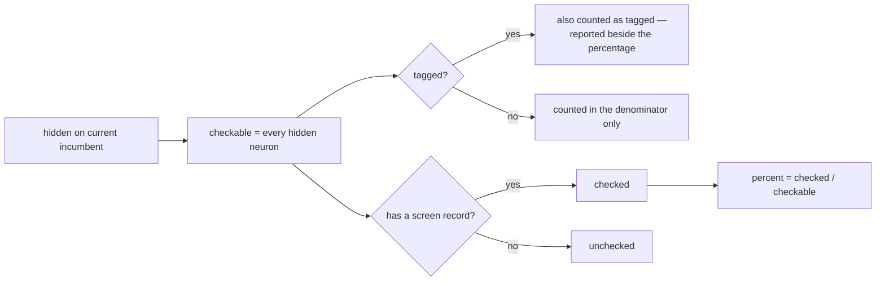

# Coverage: count every hidden neuron in the denominator, including tagged ones

## Summary

`coverage()` computed `checkable = hidden - tagged` and divided by that.
Since #63 put GRQ-tagged neurons into the prune pool, deducting them *overstated*
progress — the fleet read `290 of 3,033` (9.6%) where the razor was 4.7%
through a creature of ~6,237 hidden neurons.

`checkable` is now the full hidden count for every input, a screened tagged
uuid raises `checked`, and `tagged` survives as a separate count reported
*beside* the percentage rather than deducted from it. The six consumers move
together — the `ockham` creature tag, `coverage.txt`, `coverage.json`,
`--report`, the journal `Coverage` event and the docs — so the tag, the commit
description and `--report` still cannot disagree.

`coverage.json` keys are untouched: `checkable` keeps its name and changes its
meaning, so anything already parsing the artefact keeps working.

Closes #74.

## Evidence

Backend/CLI change with no web interface, so no screenshot applies. The
evidence is the test suite plus the rendered artefacts, which are pinned
byte-exactly because GRQ `cat`s `coverage.txt` into a commit description
without parsing it.

The rendered block, before and after:

```text
- checked:   1204 of 4971 hidden (24.2%)
- unchecked: 3767 remaining (~38 runs at 100/run)
- skipped:   42 tagged (GRQ provenance, outside the denominator)
+ checked:   1204 of 5013 hidden (24.0%)
+ unchecked: 3809 remaining (~39 runs at 100/run)
+ tagged:    42 carry GRQ provenance, screened like any other
```

How a hidden neuron reaches the figures:



Quality gate: `./quality.sh` aborts at its codespell preflight — the container
has no `codespell`, no `pip`/`pip3`, no `pipx` and no root, and
`python3 -m venv` fails with `Failing command: /tmp/cs-venv/bin/python3`. The
exact output is `spell-check: codespell is not installed.` … `spell-check:
FAILED`. Every other gate step was run individually and passes: bash syntax,
shellcheck, the neat-core version gate, `markdownlint-cli2` (0 issues),
`actionlint`, `cargo deny check` (advisories/bans/licenses/sources ok),
`cargo fmt --all -- --check`, the full clippy invocation with `-D warnings`,
`cargo test --workspace --all-features` (215 + 32 tests, 0 failures) and
`RUSTDOCFLAGS="-D warnings" cargo doc`. CI runs codespell for real.

## Acceptance Criteria

<!-- vibe-spec-review inputs="diff+issue-body" -->

- **met** — `coverage()` returns `checkable == hidden` for every input,
  including when every hidden neuron is tagged — evidence:
  `ockham/src/coverage.rs::coverage` and
  `coverage::tests::checkable_equals_hidden_however_many_neurons_are_tagged`
  (0/1/3/6 tagged over a 6-hidden creature) — reviewer: met
- **met** — a screened tagged uuid raises `checked`; a test asserts it —
  evidence: `coverage::tests::a_screened_tagged_uuid_counts_as_checked`
  (rewrite of `a_screened_tagged_uuid_never_counts_as_checked`) — reviewer: met
- **met** — an all-tagged, all-screened creature reports 100% — evidence:
  `coverage::tests::an_all_tagged_fully_screened_creature_reports_one_hundred_percent`,
  plus the end-to-end
  `run::tests::a_run_over_a_fully_tagged_creature_counts_every_hidden_neuron`
  — reviewer: met
- **met** — `Coverage::percent` never divides by zero and never exceeds 100 —
  evidence:
  `coverage::tests::an_empty_denominator_yields_zero_percent_without_panicking`
  and `coverage::tests::percent_never_exceeds_one_hundred` — reviewer: met
- **met** — `summary()` and `description()` no longer say "skipped" or
  "never pruned" about tagged neurons; a test pins the exact block — evidence:
  `coverage::tests::the_description_block_renders_exactly_as_grq_will_paste_it`
  and
  `coverage::tests::the_rendered_artefacts_never_call_tagged_neurons_skipped_or_unprunable`
  — reviewer: met
- **met** — `coverage.json` round-trips into `Coverage` and `CoverageReport`
  unchanged in shape — evidence:
  `coverage::tests::the_json_stays_readable_by_a_consumer_that_only_knows_coverage`
  — reviewer: met
- **met** — the `ockham` tag's compact clause uses the new denominator and the
  pinned tags.rs messages are updated — evidence:
  `tags::tests::search_carries_the_compact_coverage_clause`,
  `tags::tests::replay_carries_the_same_compact_coverage_clause`,
  `tags::tests::stamped_acceptance_puts_coverage_in_the_ockham_tag`,
  `tags::tests::an_all_tagged_creature_still_renders_an_honest_clause` —
  reviewer: met
- **met** — `--report` and the journal `Coverage` event carry the new figures;
  their tests are updated — evidence:
  `report::tests::the_report_carries_the_whole_coverage_block_not_just_the_percentage`,
  `report::tests::the_last_coverage_record_becomes_the_reported_progress`,
  `ockham/src/journal.rs` `Event::Coverage` field docs — reviewer: met
- **met** — the `coverage.rs` module doc no longer states that tagged neurons
  are not checkable — evidence: `ockham/src/coverage.rs:11-15` — reviewer: met
- **met** — README's coverage section and diagram, and
  `docs/grq-integration.md`, match the code — evidence: `README.md:369-403`,
  `README.md:421-436`, `docs/grq-integration.md:372-373` — reviewer: partial —
  reason: the reviewer saw a dangling `tagged?` branch in the mermaid diagram
  and two docs still claiming byte-for-byte parity with the pre-#59 block; both
  were fixed in commit `98cd8a7` after its verdict, so the criterion is now met
- **partial** — `./quality.sh` passes — evidence: every gate step run
  individually passes (see Evidence) — reviewer: partial — reason: the
  container cannot install codespell, so the script itself aborts at its
  preflight; CI runs that step
- **unrequested** — `report::summarise` derives `checkable` from `hidden`
  rather than replaying the journalled value, with
  `report::tests::a_pre_issue_74_journal_is_reported_on_the_full_hidden_denominator`
  — reason: without it a journal written by a pre-#74 binary replays the old
  `hidden - tagged` denominator, so `--report` would still print the
  overstatement this issue removes while the tag and description print the
  truth — exactly the cross-consumer divergence the issue's Failure Detection
  section names as the worst outcome
- **unrequested** — a `hidden_neurons(best)` test helper in `run.rs`, replacing
  `tag.contains("/3 (") || tag.contains("/4 (")` in
  `an_accept_stamps_coverage_into_the_ockham_tag` — reason: the old assertion
  accepted either denominator and so could not detect the change; it now pins
  the tag's denominator to the published creature's hidden count

## Standards Review

<!-- vibe-standards-review inputs="diff+CODING-STANDARDS.md" -->

The repository has no `CODING-STANDARDS.md`; the reviewer was given the diff
plus `CONTRIBUTING.md` and the fleet-wide standards (Australian English, never
fail silently, tests that call real code, no hidden files, KISS/DRY/scope).

- **violation** — `--report` replayed the journalled `checkable`, so a pre-#74
  journal still produced the old overstated percentage under a doc comment
  saying the opposite — evidence: `ockham/src/report.rs:181-207` — reason:
  fixed here; `summarise` now derives `checkable` from `hidden` and
  `a_pre_issue_74_journal_is_reported_on_the_full_hidden_denominator` covers it
- **violation** — the coverage fixture was made arithmetically incoherent
  (12 hidden, `cut: 2`, then 8 hidden) to preserve a 37.5% expectation —
  evidence: `ockham/src/report.rs:505-513` — reason: fixed here; the second
  record is now `hidden: 10` and the assertion moved to 30.0%
- **violation** — a regression guard asserted `!text.contains("skipped")` over
  the whole `coverage.txt`, which would fail on the legitimate
  `bundles: … · N skipped` winner clause — evidence: `ockham/src/run.rs:2116` —
  reason: fixed here; it now matches the `skipped:` line prefix
- **violation** — the README mermaid `tagged?` decision node had a `yes` edge
  and no `no` edge — evidence: `README.md:397-398` — reason: fixed here; both
  edges are present
- **violation** — redundant assertions restating an exact-match assertion two
  lines above — evidence: `ockham/src/coverage.rs:499` — reason: the redundant
  `!summary().contains("skipped")` line was removed; the dedicated
  `the_rendered_artefacts_never_call_tagged_neurons_skipped_or_unprunable`
  guard stands, because it is the detector the issue names for a wording
  regression across both artefacts
- **violation** — `checkable` is now an unenforced duplicate of `hidden` in the
  in-memory struct — evidence: `ockham/src/coverage.rs:310` — reason: stands.
  The issue forbids renaming or dropping the `coverage.json` key, and
  `#[serde(flatten)]` on `CoverageReport` means the field must exist on the
  struct to serialise; collapsing it would break the JSON contract the issue
  requires be kept
- **clean** — Australian English throughout the new prose (`deserialisable`,
  `artefacts`, `optimisation`); no swallowed errors (`write_files` still names
  the file it could not write and the run still warns rather than failing);
  every new test drives real functions (`coverage()`, `description()`,
  `summary()`, `establish_run`, `summarise`, `ockham_progress_message`) and
  asserts on returned values or files those functions wrote; no source-text
  grepping added; no hidden paths staged; scope limited to the seven files the
  issue names; the razor commit-message prefix per `CONTRIBUTING.md`

## Test Plan

Rewritten (not deleted) for the new denominator:

- `coverage::tests::tagged_neurons_stay_in_the_denominator_and_are_reported_separately`
  (was `…leave_the_denominator…`)
- `coverage::tests::a_screened_tagged_uuid_counts_as_checked`
  (was `…never_counts_as_checked`)
- `coverage::tests::nothing_checked_yields_zero_percent_without_panicking`
  (was `nothing_checkable_…`)
- `coverage::tests::summary_appends_the_tagged_clause_when_neurons_carry_provenance`
- `coverage::tests::the_description_block_renders_exactly_as_grq_will_paste_it`,
  `…the_description_omits_the_tagged_line_when_nothing_is_tagged`,
  `…the_winners_block_renders_exactly_as_grq_will_paste_it`,
  `…a_zero_batch_size_drops_the_runs_clause_rather_than_rendering_inf`,
  `…both_files_are_written_and_the_json_deserialises_back_into_coverage`,
  `…the_json_stays_readable_by_a_consumer_that_only_knows_coverage`
- `tags::tests::search_carries_the_compact_coverage_clause`,
  `…replay_carries_the_same_compact_coverage_clause`,
  `…the_clause_is_compact_rather_than_the_full_summary`,
  `…nothing_checkable_still_renders_an_honest_clause_when_coverage_exists`,
  `…stamped_acceptance_puts_coverage_in_the_ockham_tag`
- `report::tests::the_last_coverage_record_becomes_the_reported_progress`,
  `…the_report_carries_the_whole_coverage_block_not_just_the_percentage`
- `run::tests::an_accept_stamps_coverage_into_the_ockham_tag`

Added:

- `coverage::tests::checkable_equals_hidden_however_many_neurons_are_tagged`
- `coverage::tests::an_all_tagged_fully_screened_creature_reports_one_hundred_percent`
  — the detector that fails loudly if only half the change lands
- `coverage::tests::an_empty_denominator_yields_zero_percent_without_panicking`
- `coverage::tests::the_rendered_artefacts_never_call_tagged_neurons_skipped_or_unprunable`
- `tags::tests::an_all_tagged_creature_still_renders_an_honest_clause`
- `report::tests::a_pre_issue_74_journal_is_reported_on_the_full_hidden_denominator`
- `run::tests::a_run_over_a_fully_tagged_creature_counts_every_hidden_neuron`
  — end-to-end: a fully tagged creature's `coverage.json` reports
  `checkable == hidden` and its `coverage.txt` carries the `tagged:` line
