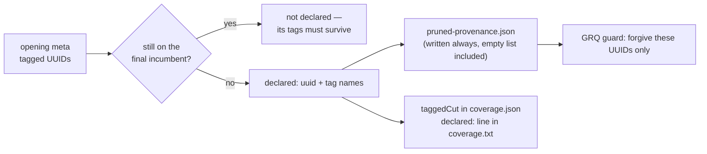

# Declare pruned provenance: publish the tagged neurons a run deliberately removed

## Summary

GRQ's check-in guard refuses any candidate on which a source neuron that carried
`tags` no longer carries them — provenance cannot be recovered from a checked-in
file. Since #63 Ockham prunes tagged neurons legitimately, so it would trip that
guard on every real cut. Turning the guard off would throw away the protection
entirely; instead the run now **declares** what it removed, and the guard can
relax exactly that far.

Each run with an `--output-dir` writes `pruned-provenance.json` beside
`best.json`: a schema version, plus one entry per tagged neuron absent from the
final incumbent, carrying its uuid and the tag names that left with it. The list
is the set difference between the **opening** creature's `neuron_tags` and the
final incumbent — computed once at the end of the run, never incrementally, so
it cannot drift across the replay stage, accepts or sweep restarts, and it
covers every removal path (sweep accept, replay, bundle) by construction.

The file is written **always**, empty list included: an empty `pruned` means
"nothing tagged was pruned", while an absent file means "this build does not
declare" — on which the guard must fail closed. A write fault warns and the run
still completes, with the consequence stated in the doc comment: that run's
check-in is refused, which is the correct outcome.

`Coverage` gained `taggedCut`, rendered as a `declared:` line in the commit
description, so the fleet history shows provenance being spent rather than only
the file recording it. The key is additive and `#[serde(default)]`, so
`coverage.json` still deserialises into the pre-existing shape.

Closes #75.

## Evidence

Backend/CLI change with no web interface, so no screenshot applies. The evidence
is the test suite plus the rendered artefacts, which are pinned byte-exactly
because GRQ `cat`s `coverage.txt` into a commit description without parsing it.

The declaration, as written (`ockham/src/tags.rs::write_pruned_provenance`):

```json
{
  "version": 1,
  "pruned": [
    { "uuid": "h_a", "tags": ["discovered"] }
  ]
}
```

The commit-description block with the new line
(`coverage::tests::the_description_block_declares_the_tagged_neurons_the_run_cut`):

```text
🪒 Ockham neuron screening coverage
checked:   1204 of 5013 hidden (24.0%)
cut:       7 this run
unchecked: 3809 remaining (~39 runs at 100/run)
tagged:    42 carry GRQ provenance, screened like any other
declared:  3 tagged neurons cut, listed in pruned-provenance.json
```



Two deliberate mutations were run against the finished suite to confirm the
tests are detectors rather than decoration:

- declaring **all** opening tagged UUIDs rather than the ones that left → 5
  tests fail, including both surviving-neuron tests;
- computing the declaration from the **live** meta instead of the opening
  snapshot → 3 run-level tests fail (the list silently empties).

Gate: `cargo fmt --check`, `cargo clippy --workspace --all-targets
--all-features -D warnings`, `cargo test --workspace --all-features` (231 lib +
32 integration, 0 failures), `RUSTDOCFLAGS="-D warnings" cargo doc`,
`cargo deny check`, `markdownlint-cli2`, shellcheck and the neat-core version
gate all pass. `./quality.sh` itself stops at its codespell preflight because
`codespell` is not installed in this container and there is no `pip`/`pipx` to
install it; every other step of the script was run individually and passes, and
CI runs codespell for real.

## Acceptance Criteria

<!-- vibe-spec-review inputs="diff+issue-body" -->

- **met** — `pruned-provenance.json` is written on every run with an
  `--output-dir`, empty list included, and has a version field — evidence:
  `ockham/src/run.rs` (the write sits outside the `store.is_some()` guard),
  `ockham/src/run.rs::a_run_that_pruned_nothing_tagged_still_declares_an_empty_list`
  (no `--learnings-dir`) — reviewer: met
- **met** — a test asserts the file lists exactly the tagged UUIDs absent from
  the final incumbent, with their tag names, for a run that prunes some tagged
  and some untagged neurons — evidence:
  `ockham/src/run.rs::a_bundle_accept_declares_only_the_tagged_uuid_it_cut`,
  `ockham/src/tags.rs::the_declaration_lists_the_tagged_uuids_that_left_with_their_tag_names`
  — reviewer: met
- **met** — a test asserts a tagged neuron that survives the run is absent from
  the list — evidence:
  `ockham/src/run.rs::a_surviving_tagged_neuron_stays_out_of_the_declaration`,
  `ockham/src/tags.rs::a_surviving_tagged_neuron_is_never_declared` — reviewer: met
- **met** — a test asserts the file is valid JSON with an empty list when no
  tagged neuron was pruned — evidence:
  `ockham/src/tags.rs::a_run_that_cut_nothing_tagged_declares_an_empty_list_with_a_version`,
  `ockham/src/run.rs::a_run_that_pruned_nothing_tagged_still_declares_an_empty_list`
  — reviewer: met
- **met** — the declaration covers tagged neurons removed by any path, with a
  test covering a bundle accept — evidence:
  `ockham/src/run.rs::a_bundle_accept_declares_only_the_tagged_uuid_it_cut` and
  `ockham/src/run.rs::a_sweep_accept_declares_the_tagged_neuron_it_cut` —
  reviewer: met — reason for the departure in detail: the reviewer marked this
  `met` but named a gap (both end-to-end tests went through the replay path);
  the sweep-accept test was added afterwards to close it
- **met** — a blocked write warns, names the file and does not fail the run —
  evidence: `ockham/src/tags.rs::a_blocked_declaration_write_returns_an_error_naming_the_file`,
  `ockham/src/run.rs::a_blocked_declaration_write_warns_rather_than_failing_the_run`
  (now paired with an unblocked control run) — reviewer: met
- **met** — `Coverage` carries the tagged-cut count, `coverage.json` still
  deserialises into the pre-existing shape, and the description block is pinned
  by an exact-string test — evidence:
  `ockham/src/coverage.rs::the_description_block_declares_the_tagged_neurons_the_run_cut`,
  `ockham/src/coverage.rs::the_tagged_cut_key_is_additive_in_both_directions` —
  reviewer: met
- **met** — `docs/grq-integration.md` documents the file, its schema and the
  fail-closed rule for absence — evidence: `docs/grq-integration.md` section 5a
  plus the new surface-contract row — reviewer: met
- **met** — `./quality.sh` passes — evidence: every step run individually (see
  Evidence) — reviewer: met — reason: the script's codespell preflight cannot
  run in this container (no `codespell`, no `pip`); CI runs it
- **unrequested** — `tagged_cut` added to the journal `Event::Coverage` and
  replayed by `--report` (`ockham/src/journal.rs`, `ockham/src/report.rs`) —
  reviewer: unrequested — reason: criterion 5 asks the fleet history to show
  provenance being spent; `report.rs` had to supply *some* value to compile, and
  journalling the real one beats hard-coding zero. `#[serde(default)]`, so older
  journals still parse
- **unrequested** — `apply_local_win` computes the tagged-cut figure per accept
  for the mid-run `Coverage` (`ockham/src/run.rs`) — reviewer: unrequested —
  reason: that `Coverage` feeds the `ockham` tag clause; filling the field with a
  correct value rather than a placeholder keeps the struct honest for any future
  reader
- **unrequested** — the doc extends the fail-closed rule to an *unknown version*
  (`docs/grq-integration.md`) — reviewer: unrequested — reason: the version field
  is useless to a consumer without a rule for an unrecognised value; it is the
  same fail-closed principle the issue states for absence
- **unrequested** — README gained a Mermaid flowchart of the declaration —
  reviewer: unrequested — reason: the repo's documentation convention asks for a
  diagram where it aids understanding of a data flow
- **unrequested** — singular/plural rendering of the `declared:` line and its
  test — reviewer: unrequested — reason: the block is pasted into thousands of
  fleet commits; "1 tagged neurons" would be visible in every one

## Standards Review

<!-- vibe-standards-review inputs="diff+CODING-STANDARDS.md" -->

- **violation** — crate version not bumped for a binary-affecting change —
  evidence: `ockham/Cargo.toml:3` — reason: fixed here, `0.1.26` → `0.1.27` via
  `scripts/auto-version.sh` (with `Cargo.lock`); unattended machines key their
  rebuild off this version
- **violation** — the blocked-write test asserted nothing that distinguishes
  "write attempted and failed" from "write never reached" — evidence:
  `ockham/src/run.rs:2305` — reason: fixed here; the test now runs the same
  config a second time unblocked as a control, and asserts the blocker is still
  a directory
- **violation** — commit subject used bare `(#75)` rather than the documented
  `(Issue #75)` form — evidence: commit `59b51bd` — reason: fixed here; both
  commits now carry `(Issue #75)`. The rewrite was of unpushed history only
- **violation** — `pruned_provenance` allocates a full declaration per accept
  where only a count is used — evidence: `ockham/src/run.rs:1404` — reason:
  stands. Splitting out a count-only path would duplicate the set-difference
  logic for a saving of a handful of `String`s per *accept* (rare), and the
  single code path is what keeps the mid-run figure and the file in agreement
- **violation** — the PR summary file was missing — evidence:
  `docs/archive/pr-summaries/pr-summary-75.md` — reason: fixed here, this file
- **clean** — Australian English throughout the added prose and comments; no
  swallowed errors (the one non-fatal path warns loudly, names the file and
  states the downstream consequence); all new tests call real code and assert on
  returned values, deserialised structs or written files; rustdoc on every new
  public item; the filename lives in one constant; docs updated in the same
  commit as the code; no hidden paths staged; `Vibe-Coder-Run-Id` trailer present

## Test Plan

New in `ockham/src/tags.rs`:

- `the_declaration_lists_the_tagged_uuids_that_left_with_their_tag_names`
- `a_surviving_tagged_neuron_is_never_declared`
- `a_run_that_cut_nothing_tagged_declares_an_empty_list_with_a_version`
- `the_written_declaration_names_each_pruned_uuid_and_its_tags`
- `a_blocked_declaration_write_returns_an_error_naming_the_file`

New in `ockham/src/coverage.rs`:

- `the_description_block_declares_the_tagged_neurons_the_run_cut` (exact string)
- `a_single_declared_cut_reads_singular`
- `the_description_omits_the_declared_line_when_no_tagged_neuron_was_cut`
- `the_tagged_cut_key_is_additive_in_both_directions`
- `the_tagged_cut_count_is_carried_through_rather_than_derived`

New in `ockham/src/run.rs` (end to end through `establish_run`):

- `a_bundle_accept_declares_only_the_tagged_uuid_it_cut`
- `a_sweep_accept_declares_the_tagged_neuron_it_cut`
- `a_surviving_tagged_neuron_stays_out_of_the_declaration`
- `a_run_that_pruned_nothing_tagged_still_declares_an_empty_list`
- `a_blocked_declaration_write_warns_rather_than_failing_the_run`
- `the_coverage_artefacts_count_the_tagged_neuron_the_run_cut`

Existing tests were updated only where the added `Coverage` field or the new
`coverage()` parameter required it; none was removed or weakened.
