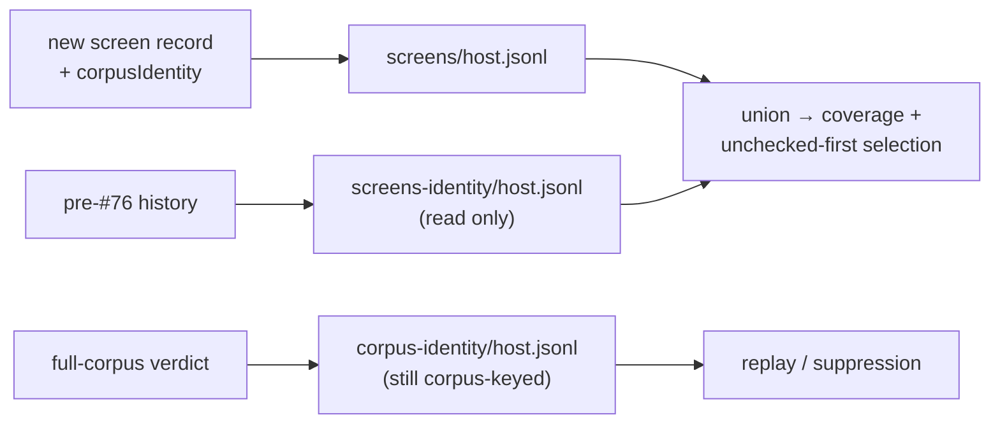

# Screen coverage outlives the corpus identity (Issue #76)

## Summary

Screen records were keyed by the corpus identity —
`<root>/screens-<identity>/<host>.jsonl`. GRQ regenerates the training corpus
before every Ockham run, so a fresh identity is the normal case: each run looked
up a directory nothing had written under that identity, `load_screens()` came
back with only that identity's slice, and `prefer_unchecked` re-screened neurons
another identity had already covered.

A screen record is a coverage fact ("this uuid has been looked at"), not a
verdict, so the corpus it was measured against does not change whether it has
been looked at. Screens now live in one stable `<root>/screens/<host>.jsonl`
with the identity carried on the record (`corpusIdentity`, screen format
version 2), pre-#76 `screens-<identity>/` directories are still read so no fleet
history is lost, and verdicts stay exactly where they were — a full-corpus
`Accepted`/`Rejected` genuinely is a claim about one corpus, so
`corpus-<identity>/` is untouched.

Closes #76.

## Evidence

Backend/CLI change — no web interface to screenshot. The evidence is the
learnings-repo survey recorded on the issue before the fix landed, plus the
tests below.

Step 1 of the issue asked for confirmation from the GRQ-Ockham learnings repo
before changing anything. That survey is
[commented on the issue](https://github.com/stSoftwareAU/NEAT-AI-Ockham/issues/76#issuecomment-5492880405):
three thinly-populated `screens-*` directories rather than one fat one —
`screens-6fc0…` 1500 records / 1260 uuids, `screens-1c15…` 500/500,
`screens-e878…` 300/294 — with the identities live concurrently and heavy
overlap between them (`screens-1c15…` ∩ `screens-6fc0…` = 415 of 500; 83%).
Union across all three: 1366 uuids; most any single run could see: 1260. The
partition is real and cost the fleet roughly 667 duplicate screens.

The same survey found the specific eight-run plateau in the stated window had a
second cause — those runs applied a replay win and stopped before the sweep
screened anything, filing no screen records at all. That per-run progress hole
is the sibling child of #63 and is out of scope here, as the issue states; the
corpus-identity partition documented above is this issue's own root cause and is
confirmed independently of it.

## Reproduction

- **symptom** — screen coverage reset between runs: every run reported roughly
  the count a single run achieves (`~190 of 3,033`), and the fleet re-screened
  neurons it had already checked because `prefer_unchecked` read an
  identity-partitioned set
- **status** — `verified` — the regression test was run against the unfixed code
  in a worktree at the base commit and failed with
  `coverage reset when the corpus identity changed: 2 then 2`; it passes on this
  branch
- **regression test** —
  `ockham/src/run.rs::run::tests::a_second_run_against_a_regenerated_corpus_advances_fleet_coverage`

## Test Plan

Added in `ockham/src/learnings.rs`:

- `screens_survive_a_corpus_identity_change` — screens written under one
  identity are returned by a store built with a different one.
- `legacy_corpus_keyed_screens_still_count_as_checked` — a hand-built
  `screens-<identity>/<host>.jsonl` version-1 line counts as checked alongside a
  new record, and keeps `corpus_identity: None`.
- `a_verdict_from_another_corpus_identity_is_still_not_loaded` — the near miss:
  the widened screens path must not widen the verdict path.
- `a_corrupt_screen_line_cannot_break_verdict_loading` — corruption is loud on
  the screens side and verdict loading is unaffected.
- `unknown_version_legacy_screen_lines_are_skipped` — a newer-version line in
  the legacy location is skipped, not a hard failure; the pre-existing
  `unknown_version_screen_lines_are_skipped` still holds.
- `a_screen_record_carries_the_corpus_it_was_measured_against` — the identity
  the path stopped carrying is on the record.

Added in `ockham/src/run.rs`:

- `a_second_run_against_a_regenerated_corpus_advances_fleet_coverage` — two runs
  over one learnings root against corpora with different identities; the second
  run's coverage is strictly greater (2 → 4).

Gate: `cargo fmt --check`, clippy with the repo's flags, `cargo deny check`,
`markdownlint-cli2`, rustdoc with `-D warnings` and
`cargo test --workspace --all-features` (238 lib tests + integration suites) all
pass. `./quality.sh` stops at its codespell preflight because `codespell` is not
installed in this container and there is no `pip`/`pipx` to install it — CI runs
that step for real; every other step of the gate was run individually and
passes.
