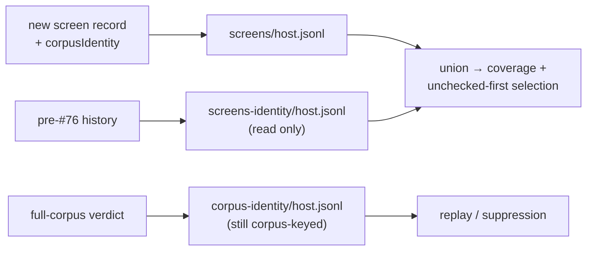

# Screen coverage outlives the corpus identity (Issue #76)

## Summary

Screen records were keyed by the corpus identity —
`<root>/screens-<identity>/<host>.jsonl`. GRQ regenerates the training corpus
before every Ockham run, so a fresh identity is the normal case: each run looked
up a directory nothing had written under that identity, `load_screens()` came
back with only that identity's slice, and `prefer_unchecked` re-screened neurons
another identity had already covered.

A screen record is a coverage fact ("this uuid has been looked at"), not a
verdict, so the corpus it was measured against does not change whether it has
been looked at. Screens now live in one stable `<root>/screens/<host>.jsonl`
with the identity carried on the record (`corpusIdentity`, screen format
version 2), pre-#76 `screens-<identity>/` directories are still read so no fleet
history is lost, and verdicts stay exactly where they were — a full-corpus
`Accepted`/`Rejected` genuinely is a claim about one corpus, so
`corpus-<identity>/` is untouched.

Closes #76.

## Evidence

Backend/CLI change — no web interface to screenshot. The evidence is the
learnings-repo survey recorded on the issue before the fix landed, plus the
tests below.

Step 1 of the issue asked for confirmation from the GRQ-Ockham learnings repo
before changing anything. That survey is
[commented on the issue](https://github.com/stSoftwareAU/NEAT-AI-Ockham/issues/76#issuecomment-5492880405):
three thinly-populated `screens-*` directories rather than one fat one —
`screens-6fc0…` 1500 records / 1260 uuids, `screens-1c15…` 500/500,
`screens-e878…` 300/294 — with the identities live concurrently and heavy
overlap between them (`screens-1c15…` ∩ `screens-6fc0…` = 415 of 500; 83%).
Union across all three: 1366 uuids; most any single run could see: 1260. The
partition is real and cost the fleet roughly 667 duplicate screens.

The same survey found the specific eight-run plateau in the stated window had a
second cause — those runs applied a replay win and stopped before the sweep
screened anything, filing no screen records at all. That per-run progress hole
is the sibling child of #63 and is out of scope here, as the issue states; the
corpus-identity partition documented above is this issue's own root cause and is
confirmed independently of it.

## Reproduction

- **symptom** — screen coverage reset between runs: every run reported roughly
  the count a single run achieves (`~190 of 3,033`), and the fleet re-screened
  neurons it had already checked because `prefer_unchecked` read an
  identity-partitioned set
- **status** — `verified` — the regression test was run against the unfixed code
  in a worktree at the base commit and failed with
  `coverage reset when the corpus identity changed: 2 then 2`; it passes on this
  branch
- **regression test** —
  `ockham/src/run.rs::run::tests::a_second_run_against_a_regenerated_corpus_advances_fleet_coverage`

## Acceptance Criteria

<!-- vibe-spec-review inputs="diff+issue-body" -->

- **met** — the root cause is stated on the issue with the evidence that
  established it, before the fix lands — evidence:
  [issue #76 comment](https://github.com/stSoftwareAU/NEAT-AI-Ockham/issues/76#issuecomment-5492880405)
  — reviewer: met
- **met** — screens survive a corpus identity change — evidence:
  `ockham/src/learnings.rs::learnings::tests::screens_survive_a_corpus_identity_change`
  — reviewer: met
- **met** — records written by the previous layout are still read — evidence:
  `ockham/src/learnings.rs::learnings::tests::legacy_corpus_keyed_screens_still_count_as_checked`
  — reviewer: met
- **met** — verdict loading is unaffected; a foreign-corpus verdict is still not
  loaded — evidence:
  `ockham/src/learnings.rs::learnings::tests::a_verdict_from_another_corpus_identity_is_still_not_loaded`
  — reviewer: met
- **met** — a corrupt or unknown-version screen line is skipped rather than
  failing the run, and cannot break verdict loading — evidence:
  `ockham/src/learnings.rs::learnings::tests::a_corrupt_screen_line_cannot_break_verdict_loading`,
  `::unknown_version_legacy_screen_lines_are_skipped`,
  `::a_below_legacy_screen_version_is_skipped`, run-level warn path at
  `ockham/src/run.rs:553-567` — reviewer: met, with a caveat it raised as
  "risk B": a corrupt line in a legacy directory poisoned the whole union, so
  coverage would have gone to zero fleet-wide. Fixed in this diff — a legacy
  directory fault is now warned and skipped
  (`learnings.rs::load_screens`), covered by
  `::a_corrupt_legacy_screen_file_does_not_empty_the_union`
- **met** — two successive runs over differing corpora show strictly greater
  coverage — evidence:
  `ockham/src/run.rs::run::tests::a_second_run_against_a_regenerated_corpus_advances_fleet_coverage`
  — reviewer: met
- **met** — `README.md` and `docs/grq-integration.md` describe the new on-disk
  layout — evidence: `README.md:52-56,345-399`, `docs/grq-integration.md:236-263`
  — reviewer: met
- **partial** — `./quality.sh` passes — evidence: every step run individually —
  shellcheck, neat-core gate, markdownlint (0 issues), `cargo deny check`,
  `cargo fmt --check`, clippy with the repo's flags,
  `cargo test --workspace --all-features` (240 + 32 tests, 0 failures), rustdoc
  with `-D warnings` — reviewer: partial — reason: the script aborts at its
  codespell preflight because `codespell` is not installed in this container and
  there is no `pip`/`pipx` to install it; CI runs that step for real, and the
  added prose was swept manually instead
- **unrequested** — crate version bump 0.1.27 → 0.1.28 (`ockham/Cargo.toml`,
  `Cargo.lock`) — reviewer: unrequested — reason: `CONTRIBUTING.md` principle 8
  requires a bump for binary-affecting changes, otherwise the unattended
  machines keep running the stale binary
- **unrequested** — the stray-directory assertion in
  `ockham/src/run.rs:2702` widened from `starts_with("screens-")` to
  `starts_with("screens")` — reviewer: traced to a scope item — reason: the
  directory it guards against was renamed by this change

The reviewer also flagged two additions as unrequested public API — `pub const
SCREENS_DIR` and a `corpus_identity()` accessor used only by a test. Both are
gone from this diff: the constant is private and the accessor was replaced by a
literal in the test fixture, so the crate's public surface is unchanged.

## Standards Review

<!-- vibe-standards-review inputs="diff+CODING-STANDARDS.md" -->

The repo has no `CODING-STANDARDS.md`; the reviewer used `CONTRIBUTING.md` plus
the machine-enforced rules in `quality.sh`, `.codespellrc`, `.markdownlint.json`
and `#![warn(missing_docs)]`.

- **violation** — non-UTF-8 legacy directory names were silently dropped inside
  the function whose doc-comment promises fail-loud — evidence:
  `ockham/src/learnings.rs:253` — reason: fixed here; the prefix is matched on
  `OsStr::as_encoded_bytes`, so no directory is dropped for its name's encoding
- **violation** — `pub const SCREENS_DIR` was new public API with no external
  consumer — evidence: `ockham/src/learnings.rs:115` — reason: fixed here; the
  constant is now private
- **violation** — `pub fn corpus_identity()` was a test-only accessor promoted
  to public API — evidence: `ockham/src/learnings.rs:222` — reason: fixed here;
  removed, and the test fixture uses a literal identity
- **violation** — `docs/grq-integration.md` says its layout block comes "from
  the file's own header", but the header did not mention the legacy directory or
  the island root — evidence: `docs/grq-integration.md:236-243` — reason: fixed
  here; the module header now documents both, so the claim is true
- **violation** — the checkpointed WIP commit `c59c121` carries the harness's
  own subject and cites Issue #47 — evidence: commit `c59c121` — reason: it
  stands; it was already pushed, and rewriting shared history to reword a
  checkpoint is a worse trade than the soft convention breach. Every commit
  authored in this run uses the 🪒 prefix and cites #76
- **clean** — Australian English throughout the added prose and code; every new
  public item documented with rationale (`missing_docs` + rustdoc `-D warnings`
  pass); all new tests drive real code paths, including an end-to-end
  `establish_run` over two corpora; errors returned rather than swallowed;
  change confined to the owning module; the additive-optional serde field
  matches the pattern `Learning::full_delta` already sets; version bumped per
  `CONTRIBUTING.md` principle 8 with no changelog added.

## Test Plan

Added in `ockham/src/learnings.rs`:

- `screens_survive_a_corpus_identity_change` — screens written under one
  identity are returned by a store built with a different one.
- `legacy_corpus_keyed_screens_still_count_as_checked` — a hand-built
  `screens-<identity>/<host>.jsonl` version-1 line counts as checked alongside a
  new record, and keeps `corpus_identity: None`.
- `a_verdict_from_another_corpus_identity_is_still_not_loaded` — the near miss:
  the widened screens path must not widen the verdict path.
- `a_corrupt_screen_line_cannot_break_verdict_loading` — corruption is loud on
  the screens side and verdict loading is unaffected.
- `unknown_version_legacy_screen_lines_are_skipped` — a newer-version line in
  the legacy location is skipped, not a hard failure; the pre-existing
  `unknown_version_screen_lines_are_skipped` still holds.
- `a_screen_record_carries_the_corpus_it_was_measured_against` — the identity
  the path stopped carrying is on the record.
- `a_below_legacy_screen_version_is_skipped` — a version older than the fleet
  history is unknown, not "legacy enough".
- `a_corrupt_legacy_screen_file_does_not_empty_the_union` — one corrupt legacy
  directory costs only its own records; the live directory and the other legacy
  directories still count.

Added in `ockham/src/run.rs`:

- `a_second_run_against_a_regenerated_corpus_advances_fleet_coverage` — two runs
  over one learnings root against corpora with different identities; the second
  run's coverage is strictly greater (2 → 4).

Gate: `cargo fmt --check`, clippy with the repo's flags, `cargo deny check`,
`markdownlint-cli2`, rustdoc with `-D warnings` and
`cargo test --workspace --all-features` (240 lib tests + integration suites) all
pass. `./quality.sh` stops at its codespell preflight because `codespell` is not
installed in this container and there is no `pip`/`pipx` to install it — CI runs
that step for real; every other step of the gate was run individually and
passes.
