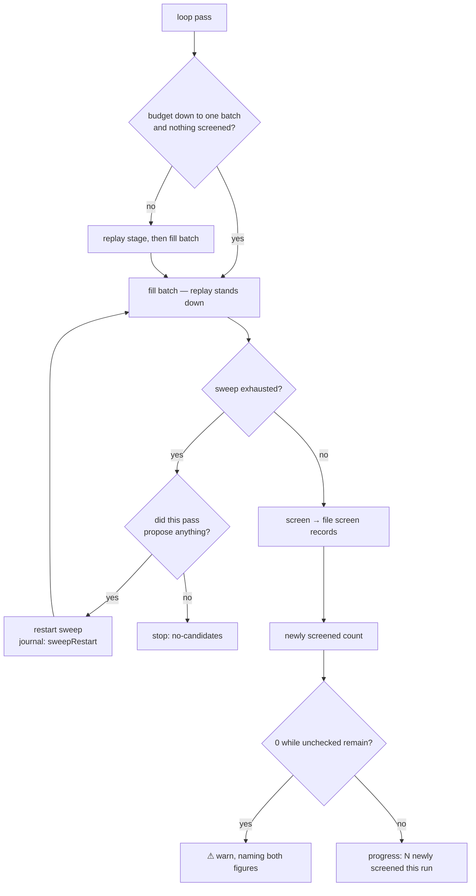

# Guarantee per-run screening progress (Issue #77)

## Summary

Every screening run must advance the checked count until 100% of the hidden
neurons have been tried, and then restart the sweep. Nothing asserted that, and
three paths broke it. Closes #77.

- **An exhausted sweep restarts.** It used to end the run outright
  (`stop_reason = "exhausted"`), so a creature the fleet had worked all the way
  through stopped being screened with its budget unspent. A fresh permutation is
  built through the one `fresh_sweep` seam the opening sweep and the post-accept
  restart already needed, unchecked-first then stalest-first, logged and
  journalled as a `sweepRestart` record.
- **Nothing spins, and a barren pass stops.** A whole pass in which not one
  hidden neuron produced a candidate would restart into the same nothing, so the
  run stops with `no-candidates` instead.
- **One screening batch is reserved from the wall clock.** Once the budget left
  falls to the estimated cost of one screening batch — and only while this run
  has screened nothing — the replay stage stands down and the sweep takes what
  remains. The reserve is claimed *inside* the budget: no scorer call starts
  after the deadline, so the #69 soft-budget contract is untouched. Sizing (the
  risk the issue flags) is argued at the reserve site in `reserve_stands`: it is
  exactly one batch, never a share of the budget, because the cost falls on
  full-corpus scoring where accepts come from, and a fleet that screens
  diligently while pruning nothing looks like healthy rising coverage. A batch
  costing more than half the run budget is the whole plan, not a reserve, and
  none is taken.
- **A zero-progress run reports itself.** The distinct UUIDs a run moved from
  unscreened to screened are counted and carried in the `stop` journal record,
  the run summary and a `progress:` line in the commit-description block, and a
  run that ends with zero of them while unchecked neurons remain logs a warning
  naming both figures.



## Evidence

Backend/CLI only — there is no web interface to screenshot. The evidence is the
journal, the coverage artefacts and the binary's own stderr, asserted by tests.

The reproduction was run against the unfixed tree in a throw-away git worktree
at the pre-change commit (`a74ced5`), with the shipped regression tests copied
in:

```text
# unfixed: ockham/tests/sweep_restart.rs
assertion `left == right` failed: the loop must keep filling batches:
  [Object {"batch": 0, "candidates": 2, "record": "batch", "remaining": 0, "skipped": 0}]
  left: 1
 right: 4

# unfixed: ockham/tests/cli.rs::a_run_that_screens_nothing_warns_that_it_advanced_no_coverage
● stop reason=max-experiments  accepts=0  experiments=0  Δ=0.000e0     ← no warning, no figure
```

Both pass on this branch. Full gate output:

```text
cargo fmt --all -- --check        ok
cargo clippy --workspace --all-targets --all-features
  -D warnings -D clippy::filter_next -D clippy::collapsible_if   ok
cargo test --workspace --all-features -- --test-threads=2        254 + 34 tests, 0 failures
RUSTDOCFLAGS="-D warnings" cargo doc --workspace --no-deps        ok
cargo deny check                  advisories ok, bans ok, licenses ok, sources ok
markdownlint-cli2                 0 issues
```

`./quality.sh` could not complete **in this container**: its codespell
preflight exits 1 because codespell is not installed and cannot be installed
here (no `pip`, no root). Every other gate it runs is listed above and passes;
CI runs codespell for real.

## Reproduction

- **symptom** — a run that had visited every hidden neuron did not restart its
  sweep: it stopped there with its budget unspent, and a run that screened
  nothing at all (replay took the budget, or the loop never reached a batch)
  reported the same well-formed coverage block as a run that screened a full
  batch — the #63 plateau ran eight runs on that silence.
- **status** — `verified` — both regression tests were run against the unfixed
  code in a worktree at `a74ced5` and observed failing (output quoted above),
  and pass after the fix.
- **regression test** — `ockham/tests/sweep_restart.rs::an_exhausted_sweep_restarts_rather_than_idling`
  and `ockham/tests/cli.rs::a_run_that_screens_nothing_warns_that_it_advanced_no_coverage`

## Acceptance Criteria

<!-- vibe-spec-review inputs="diff+issue-body" -->

- **met** — a test drives a run to sweep exhaustion and asserts the sweep restarts, on batch events not wall-clock — evidence: `ockham/src/run.rs::an_exhausted_sweep_restarts_rather_than_issuing_empty_batches` (4 batch records, all with 2 candidates; 3 `sweepRestart` records) and `ockham/tests/sweep_restart.rs::an_exhausted_sweep_restarts_rather_than_idling` — reviewer: met
- **met** — a fully screened creature still fills batches after restart, stalest-first — evidence: `ockham/src/run.rs::a_fully_screened_creature_refills_after_a_restart_stalest_first` and `::a_run_over_a_fully_screened_creature_recycles_stalest_first_across_a_restart` — reviewer: met — note: the loop-level test asserts stalest-first for the pre-restart fills only; both post-restart candidates carry a record from the same whole second by then, so their staleness is genuinely equal and the exact order is asserted at unit level
- **met** — a run whose every hidden neuron fails to propose terminates with a stop reason — evidence: `ockham/src/run.rs::a_creature_that_can_never_propose_stops_instead_of_looping` (`stop_reason == "no-candidates"`, no restart journalled) — reviewer: met — note: the barren pass is produced by a cache full of fresh rejections rather than by `propose` erroring; both reach the same `pass_candidates == 0` guard, and the warning now names both causes
- **met** — a run with a budget large enough for one batch screens one batch, even when replay has work queued — evidence: `ockham/src/run.rs::a_run_down_to_its_last_batch_screens_it_rather_than_replaying`, plus the sizing rules in `::the_screening_reserve_is_sized_at_one_batch` and `::the_reserve_stands_only_when_the_budget_is_down_to_one_batch` — reviewer: met — note: the reviewer confirmed the test is non-vacuous (forcing `reserving = false` fails it) and flagged it as the one wall-clock-coupled test; the margin is >30% jitter and it is the only place a reserve about time left can be tested
- **met** — the `Stop` journal event carries the count of UUIDs newly screened this run, and a test asserts it — evidence: `ockham/src/journal.rs` `Stop { newly_screened }`; `ockham/src/run.rs::the_stop_record_and_run_summary_carry_the_uuids_newly_screened` — reviewer: met
- **met** — a run ending with zero newly-screened UUIDs while unchecked neurons remain warns, naming both figures — evidence: `ockham/src/coverage.rs::a_run_that_advanced_nothing_warns_naming_both_figures` and the stderr assertion `ockham/tests/cli.rs::a_run_that_screens_nothing_warns_that_it_advanced_no_coverage` — reviewer: met
- **met** — two successive runs show the second's checked count advanced by the batch size, bounded by the unchecked remainder — evidence: `ockham/src/run.rs::two_successive_runs_advance_the_checked_count_by_the_batch_size` (3 neurons, batch 2: 2 then 1, `unchecked == 0`) — reviewer: met
- **met** — `README.md` states the progress guarantee and the restart-at-100% behaviour — evidence: `README.md` "Every run advances the checked count" — reviewer: met
- **partial** — `./quality.sh` passes — evidence: gate output above — reviewer: met — reason: departing from the reviewer's verdict deliberately, since it could not run the script end to end either: codespell is absent from this container and cannot be installed, so the script's preflight exits 1. Every other check it runs passes; CI runs codespell.
- **unrequested** — `Report.sweep_restarts` and its README bullet — reviewer: unrequested — reason: `report.rs` matches `Event` exhaustively, so the new variant forced an arm; counting a meaningful fleet event beats discarding it silently, and it is tested by `report_counts_the_sweeps_a_run_rebuilt`
- **unrequested** — `newlyScreened` key in `coverage.json` — reviewer: unrequested — reason: point 5 asks for the description block, and `coverage.json` is documented as "the same figures as JSON"; letting the two disagree would be the worse artefact. Round-trip and pre-#77 back-compat are tested
- **unrequested** — `"exhausted"` retired as a stop reason, the hidden-exhaustion exit now `"no-hidden"` — reviewer: unrequested — reason: point 1 removes the only path that set it; leaving a reason string alive with a silently different meaning was the alternative. Recorded in `README.md`
- **unrequested** — `MAX_SCREEN_RESERVE_SHARE` half-budget cap on the reserve — reviewer: unrequested — reason: point 3 makes sizing the implementer's judgement; without the cap a creature whose batch costs more than the run budget would stand replay down on every pass forever
- **unrequested** — `CostModel::observe_baseline`, threading `baseline.scorer_ms` into the loop — reviewer: traceable, not creep — reason: the reserve must be sized before any cohort has run; kept out of the rolling cohort estimate so cohort sizing is unchanged

## Standards Review

<!-- vibe-standards-review inputs="diff+CONTRIBUTING.md" -->

The repo has no `CODING-STANDARDS.md`; the reviewer was given `CONTRIBUTING.md`
and the house style visible in the surrounding source.

- **violation** — the prose claimed the pre-change loop spun on an exhausted sweep and exited as `timeout`; it did not, it stopped cleanly with `exhausted` — evidence: `README.md` motivating paragraph, `ockham/src/run.rs` restart comment, two test docs — reason: fixed in this diff; all four now describe the early stop that was actually replaced
- **violation** — `reserve_stands`'s doc claimed a "screened nothing so far" condition the function did not implement (it lived in the caller) — evidence: `ockham/src/run.rs` — reason: fixed — the guard moved into the function, and the test now asserts it
- **violation** — the reserve stand-down logged at `warn`, the same severity as the zero-progress warning the issue exists to make visible — evidence: `ockham/src/run.rs` — reason: fixed, downgraded to `info`
- **violation** — the barren-pass warning told the operator no neuron could propose when the cause was a cache of fresh rejections — evidence: `ockham/src/run.rs` — reason: fixed, the line names both causes
- **violation** — `Report.sweep_restarts` and the `sweepRestarts` README promise had no test — evidence: `ockham/src/report.rs` — reason: fixed, `report_counts_the_sweeps_a_run_rebuilt` added
- **violation** — `report.rs`'s reason for not aggregating `newly_screened` equated it with `screened`, which counts every record including re-screens — evidence: `ockham/src/report.rs` — reason: fixed, the comment now gives the real reason
- **violation** — test journal readers used `filter_map(… .ok())`, so a broken serialisation would look like a missing record — evidence: `ockham/src/run.rs`, `ockham/tests/sweep_restart.rs` — reason: fixed, an unparseable line now fails the test
- **violation** — a stale "serde ignores the extra key" (singular) on `CoverageReport`, which now has two — evidence: `ockham/src/coverage.rs` — reason: fixed
- **violation** — the reserve test's doc claimed determinism while depending on the wall clock — evidence: `ockham/src/run.rs` — reason: fixed, the doc now states the dependence and the margin; the mechanism itself is covered by two clock-free unit tests
- **violation** — `run.rs` grows past 3,700 lines — evidence: `ockham/src/run.rs` — reason: partly addressed — `ScreenProgress` and `zero_progress_warning` moved to `coverage.rs` beside the figures they report; the loop changes themselves belong in `run.rs`, and splitting that file is a separate change
- **clean** — Australian English throughout the added prose and identifiers; rustdoc on every new public item stating *why*; the version bump 0.1.28 → 0.1.29 with `Cargo.lock`, per `CONTRIBUTING.md`; no swallowed errors (journal writes stay `?`-propagated, and `ScreenProgress` counts only records `file_screens` actually filed, so a store fault cannot be mistaken for coverage gained); serde naming consistent with its neighbours (snake_case journal payloads, camelCase artefacts) with `#[serde(default)]` back-compat round-trip tested; tests call real functions and assert on real artefacts, never on source text; `fresh_sweep` removes three duplicated sweep-construction sites

## Test Plan

Added (`ockham/src/run.rs`):

- `an_exhausted_sweep_restarts_rather_than_issuing_empty_batches` — four batches,
  never empty, three journalled restarts.
- `a_fully_screened_creature_refills_after_a_restart_stalest_first` — the restart's
  own `fresh_sweep` call orders and fills stalest-first.
- `a_run_over_a_fully_screened_creature_recycles_stalest_first_across_a_restart` —
  the same through the loop, one screen record per batch across the restart.
- `a_creature_that_can_never_propose_stops_instead_of_looping` — `no-candidates`.
- `the_screening_reserve_is_sized_at_one_batch`,
  `the_reserve_stands_only_when_the_budget_is_down_to_one_batch` — the sizing and
  the claim conditions, clock-free.
- `a_run_down_to_its_last_batch_screens_it_rather_than_replaying` — the reserve
  end to end, with replay work queued.
- `the_stop_record_and_run_summary_carry_the_uuids_newly_screened`,
  `a_run_that_screened_nothing_reports_zero_progress`,
  `two_successive_runs_advance_the_checked_count_by_the_batch_size`.

Added (`ockham/src/coverage.rs`): `only_a_first_ever_screen_record_counts_as_progress`,
`a_run_that_advanced_nothing_warns_naming_both_figures`,
`a_run_that_advanced_nothing_still_renders_its_zero_progress`.

Added (`ockham/src/report.rs`): `report_counts_the_sweeps_a_run_rebuilt`.

Added (`ockham/tests/`): `sweep_restart.rs::an_exhausted_sweep_restarts_rather_than_idling`
and `cli.rs::a_run_that_screens_nothing_warns_that_it_advanced_no_coverage` — the
two reproductions, driving the shipped binary.

Modified, and why:

- `coverage.rs::a_run_with_no_winners_renders_exactly_todays_block` and
  `both_files_are_written_and_the_json_deserialises_back_into_coverage` — the
  description block now always carries the `progress:` line, so these compare
  against `CoverageReport::description` rather than `Coverage::description`.
- `coverage.rs::the_winners_block_renders_exactly_as_grq_will_paste_it` and the
  two line-omission tests — the expected block gains the `progress:` line.
- `run.rs::the_run_writes_the_coverage_description_and_json_beside_best_json` —
  asserts the text renders the JSON figures via `CoverageReport`, and that the
  run's own progress figure is in both.
- `report.rs` stop-event fixtures — the `Stop` event gained `newly_screened`.
