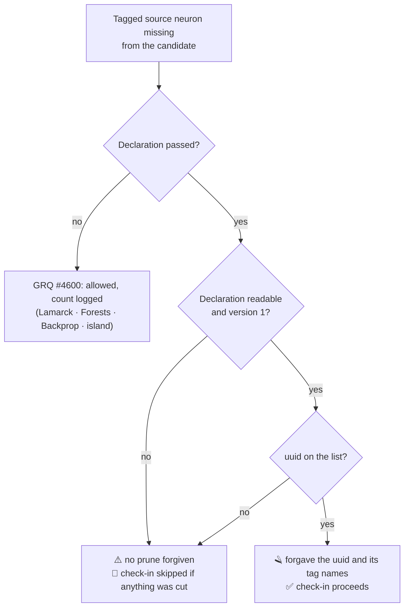

## Summary

Relaxed GRQ's check-in provenance guard for Ockham's **declared** prunes only,
and recorded the resulting contract in this repo's `docs/grq-integration.md`.
Closes #78.

The load-bearing change is in `stSoftwareAU/GRQ` — the issue says so, and the
guard lives there. It is on the branch
`issue-78-ockham-declared-prune-provenance-guard`, pushed to GRQ, with the PR
declared through the cross-repo marker (base `Develop`). This repository's own
diff is the documentation half of the same contract: section 5a of
`docs/grq-integration.md` now describes both what Ockham publishes (Issue #75)
and what the guard does with it, in a rule block that is **byte-identical** to
GRQ's `worker/teams/README.md`.

**What the guard does now.** `worker/Ockham/run.sh` passes
`<output-dir>/pruned-provenance.json` as the sixth argument of
`grq_creature_guard_checkin_lineage`. In that declared mode a tagged neuron
missing from the candidate is forgiven **only** when its uuid is on the list;
every other absence is fatal again.

**Why it is a tightening as much as a relaxation.** GRQ #4600 — which landed
after this issue was written — had already relaxed rule 2 so that *any* tagged
neuron absent from the candidate is forgiven, on every path. That unblocks
Ockham but also forgives the failure #4216 exists to catch: a serialisation bug
that dropped a tagged neuron Ockham never touched. Scoping the forgiveness to
the declaration restores that protection for Ockham without touching Lamarck,
Forests, Backprop or island acceptance, which stay exactly on #4600. This is
what acceptance criterion 2 ("the same tags missing but **no** declaration is
still declined") requires, and it is only observable as a change because #4600
landed first.



## Evidence

Backend/CLI change across two repositories — no web interface to screenshot.
The evidence is the test suites, all run in the foreground with stdin from
`/dev/null`.

In `stSoftwareAU/GRQ` (branch `issue-78-ockham-declared-prune-provenance-guard`):

```text
bash worker/shared/test_creature_provenance_guard.sh   200 passed, 0 failed (was 145)
bash worker/shared/test_ockham_checkin.sh               50 passed, 0 failed (was 36)
bash worker/shared/test_island_provenance_skip.sh        7 passed, 0 failed (unchanged)
bash worker/shared/test_checkin_gate_coverage.sh        23 passed, 0 failed (unchanged)
bash worker/shared/test_checkin_gate_wiring.sh          18 passed, 0 failed (unchanged)
bash worker/shared/test_checkin_gate_publishers.sh      33 passed, 0 failed (unchanged)
bash quality/bash_syntax.sh                              551 scripts, all pass
bash quality/shellcheck.sh                               pass
bash quality/portability_guard.sh                        pass
bash quality/shell_source_chain.sh                       315 scripts, all pass
bash quality/impacted_tests.sh                           52 passed, 0 failed (Deno)
markdownlint-cli2 worker/teams/README.md                 0 issues
```

In this repository:

```text
./quality.sh            bash syntax · shellcheck · neat-core version gate: pass
                        codespell: NOT RUN — not installed and this container has
                        no pip/ensurepip to install it; CI runs it for real
markdownlint-cli2       21 files, 0 issues
cargo fmt --all -- --check                               pass
cargo clippy --workspace --all-targets --all-features    pass
```

No Rust source changed here (the diff is one Markdown file), so the crate gates
are unaffected. The codespell gap is an environment limitation, not a finding:
the diff was read for Australian English by hand and by grep (`optimiz`,
`behavior`, `honor`, `recogniz`, `analyz`, `summariz`, `defense`, `color` — no
hits).

## Acceptance Criteria

<!-- vibe-spec-review inputs="diff+issue-body" -->

- **met** — a test asserts a candidate that pruned a declared tagged neuron
  passes the Ockham guard — evidence:
  `worker/shared/test_creature_provenance_guard.sh::a declared prune passes the Ockham gate`,
  end-to-end at `worker/shared/test_ockham_checkin.sh::a declared prune is a success`
  — reviewer: met
- **met** — a test asserts the same candidate with no declaration is still
  declined — evidence:
  `test_creature_provenance_guard.sh::the same prune with an empty declaration is declined`
  and `::an absent declaration file declines the same prune`;
  `test_ockham_checkin.sh::nothing was checked in without a declaration`
  — reviewer: met
- **met** — a test asserts a candidate that dropped tags from a neuron still
  present is declined, declared or not — evidence:
  `test_creature_provenance_guard.sh::a stripped survivor is declined even when its uuid is declared`,
  alongside the pre-existing undeclared case — reviewer: met
- **met** — a test asserts an undeclared uuid missing alongside a declared one is
  declined — evidence:
  `test_creature_provenance_guard.sh::an undeclared uuid alongside a declared one is declined`
  and `::and names only the undeclared uuid` — reviewer: met
- **met** — a test asserts a malformed or empty declaration file is declined,
  not ignored — evidence:
  `test_creature_provenance_guard.sh::a malformed declaration declines the same prune`,
  `::an empty declaration file declines the same prune`, the seven parser cases,
  and `test_ockham_checkin.sh::a malformed declaration is a clean skip`
  — reviewer: met
- **met** — a test asserts Lamarck, Forests and Backprop behaviour is
  byte-identical, including their log output — evidence:
  `test_creature_provenance_guard.sh::<worker>'s gate log is unchanged by the relaxation`
  and `::<worker>'s lineage log is unchanged, no rebase`, both asserting full
  stderr for all three workers — reviewer: **partial** — reason: the reviewer saw
  only Lamarck asserted byte-for-byte and Forests/Backprop asserted on exit code;
  the loop covering all three on both gate shapes was added in the follow-up
  commit `b0d552c`, after the reviewed diff was cut.
- **met** — the existing strict-path tests pass unchanged — evidence:
  `test_island_provenance_skip.sh` (7/7) and `test_checkin_gate_coverage.sh`
  (23/23), neither file touched by the diff — reviewer: met
- **met** — forgiven prunes appear in the log with uuid and tag names, truncated
  to the existing list cap — evidence:
  `creature_provenance_guard.sh` `forgave declared prune(s):` line;
  `test_creature_provenance_guard.sh::and the forgiven list is truncated at the existing cap`
  asserts `(+3 more)` on eight declared prunes — reviewer: met
- **met** — the lineage double-check still refuses an undeclared lineage and
  still checks both `onto-candidate` hops — evidence:
  `test_creature_provenance_guard.sh::a replaced candidate with no declared base is refused, declaration or not`,
  `::onto-candidate: the optimiser hop is still checked under a declaration`,
  `::onto-candidate: a loss on the rebase hop is not excused by the declaration`
  — reviewer: met
- **met** — `worker/teams/README.md` and `docs/grq-integration.md` describe the
  relaxation identically — evidence: the six-bullet rule block is byte-identical
  in both files (verified with `diff`) — reviewer: **partial** — reason: the
  reviewer saw a paraphrase with two sentences present on only one side; the
  blocks were made byte-identical in the follow-up commit `b0d552c`, after the
  reviewed diff was cut.
- **met** — GRQ's own shell lint / test suite passes — evidence: the GRQ block
  under **Evidence** above — reviewer: met
- **unrequested** — the rebase hop of a *declared* lineage is stricter than
  #4600: it runs in declared mode with an empty list, so a tagged neuron the
  rebase dropped is refused for Ockham where it is forgiven for the other
  workers — evidence: `worker/shared/creature_provenance_guard.sh`
  `_grq_creature_guard_checkin_hops "${rebase_base}" … "${rebase_mode}" '[]'`
  — reviewer: unrequested — reason: kept. Scope item 6 requires that a
  declaration for one hop not excuse a loss on another, and under #4600 the only
  way that requirement has any effect is to close the rebase hop for a declared
  lineage. Ockham rebases `onto-candidate` and NEAT-AI-Rebase v1 grafts rather
  than prunes, so the refusal path is not expected in production; when it does
  fire the message carries the `Ockham rebase` label, so the log says which hop
  lost the neuron.
- **unrequested** — `test/worker/CreatureProvenanceGuard.ts` gains the three new
  helper names in its `declare -F` assertion — reviewer: unrequested — reason:
  that test is the Deno wrapper CI runs the shell suite through; leaving the new
  public helpers out of it would let a future rename pass the gate.
- **unrequested** — `docs/archive/pr-summaries/pr-summary-neat-ai-ockham-78.md`
  in GRQ — reviewer: unrequested — reason: GRQ's `CONTRIBUTING.md` requires a
  summary per PR; the durable learning is absorbed into `worker/teams/README.md`
  as that policy demands.

## Standards Review

<!-- vibe-standards-review inputs="diff+CODING-STANDARDS.md" -->

Neither repo has a `CODING-STANDARDS.md`; the reviewer was given GRQ's
`AGENTS.md` and `CONTRIBUTING.md`, this repo's `CONTRIBUTING.md`, and the house
rules (Australian English, KISS, DRY, never fail silently, tests must call real
code).

- **violation** — the declaration was read with `declared="$(helper)" || { … }`,
  the documented #4282 shape: a helper's benign `return 1` fires the inherited
  ERR trap inside the substitution on bash 3.2 and stamps a `[stage] FAIL:` on a
  run that only lacked a declaration — evidence:
  `worker/shared/creature_provenance_guard.sh` (GRQ), the `grq_creature_guard_checkin`
  body — reason: fixed in `b0d552c`; the suppression is now inside the
  substitution (`|| true`) and emptiness carries the signal, as AGENTS.md
  prescribes.
- **violation** — two `❌ [provenance-guard]` lines were printed on a path that
  returns 0, so every green Ockham run on a host with a pre-#75 binary logged a
  refusal that never happened — evidence: the declaration-parser diagnostics in
  `creature_provenance_guard.sh` — reason: fixed in `b0d552c`; declaration faults
  are `⚠️`, `❌` stays the marker of an actual refusal, and
  `test_ockham_checkin.sh::and no provenance-guard refusal was logged` pins it.
- **violation** — the documented "empty-path fails closed" rule was false at the
  gate: an empty declaration argument selected #4600's open mode — evidence:
  `grq_creature_guard_checkin`'s `[[ -n "${declaration}" ]]` mode test — reason:
  fixed in `b0d552c`; presence of the argument (`$# -ge 4`, `$# -ge 6`) selects
  declared mode, with tests on both the gate and the lineage walker.
- **violation** — `worker/Ockham/run.sh` synthesised `/pruned-provenance.json`
  from `"${OCKHAM_OUT_DIR:-}/…"` when the output dir was unset — evidence: the
  `BEGIN_OCKHAM_PROVENANCE_GUARD_4216` block — reason: fixed in `b0d552c`; the
  path is built only when `OCKHAM_OUT_DIR` is set, and the empty string now fails
  closed on its own.
- **violation** — a missing `jq` was reported as "declaration is not valid JSON"
  — evidence: the parser's first checks — reason: fixed in `b0d552c`; the parser
  names a missing `jq` for what it is, matching `_grq_creature_guard_readable`.
- **violation** — `docs/grq-integration.md` states that every citation is
  against GRQ `Develop` at `6ad319f` and names its exceptions, but the new guard
  behaviour is not on `Develop` — evidence: this repo's
  `docs/grq-integration.md` header — reason: fixed in `9b22304`; the header
  records the third exception and each affected place is flagged.
- **violation (not fixed)** — a persistent degradation is neither version-gated
  nor counted: a host whose `neat_ai_ockham` predates the declaration has every
  tagged-neuron prune refused with `exit 0`, no stage marker and no
  `grq_capability_degraded` reporting — evidence: GRQ
  `worker/Ockham/run.sh`, the guard block — reason: it stands. Capability-health
  reporting is a change to the worker's health wiring, which the issue puts out
  of scope ("the score gate, the rebase logic and the check-in retry path in
  `worker/Ockham/run.sh`" are out, and nothing asks for health plumbing); the
  issue's own answer to detection is the `[provenance-guard]` log line, which
  this change provides on both outcomes. GRQ syncs and rebuilds
  `neat_ai_ockham` from `NEAT-AI-Ockham` HEAD on every call, so the skew window
  is a host that cannot build at all.
- **clean** — bash 3.2 portability (no `mapfile`, `readlink -f`, `grep -P`,
  `sed -i`, GNU-only flags; no arrays, so no `${arr[@]}` under `set -u`); every
  expansion quoted; jq usage correct (`--argjson` / `--slurpfile` well-formed,
  `index()` bound through a variable, `"invalid"` sentinel keeps a schema fault
  distinguishable from a jq crash, both refusing); no silent failure path — a jq
  error on either new helper sets `jq_rc` and produces a refusal; tests call the
  real functions and drive the real worker rather than grepping source text;
  Australian English throughout both diffs; no hidden or secret files staged;
  GRQ's PR-summary absorb-then-prune policy honoured.

## Test Plan

Added in `stSoftwareAU/GRQ` — all tests call the real guard functions, the real
anchored `run.sh` guard blocks, or the real worker end to end:

- `worker/shared/test_creature_provenance_guard.sh` — a new
  **declared prunes** section (parser faults, forgiveness, refusals, the log
  line and its truncation, the byte-identical undeclared-caller logs for all
  three other workers) and new **lineage** cases (declaration honoured on the
  optimiser hop, refused on the rebase hop, undeclared lineage still refused).
  The shared worker loop is now worker-aware: Ockham checks a declared prune in
  and skips the same candidate without a declaration; the other three workers'
  assertions are unchanged. 145 → 200 assertions.
- `worker/shared/test_ockham_checkin.sh` — four hermetic end-to-end cases
  through the real `worker/Ockham/run.sh`: a cut tagged neuron is committed when
  declared, is a skipped check-in when the declaration is absent or malformed,
  and a run that cut nothing tagged still checks in with no declaration and no
  refusal in its log. 36 → 50 assertions.
- `test/worker/CreatureProvenanceGuard.ts` — the three new public helpers added
  to the `declare -F` assertion.

Unchanged and still passing: `worker/shared/test_island_provenance_skip.sh`,
`worker/shared/test_checkin_gate_coverage.sh`,
`worker/shared/test_checkin_gate_wiring.sh`,
`worker/shared/test_checkin_gate_publishers.sh`.

In this repository the change is documentation only; `./quality.sh` and
`markdownlint-cli2` cover it (see **Evidence** for the codespell gap).
