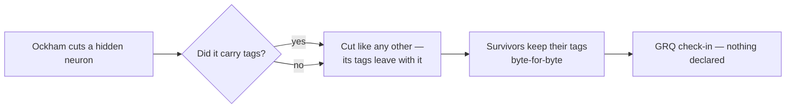

# Neuron tags are informational only — the declare/forgive protocol is gone

## Summary

Neuron tags describe a neuron; they never change what Ockham does with it. The
last tag-driven behaviour was the declare/forgive check-in protocol (#75, #78):
Ockham wrote `pruned-provenance.json` declaring the tagged UUIDs it cut, so
GRQ's check-in guard could forgive exactly those losses. That machinery is
removed outright. Closes #87.

- `ockham/src/tags.rs` — `PrunedProvenance`, `PrunedNeuron`,
  `PRUNED_PROVENANCE_FILE`, `PRUNED_PROVENANCE_VERSION`,
  `write_pruned_provenance` and `CreatureMeta::pruned_provenance` deleted.
- `ockham/src/coverage.rs` — the `taggedCut` field and the
  `declared:  N tagged neurons cut…` description line deleted; the `tagged:`
  line now reads `N carry tags, screened like any other`.
- `ockham/src/run.rs`, `journal.rs`, `report.rs` — the end-of-run declaration
  write, the `opening_meta` snapshot it needed, and the `tagged_cut` plumbing
  through the journal and `--report` are gone.
- `sweep.rs`, `ablation.rs`, `collapse.rs` — residual wording only.
- `README.md`, `docs/grq-integration.md` — the protocol is purged, and the stale
  claim that a tag skips a neuron (`README.md`, "Tagged and known-failure skips
  still apply") is corrected.
- `ockham/Cargo.toml` → `0.1.31`: removing a published artefact is
  binary-affecting (CONTRIBUTING principle 8).

What is unchanged: a neuron that **survives** keeps its `tags` byte-for-byte,
and a cut neuron takes its tags with it. That is the whole of the tag contract,
enforced by the existing round-trip tests only — no runtime enforcement was
added.



### GRQ release ordering — read before adopting this build

GRQ's guard (`worker/shared/creature_provenance_guard.sh`) still refuses a
check-in when a tagged neuron is missing undeclared, and it fails closed on an
absent declaration. This build no longer writes one, so **the GRQ change must
land first** or every run that cuts a tagged neuron has its check-in silently
skipped.

The issue asked the implementing worker to file that GRQ issue.
`gh issue create --repo stSoftwareAU/GRQ` is refused by this run's write
boundary (`[SECURITY] [WRITE_REPO_BLOCKED]` — writes are allowlisted to this
repo only), so the work is recorded in this repo as **#89** instead, and
`docs/grq-integration.md` section 5a states the hazard and the ordering. A human
with GRQ access must mirror #89 there.

## Evidence

Backend/CLI change — no web interface to screenshot. The evidence is the test
suite and the rendered GRQ-facing artefacts.

`coverage.txt`, before → after (pinned by
`coverage::tests::the_description_block_renders_exactly_as_grq_will_paste_it`):

```text
 tagged:    42 carry GRQ provenance, screened like any other
-declared:  3 tagged neurons cut, listed in pruned-provenance.json
```

becomes

```text
 tagged:    42 carry tags, screened like any other
```

Full gate: `cargo fmt --check`, `cargo clippy -D warnings`, `cargo deny check`,
`RUSTDOCFLAGS="-D warnings" cargo doc`, `markdownlint-cli2` and `actionlint` all
pass; `cargo test --workspace --all-features` is 275 tests, 0 failures.
`./quality.sh` stops at its codespell preflight because `codespell` cannot be
installed on this host (no `pip`, `pip3`, `pipx` or `ensurepip`); every other
stage of that script was run individually and passes, and CI's Spell Check job
is the authority.

## Acceptance Criteria

<!-- vibe-spec-review inputs="diff+issue-body" -->

- **met** — Remove the declare/forgive machinery from Ockham; stop writing the
  pruned-provenance declaration — evidence:
  `ockham/src/run.rs::a_run_that_cut_a_tagged_neuron_writes_no_declaration_artefact`
  (drives `establish_run` end to end and asserts no `pruned-provenance.json`, no
  `declared:` line, no `taggedCut`, no `tagged_cut` journal key) — reviewer: met
- **partial** — Observable: a repo-wide grep for `provenance`/`forgive` over
  non-archive source and docs returns nothing — evidence:
  `ockham/src/coverage.rs:609`, `ockham/src/run.rs:2466`,
  `docs/grq-integration.md:308`, `:407` — reviewer: partial — reason: four hits
  stand deliberately — two are negative regression assertions (`assert!(!text
  .contains("provenance"))`, `assert!(!…join("pruned-provenance.json").exists())`)
  and two name GRQ's real file `worker/shared/creature_provenance_guard.sh`,
  which a re-verifiable audit cannot rename; `forgive`/`forgiv*` returns nothing.
- **met** — Purge live claims that tagged neurons are protected from deletion —
  evidence: `README.md:66-68`, `README.md:600` ("a tag never skips a neuron
  (#87)"), `ockham/src/sweep.rs:213`, `ockham/src/run.rs:1022` — reviewer: met
- **met** — A surviving neuron keeps its tags verbatim, enforced by the existing
  round-trip tests only, no runtime enforcement — evidence:
  `ockham/src/tags.rs::a_cut_tagged_neuron_leaves_no_tags_entry_and_the_survivors_keep_theirs`
  and `ockham/src/sweep.rs::every_hidden_neuron_is_a_candidate_even_when_all_are_tagged`,
  both untouched apart from comment wording — reviewer: met
- **partial** — File the GRQ issue retiring the declaration requirement —
  evidence: #89 in this repo, and `docs/grq-integration.md` section 5a —
  reviewer: missing — reason: the reviewer is right that no issue exists in
  `stSoftwareAU/GRQ`; `gh issue create --repo stSoftwareAU/GRQ` is refused by
  the run's write boundary, so the analysis and the ordering hazard are recorded
  in the only writable repo (#89) rather than lost. Raised to `partial` because
  the deliverable exists and is cross-linked, not because the GRQ issue is filed.
- **unrequested** — the GRQ-facing `coverage.txt` string changed
  (`tagged: N carry GRQ provenance…` → `N carry tags…`) and the run log prefix
  `provenance:` → `tags:` — reason: both are forced by the grep observable the
  issue states; GRQ relays `coverage.txt` verbatim without parsing it, and
  Ockham's stdout is read by nothing (`docs/grq-integration.md` surface
  contract).
- **unrequested** — `ockham/Cargo.toml` / `Cargo.lock` bumped to `0.1.31` —
  reason: CONTRIBUTING principle 8 requires a bump for binary-affecting changes,
  and removing a published artefact is one.

Departure from the Spec reviewer, recorded: it also reported the section 5a and
surface-contract rows as **wrong** — they described GRQ's guard as already
retired, when GRQ#4632 merged the declaration-consuming guard on 2026-09-01.
That finding was correct and is **fixed** in commit `1ef9a07`: the audit now
documents the six-argument call as live, keeps the `pruned-provenance.json`
contract row marked "no longer written, retirement pending", and states the
release ordering.

## Standards Review

<!-- vibe-standards-review inputs="diff+CODING-STANDARDS.md" -->

- **violation** — commit subjects used bare Conventional Commits prefixes with
  no `🪒`, against `CONTRIBUTING.md:29` ("Ockham uses **🪒** as its
  commit-message prefix … not a Conventional Commits taxonomy") — evidence:
  `CONTRIBUTING.md:27-32` — reason: fixed here. Both commits were re-authored as
  `🪒 refactor: …` / `🪒 docs: …` and the branch force-pushed with
  `--force-with-lease`. The rewrite is justified and bounded: the branch is this
  run's alone, unmerged and unreviewed, the trees are byte-identical
  (`git diff 8369185 HEAD` is empty), and the alternative was shipping a
  documented-standard violation.
- **violation** — `ockham/Cargo.toml` version not bumped (found at `c0362b6`) —
  evidence: `ockham/Cargo.toml:3` — reason: fixed in the same branch; `0.1.30` →
  `0.1.31` with `Cargo.lock` in lockstep.
- **clean** — Australian English throughout the added lines (`artefact`,
  `optimiser`, `behaviour`, `serialise`); rustdoc completeness under
  `#![warn(missing_docs)]` + `-D warnings`, with no dangling intra-doc link left
  by the removal of `[crate::tags::write_pruned_provenance]`; no dead code or
  unused imports (`HashSet` still used by `retain_neurons`; `MIXED` / `keeping`
  fixtures removed with their tests rather than orphaned); tests call real code
  rather than grepping source; `markdownlint-cli2` 22 files / 0 issues with no
  stale anchors from the deleted README section; no hidden or secret files
  staged; `Co-Authored-By` and `Vibe-Coder-Run-Id` trailers present.
- **could not verify** — `codespell`, for the reason given under Evidence.

## Test Plan

Added:

- `ockham/src/run.rs::a_run_that_cut_a_tagged_neuron_writes_no_declaration_artefact`
  — the regression test for this issue. Watched fail against the unfixed code
  ("a declaration artefact must never be written again"), passes after.
- `ockham/src/coverage.rs::the_declaration_key_is_neither_written_nor_required_when_reading`
  — a new `coverage.json` carries no `taggedCut`, and one written while the key
  existed still deserialises rather than failing the read.

Changed:

- `coverage::tests::the_rendered_artefacts_never_call_tagged_neurons_skipped_or_unprunable`
  → `…_skipped_or_declared`, extended to assert the rendered block contains
  neither `declared:` nor `provenance`.
- `coverage::tests::the_tagged_cut_count_is_carried_through_rather_than_derived`
  → `the_cut_count_is_carried_through_rather_than_derived`, now also pinning
  that `tagged` is an informational count.
- Fixture-only edits where `Coverage`/`Event::Coverage` lost a field or
  `coverage()` lost an argument.

Removed — **documented deliberately**, these tested the deleted protocol and
have no behaviour left to cover:

- `tags.rs`: `the_declaration_lists_the_tagged_uuids_that_left_with_their_tag_names`,
  `a_surviving_tagged_neuron_is_never_declared`,
  `a_run_that_cut_nothing_tagged_declares_an_empty_list_with_a_version`,
  `the_written_declaration_names_each_pruned_uuid_and_its_tags`,
  `a_blocked_declaration_write_returns_an_error_naming_the_file`.
- `run.rs`: `a_bundle_accept_declares_only_the_tagged_uuid_it_cut`,
  `a_surviving_tagged_neuron_stays_out_of_the_declaration`,
  `a_run_that_pruned_nothing_tagged_still_declares_an_empty_list`,
  `a_blocked_declaration_write_warns_rather_than_failing_the_run`,
  `a_sweep_accept_declares_the_tagged_neuron_it_cut`,
  `the_coverage_artefacts_count_the_tagged_neuron_the_run_cut`.
- `coverage.rs`: `the_description_block_declares_the_tagged_neurons_the_run_cut`,
  `a_single_declared_cut_reads_singular`,
  `the_description_omits_the_declared_line_when_no_tagged_neuron_was_cut`.

The tagged-neuron-is-an-ordinary-candidate coverage those removals touched is
still held by
`run.rs::a_tagged_hidden_neuron_that_improves_the_score_is_proposed_screened_and_accepted`,
`run.rs::replay_cuts_a_confirmed_win_on_a_tagged_neuron` and the new regression
test above.
