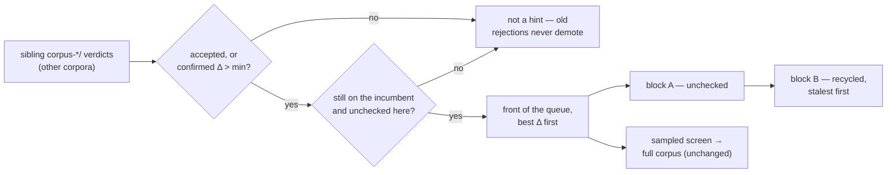

# Use old-corpus learnings verdicts to prioritise the pruning sweep (Issue #88)

## Summary

GRQ regenerates the training corpus before every Ockham run, so
`LearningsStore::load` — which reads the `corpus-<identity>/` directory named
for the corpus in hand — never consults a prune the fleet accepted under earlier
training data again. A hidden neuron one of those corpora removed, still on the
incumbent and still unchecked here, is the likeliest thing on the creature to be
removable again; it was going into the queue behind every neuron with no history
at all.

Ockham now reads every sibling `corpus-*` directory under `--learnings-dir` and
moves that set to the **front** of the screening queue, ahead of the
unchecked-first block. Old data is a hint, never proof: those records never join
the verdict set, so nothing from another corpus can suppress, replay or accept a
cut, and every prioritised neuron still passes the sampled screen and full-corpus
scoring. Coverage counting is untouched (#93). On by default wherever
`--learnings-dir` is set; `--old-corpus-first=false` disables it.

Closes #88.

## Evidence

Backend/CLI only — there is no web interface to screenshot. The evidence is the
test suite and the local gate.

Where the pieces live:

- `ockham/src/learnings.rs` — `LearningsStore::load_prior_corpora` reads the
  sibling `corpus-*` directories (its own excluded); `prior_corpus_priority`
  turns them into the still-present, still-unchecked uuid queue.
  `dirs_named` is now shared with `legacy_screens_dirs` rather than copied.
- `ockham/src/run.rs` — `PriorHint` plus `prefer_prior_corpus`, applied inside
  `fresh_sweep` so the opening sweep, the post-accept restart and the
  exhausted-sweep restart all get the same order.
- `ockham/src/sweep.rs` — `Sweep::prefer` now returns how many UUIDs it moved,
  and `Sweep::old_corpus_first` records it.
- `ockham/src/config.rs`, `ockham/src/main.rs` — `--old-corpus-first`, defaulting
  to on with `--learnings-dir`.

Local gate: `cargo fmt --check`, `cargo clippy --workspace --all-targets
--all-features -D warnings`, `cargo test --workspace --all-features` (273 lib +
34 integration tests, all pass), `cargo deny check`, `markdownlint-cli2`,
`actionlint`, and `RUSTDOCFLAGS="-D warnings" cargo doc` all pass.

**One gate stage could not be run here.** `./quality.sh` stops at the codespell
preflight with `spell-check: codespell is not installed.` — the container has no
`pip`, `pipx` or `sudo`, so codespell cannot be installed (`/bin/bash: line 1:
pip: command not found`; `sudo: a password is required`). Every other stage of
`quality.sh` was run individually and passes, and CI runs the spell-check job for
real. The added prose was checked by hand for US spellings and common typos.

## Acceptance Criteria

<!-- vibe-spec-review inputs="diff+issue-body" -->

- **met** — Ockham scans all sibling `corpus-*` directories under
  `--learnings-dir` — evidence:
  `ockham/src/learnings.rs::load_prior_corpora`, tests
  `the_current_corpus_is_excluded_from_the_prior_hint`,
  `the_screens_directory_is_never_read_as_a_prior_corpus`,
  `a_corrupt_prior_corpus_directory_costs_only_its_own_records` — reviewer: met
- **met** — the qualifying set is accepted verdicts plus confirmed-but-not-applied
  wins with a positive measured delta, still on the incumbent and unchecked under
  the current corpus — evidence:
  `ockham/src/learnings.rs::prior_corpus_priority`, tests
  `the_prior_priority_is_still_present_unchecked_and_best_delta_first`,
  `a_uuid_already_screened_under_this_corpus_is_not_prioritised` — reviewer:
  partial — reason: the reviewer found that collapsing to the latest record per
  uuid let a later corpus's `Rejected` cancel an earlier corpus's `Accepted`;
  fixed in this diff by selecting the qualifying records **before** the
  latest-per-uuid collapse, covered by the new test
  `a_later_corpus_rejecting_does_not_cancel_an_earlier_corpus_win`
- **met** — that set is moved to the front of the screening queue, and each
  neuron still passes the sample screen and full-corpus scoring — evidence:
  `ockham/src/run.rs::prefer_prior_corpus` via `Sweep::prefer` (a permutation of
  the same tail), test
  `run::tests::an_old_corpus_win_is_screened_before_neurons_with_no_history`,
  which compares against a same-seed control run — reviewer: met
- **met** — the coverage log line reports how many neurons were prioritised —
  evidence: `coverage: N neuron(s) prioritised from older corpus caches (#88)` in
  `ockham/src/run.rs::prefer_prior_corpus` — reviewer: met with caveats — reason:
  the reviewer noted the count was taken before the move and that nothing was
  logged when no records were found; both fixed here — the count is now
  `Sweep::prefer`'s return value, and the line is emitted whenever the priority is
  enabled, `0` included
- **met** — enabled by default whenever `--learnings-dir` is set, with a flag to
  disable — evidence: `ockham/src/config.rs::old_corpus_first_enabled`, tests
  `old_corpus_first_follows_the_learnings_dir_by_default`,
  `an_explicit_old_corpus_first_flag_overrides_the_default`, and end-to-end
  `old_corpus_first_off_keeps_the_order_the_run_would_have_had` — reviewer: met
- **met** — old-corpus rejections do not deprioritise; failure suppression stays
  per-corpus — evidence: `prior_records` is never merged into `known`
  (`ockham/src/run.rs`), tests
  `a_prior_corpus_rejection_does_not_suppress_this_run`,
  `an_old_rejection_is_neither_a_hint_nor_a_penalty`,
  `a_later_corpus_rejecting_does_not_cancel_an_earlier_corpus_win` — reviewer:
  partial — reason: the reviewer's gap was the ordering half of this rule, now
  closed by the same fix
- **met** — old-corpus wins go to the front of the queue rather than straight to a
  full-corpus replay — evidence: only `Sweep::prefer` is called; nothing from
  `prior_records` reaches `ranked_confirmed(&known, …)` or `known_failures` —
  reviewer: met
- **met** — within the prioritised set, best measured full-corpus delta first,
  most recent breaking ties, matching `confirmed_wins` — evidence:
  `ranked_confirmed` is reused verbatim, test
  `the_prior_priority_is_still_present_unchecked_and_best_delta_first` —
  reviewer: met
- **met** — no GRQ-side change is needed — evidence: `docs/grq-integration.md`
  records that `--old-corpus-first` is never passed and the default follows
  `--learnings-dir`; no GRQ code touched — reviewer: met
- **met** — must not change how coverage counts are computed (#93) — evidence:
  `ockham/src/coverage.rs` is untouched; the only sweep mutation is a tail
  permutation, leaving `permutation_identity` and the visit counters alone —
  reviewer: met
- **unrequested** — `ConfigReport.old_corpus_first` and the `old_corpus_first`
  count on the `start` journal record — reason: the reorder happens *after*
  `permutation_identity` is hashed, so without it a run whose order this changed
  is not reconstructable from `experiments.jsonl`; this is the rule the README
  already states for `unchecked_first`, and both fields are additive with
  `#[serde(default)]`
- **unrequested** — the `prior corpora: N verdict(s) … read as a priority hint`
  load line — reason: one line at load time distinguishes "no old corpora
  found" from "found and none qualified", which the single coverage line cannot
- **unrequested** — `Sweep::prefer` now returns the number moved — reason: the
  logged and journalled count would otherwise report what was asked for rather
  than what happened
- **unrequested** — README section, flag-table row and Mermaid diagram, plus the
  `docs/grq-integration.md` note — reason: a new CLI flag must be documented
  (the `readme_contract` test enforces it), and the "Coverage outlives the
  corpus" section previously said a foreign verdict is *never loaded*, which
  this change makes only true of verdicts, not of hints

## Standards Review

<!-- vibe-standards-review inputs="diff+CODING-STANDARDS.md" -->

- **violation** — no PR summary for this issue, breaking the
  one-summary-per-issue convention — evidence:
  `docs/archive/pr-summaries/` — reason: fixed — this file
- **violation** — `ockham/Cargo.toml` version not bumped, against CONTRIBUTING
  principle 8 for a binary-affecting change — evidence:
  `ockham/Cargo.toml:3` — reason: fixed — bumped to `0.1.35` with `Cargo.lock`
  via `scripts/auto-version.sh`
- **violation** — `other_corpus_dirs` duplicated `legacy_screens_dirs` almost
  line for line (DRY) — evidence: `ockham/src/learnings.rs:338` — reason: fixed
  — both now call one `dirs_named(prefix, skip)` helper
- **violation** — the test helper `old_corpus_cfg` was a verbatim copy of
  `unchecked_first_cfg` (DRY) — evidence: `ockham/src/run.rs:2700` — reason:
  fixed — it now derives from `unchecked_first_cfg`
- **violation** — the reorder was not journalled, so a run it changed was not
  reconstructable from `experiments.jsonl` — evidence:
  `ockham/src/run.rs:696` (`Event::Start`) — reason: fixed — `Event::Start` and
  `Sweep` now carry `old_corpus_first`, asserted by
  `an_old_corpus_win_is_screened_before_neurons_with_no_history`
- **violation** — the README claimed the count is logged "in every run's log"
  while the code returned early when no records were found — evidence:
  `ockham/src/run.rs:1793` — reason: fixed — the line is now emitted whenever the
  priority is enabled, `0` included
- **violation** — `run.rs` is already the largest module and this adds
  `PriorHint`/`prefer_prior_corpus` to it rather than a focused module —
  evidence: `ockham/src/run.rs:1753` — reason: stands. The function is the
  sibling of `prefer_unchecked` and is called from `fresh_sweep`, the one place a
  sweep is built (#77); splitting the sweep-construction path across modules
  would cost more clarity than the line count saves. Splitting `run.rs` up is
  separate work, not this issue's.
- **clean** — Australian English throughout (`prioritised`, `behaviour`,
  `optimisation`); never-fail-silently upheld (`load_prior_corpora` warns and
  skips a corrupt foreign directory, still errors on an unreadable root; both
  call sites log the `Err`; no swallowed results, no new `unwrap`); every new
  test drives real functions (`load_prior_corpora`, `prior_corpus_priority`,
  `OckhamConfig::report`, full `establish_run` runs) and asserts on returned
  values — no source-text grepping; documented safety invariants untouched (a
  sampled screen still cannot accept, only a full-corpus result can); no hidden
  files or secrets staged, no new dependencies.

## Known cost

Every run now reads and parses every sibling `corpus-*` directory, and GRQ
regenerates the corpus identity often, so that set grows with fleet history. It
is what the issue asks for and each directory holds only the verdicts filed
under that corpus, but it is the one place this change makes startup cost grow
over time.

## Test Plan

New tests:

- `ockham/src/learnings.rs`
  - `prior_corpus_verdicts_are_read_as_a_hint_and_never_as_verdicts`
  - `the_current_corpus_is_excluded_from_the_prior_hint`
  - `the_screens_directory_is_never_read_as_a_prior_corpus`
  - `a_corrupt_prior_corpus_directory_costs_only_its_own_records`
  - `a_prior_hint_from_an_absent_root_is_empty`
  - `the_prior_priority_is_still_present_unchecked_and_best_delta_first`
  - `a_uuid_already_screened_under_this_corpus_is_not_prioritised`
  - `an_old_rejection_is_neither_a_hint_nor_a_penalty`
  - `a_later_corpus_rejecting_does_not_cancel_an_earlier_corpus_win`
- `ockham/src/config.rs`
  - `old_corpus_first_follows_the_learnings_dir_by_default`
  - `an_explicit_old_corpus_first_flag_overrides_the_default`
- `ockham/src/run.rs`
  - `an_old_corpus_win_is_screened_before_neurons_with_no_history` — the
    behavioural test: a control run with the same seed establishes which uuid the
    sweep would have reached, then a second run with an old-corpus win on a
    *different* uuid must screen that one instead, and journal the reorder.
    Verified red before the change (screened `h_c`, expected `h_a`) and green
    after.
  - `old_corpus_first_off_keeps_the_order_the_run_would_have_had`
  - `a_prior_corpus_rejection_does_not_suppress_this_run`

No existing test was modified or removed.
