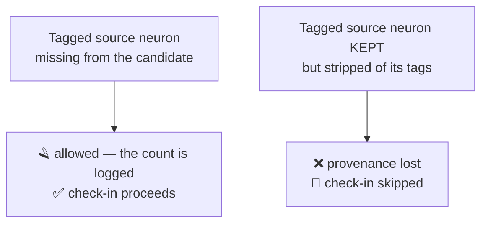

# GRQ retires the pruned-provenance declaration requirement (#89)

## Summary

Issue #87 removed the declare/forgive protocol from Ockham: it writes no
`pruned-provenance.json` and passes no declaration, because neuron tags are
informational metadata only. The other half lived in the private
`stSoftwareAU/GRQ` repo, where the check-in guard **fails closed** — an absent
declaration forgives nothing — so every run that legitimately cut a tagged
neuron had its check-in refused, exit 0, silently skipped, and the fleet stopped
publishing progress on tagged creatures.

`stSoftwareAU/GRQ` is an internal dependency this run can reach, so the root
cause was fixed where it lives rather than deferred to a follow-up issue. The
fix is committed on the GRQ branch
`retire-pruned-provenance-declaration-ockham-89` (commit `be5e887`):

- `worker/shared/creature_provenance_guard.sh` — the declaration parser
  (`grq_creature_guard_declared_prunes`), the matching helpers
  (`grq_creature_guard_undeclared_prunes`, `grq_creature_guard_forgiven_prunes`,
  `_grq_creature_guard_prunes_matching`), the schema-version constant and the
  `mode` / `declared` plumbing of `_grq_creature_guard_checkin_hops` are gone.
  `grq_creature_guard_checkin` is one three-argument function that every check-in
  path and both lineage hops share.
- `worker/Ockham/run.sh` — no sixth argument, no `OCKHAM_PRUNED_PROVENANCE`.
- `worker/teams/README.md` — the declared-mode section, its schema table and its
  flowchart are replaced by the retirement.
- Plus its own `docs/archive/pr-summaries/pr-summary-neat-ai-ockham-89.md`, per
  GRQ's CONTRIBUTING.

In **this** repo the change is documentation: `docs/grq-integration.md` audits
how GRQ drives Ockham, and section 5a recorded the GRQ half as pending with no
work behind it. It now records what exists, on which branch, and what is still
true of GRQ `Develop`.

The GRQ branch is **not** merged or released here — that is a human decision.
Until it merges, GRQ `Develop` still refuses an undeclared cut, so the merge must
precede GRQ adopting the Ockham release carrying #87.

Closes #89.

## Evidence

Documentation and backend/CLI change — no web interface to screenshot, so no
Playwright capture applies. The evidence is the test runs below.

**Red first.** With the new GRQ test assertions in place but
`creature_provenance_guard.sh` and `worker/Ockham/run.sh` reverted to `Develop`,
`worker/shared/test_creature_provenance_guard.sh` reported **6 failures**: the
three retired helpers still defined, and the real anchored Ockham `run.sh` guard
block still skipping the check-in of a cut tagged neuron. After the fix, all
green.

| Check                                                       | Result                |
| ----------------------------------------------------------- | --------------------- |
| GRQ `worker/shared/test_creature_provenance_guard.sh`        | 185 passed, 0 failed  |
| GRQ `worker/shared/test_ockham_checkin.sh`                   | 46 passed, 0 failed   |
| GRQ `deno test test/worker/CreatureProvenanceGuard.ts`       | 5 passed, 0 failed    |
| GRQ `deno test` — OckhamCheckin, CheckinGateCoverage, IslandProvenanceSkip, CheckinSampleProvenanceTags | 19 passed, 0 failed |
| GRQ `bash ./quality/shellcheck.sh`                           | passed                |
| This repo — `./quality.sh`                                   | all checks passed     |

The check-in path after the retirement — one rule for every worker, on every
hop:

## Acceptance Criteria

<!-- vibe-spec-review inputs="diff+issue-body" -->

- **met** — `worker/shared/creature_provenance_guard.sh` stops refusing a
  check-in when a tagged source neuron is missing and undeclared — evidence:
  `worker/shared/test_creature_provenance_guard.sh::<worker> accepts a cut tagged neuron`
  (all four workers) — reviewer: met — the reviewer additionally verified the
  executable code is a byte-exact revert to the pre-#78 file, comments aside.
- **met** — `worker/Ockham/run.sh` stops passing `pruned-provenance.json` as the
  sixth argument — evidence: `/tmp/GRQ/worker/Ockham/run.sh:282`, and
  `test_ockham_checkin.sh::the cut was checked in` — reviewer: met —
  `OCKHAM_OUT_DIR` still resolves `coverage.txt`, so nothing else broke.
- **met** — `worker/teams/README.md` drops the declared-mode documentation —
  evidence: `worker/teams/README.md:1009` — reviewer: met — the inbound
  cross-reference anchor was updated and no dangling anchor remains.
- **met** — what stays unchanged: a surviving neuron keeps its `tags`, and
  `uuid` / `memetic` stay absent — evidence:
  `test_creature_provenance_guard.sh::a survivor stripped on the rebase hop is refused`
  and the pool-wide `uuid`/`memetic` sweep — reviewer: met — verified in the
  code, not only the tests: `grq_creature_guard_missing_neuron_tags` and
  `grq_creature_guard_strip_identity` are untouched and still called on every
  hop.
- **met** — ordering: the retirement must land before GRQ adopts the #87 release
  — evidence: `docs/grq-integration.md` section 5a — reviewer: met — not
  enforceable in code; recorded in both repos.
- **unrequested** — this repo's `docs/grq-integration.md` rewrite — reviewer:
  unrequested — reason: the issue lists GRQ changes only and cites section 5a as
  a reference. Kept: the section asserted "the GRQ half is still live … retiring
  it is pending", which this change set makes false, and the issue's own
  ordering clause is what that section records. The reviewer's staleness point
  is addressed by a "Re-pin when it merges" note naming the four places to
  update.
- **unrequested** — the GRQ rebase hop now forgives a cut of a *rebase base /
  champion* tagged neuron for Ockham too — reviewer: unrequested — reason: a
  consequence the issue does not spell out, but it is exactly the pre-#78 #4600
  semantics and follows from "cutting a tagged hidden neuron is ordinary
  pruning … on every path". The survivor rule still refuses a stripped
  champion neuron, which is asserted.
- **unrequested** — new GRQ assertions with no pre-existing counterpart
  (stripped survivor on the rebase hop, stripped champion neuron, the retired
  helpers are undefined) — reviewer: unrequested (judged "in-spirit") — reason:
  replacement coverage for the deleted declared-mode block, testing the "what
  stays unchanged" clause directly.

## Standards Review

<!-- vibe-standards-review inputs="diff+CODING-STANDARDS.md" -->

Neither repo has a `CODING-STANDARDS.md`; the reviewer judged against each
repo's `CONTRIBUTING.md`/`README.md`, the Australian-English rule, bash 3.2
portability, fail-loud, and the real-code test rule.

- **violation** — the GRQ branch added no PR summary, which
  `CONTRIBUTING.md:255` requires of every PR — evidence:
  `/tmp/GRQ/CONTRIBUTING.md:255` — reason: fixed here —
  `docs/archive/pr-summaries/pr-summary-neat-ai-ockham-89.md` added to the GRQ
  branch, carrying the negative result (a fail-closed gate over informational
  metadata is a silent outage) as CONTRIBUTING:266 requires.
- **violation** — this repo adds no `pr-summary-89.md`, breaking the
  one-summary-per-issue convention — evidence:
  `docs/archive/pr-summaries/` — reason: fixed here — this file.
- **violation** — `_grq_creature_guard_summarise`'s `+N more` truncation cap
  lost its only test as collateral of removing the declared-prune block —
  evidence: `/tmp/GRQ/worker/shared/creature_provenance_guard.sh:247` — reason:
  fixed here — `eight stripped survivors` asserts
  `m-0, m-1, m-2, m-3, m-4 (+3 more)` through the surviving lost-survivor-tags
  path.
- **violation** — section 5a's heading said "retired both sides" while the body
  said the GRQ half is unmerged — evidence: `docs/grq-integration.md:390` —
  reason: fixed here — heading is now "Ockham retired, GRQ pending", and the
  header lead matches.
- **violation** — permanent documentation is pinned to a transient GRQ branch
  name and to "committed but not yet merged", which goes stale on merge with
  nothing forcing the edit — evidence: `docs/grq-integration.md:19` — reason:
  partly stands, by design. The audit's value is naming where the fix actually
  is, and a branch name is the only durable handle this repo has. Mitigated
  with an explicit "Re-pin when it merges" note listing the four places to
  update. The reviewer's related point about the header wording claiming an
  *open PR* was a real over-claim and is fixed — the doc now says only that the
  work is committed on a branch.
- **violation** — section 4 step 7 still documents the six-argument call form —
  evidence: `docs/grq-integration.md:310` — reason: stands. The document audits
  GRQ `Develop` at `6ad319f`, where that call form is what runs today; step 7
  already flags the retirement as committed-not-merged, and the re-pin note
  names step 7 explicitly.
- **clean** — no stale references to any removed symbol anywhere in either repo
  outside deliberate "this is retired" prose and the frozen archive;
  `quality/shellcheck.sh` passes; both bash suites drive real functions and the
  real anchored `run.sh` block (the retired-helper check uses `declare -F`
  against a sourced shell, not a source-text grep); bash 3.2 safe, no arrays or
  GNU-only flags added; Australian spelling throughout (`artefact`,
  `summarise`, `optimiser`); no dead code or orphaned variables left; fail-loud
  preserved (jq-rc propagation and both non-numeric-count refusals intact); the
  guard's API header matches the surviving function set; `markdownlint-cli2`
  reports 0 issues; no hidden paths staged in either repo.

## Test Plan

GRQ (`retire-pruned-provenance-declaration-ockham-89`) — the declared-mode
assertions are **removed, not disabled**, because the mode they exercised no
longer exists; they are replaced by assertions on the behaviour that replaced
it:

- `worker/shared/test_creature_provenance_guard.sh`
  - all four workers accept a cut tagged neuron with byte-identical gate logs,
    on the single-hop gate and both lineage shapes;
  - none logs any declaration line;
  - the three retired helpers are asserted undefined, so the mode cannot be
    quietly resurrected;
  - the survivor rule re-asserted on the rebase hop and against the champion;
  - the `+N more` truncation cap regains a test;
  - the real `BEGIN_OCKHAM_PROVENANCE_GUARD_4216` block from `run.sh` is driven
    end to end and now checks the cut in.
- `worker/shared/test_ockham_checkin.sh` — hermetic worker run: a sample with a
  GRQ-tagged hidden neuron, a candidate that cut it, no declaration anywhere.
  The check-in lands and is committed; before the retirement it was refused.
- `test/worker/CreatureProvenanceGuard.ts` — public-helper list matches the
  surviving function set.

This repo — documentation only; no test changes. `./quality.sh` passes,
including markdownlint over the edited `docs/grq-integration.md`.
