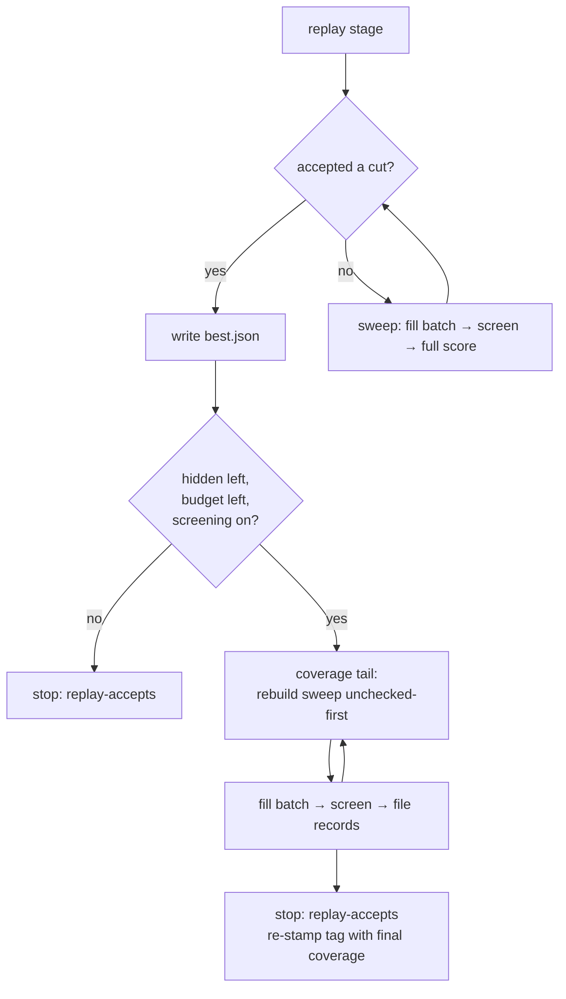

# An accept ends the search, not the run's coverage duty (Issue #91)

## Summary

Nine consecutive GRQ-sampler check-ins reported `progress: 0 newly screened
this run` while `checked` sat at 1,417–1,419 of ~6,950. Closes #91.

Two independent causes, both in this crate:

1. **Every one of those runs accepted before it screened anything.** A replayed
   known win — and the last accept `--max-accepts 1` allows — ended the run the
   moment it landed. Of the 41 Ockham check-ins on 2026-09-01/02, **30** are
   `replay` / `replay-bundle` runs — the replay stage runs before the first
   batch is ever filled, so those runs screened nothing at all
   (`winners: 0 screened`) — and the other 11 stopped after two or three
   batches on `--max-accepts 1`. The accept
   now ends the **search** only: `best.json` is written exactly as before, and
   nothing after it replays, full-scores or accepts, but what remains of the
   budget goes to screening, batch after batch, over a sweep rebuilt against the
   creature the accept just changed so unchecked-first selection (#38) applies
   to it.
2. **The sweep could not afford the batches anyway.** `cleanup_cascade` asked
   "has this neuron any outgoing synapse?" by scanning every synapse, once per
   neuron, on every iteration — O(neurons × synapses) — and `ablate_mean` cloned
   the whole incumbent *before* the checks that reject the ~79% of forest
   neurons feeding an aggregate squash. On a 7,041-neuron creature that was
   **316ms per visited neuron**: one batch of 100 candidates cost ~2.6 minutes
   of CPU before the scorer was called at all. Both are fixed; the walk is now
   **10ms per visit**.

The stop reason still names the accept (`replay-accepts`, `max-accepts`),
because that is what ended the search; the tail's own end is in the log. The
`ockham` check-in tag is re-stamped at the end of the run so the commit
subject's `checked X/Y` reports the coverage the run finished on rather than the
figure at the cut — otherwise the subject would keep showing the stalled number
this issue is about.



**The judgement call.** A replay accept used to stop immediately "so the prune
can check in" (`docs/population-entry.md`), and the tail delays that check-in by
whatever is left of the soft hour limit. That is the trade the issue asks for —
"we get a number of loops within the soft hour limit, so that would be multiples
of ~100" — and the accepted creature is already on disk before the tail starts,
so nothing about the prune itself is at risk. With `--screen-sample-rate 0` no
tail is opened at all: the only check available there is a full-corpus cohort,
which is precisely the search the accept ended.

## Evidence

Backend/CLI only — no web interface to screenshot. The evidence is the
benchmark, the regression tests and the fleet commit log.

**Before, from the fleet** (`gh api repos/stSoftwareAU/GRQ-sampler/commits`):

```text
2026-09-02T19:20Z 🪒 Ockham · replay · 1 cuts · checked 1417/6969 (20.3%)
2026-09-02T20:29Z 🪒 Ockham · replay · 1 cuts · checked 1417/6981 (20.3%)
2026-09-02T22:02Z 🪒 Ockham · search individual · 1 accepts / 3 batches · checked 1417/6994
2026-09-02T23:23Z 🪒 Ockham · search bundle · 1 accepts / 2 batches · checked 1416/7005

🪒 Ockham neuron screening coverage
checked:   1416 of 7005 hidden (20.2%)
progress:  0 newly screened this run
winners:   7 screened · 2 confirmed · 2 applied · 0 carried
```

**Throughput, before and after** —
`cargo run --release --example sweep_fill_bench`, the same benchmark on the same
machine, on a 7,041-neuron / 49,040-synapse forest creature where 8 in 10 hidden
neurons feed an aggregate squash (the shape #93 measured at 78.8% on a real GRQ
creature):

| | 400 sweep visits | per visit |
|---|---:|---:|
| before | 126.596s | 316.49ms |
| after | 3.996s | 9.99ms |

**31.7× faster.** Filling one batch of 100 candidates on that creature falls
from ~2.6 minutes of CPU to ~5 seconds, which is what lets several loops fit
inside the soft hour limit.

**After, from the run log** (the new test's own output, the shape a fleet run
now takes):

```text
✓ accepted local win score=0.8 Δ=3.000e-1 hidden=4
● replay-accepts: the search is over; spending the remaining 29s screening for coverage (#91)
● coverage: 4 unchecked first, 0 already screened deferred
● batch 0: 2 candidates, 0 skipped, 2 hidden left, 29s remaining
● coverage tail: 3 batch(es) screened after the accept; 4 newly checked this run (#91)
● checked 4 of 4 hidden (100.0%), 1 cut
● stop reason=replay-accepts  accepts=1  experiments=4  newlyScreened=4  restarts=1
```

**Verified against #93's symptom.** #93's fix (counting every visit as coverage)
is untouched: all of its regression tests still pass, and nothing here changes
how `checked` is counted — the tail can only add records, never remove them. The
two changes compose: #93 made a visit count, #91 makes the visits happen.

**Quality gate.** `./quality.sh` stops at its codespell preflight because
codespell cannot be installed in this container (no `pip`, no `ensurepip`, no
root) — the same blocker recorded in `pr-summary-93.md`; CI runs that stage for
real. Every other stage was run in the foreground and passed: bash syntax,
shellcheck, the neat-core version gate, markdownlint (0 issues), actionlint,
`cargo deny check` (advisories/bans/licenses/sources ok), `cargo fmt --check`,
`cargo clippy --workspace --all-targets --all-features -D warnings`,
`cargo test --workspace --all-features` (256 + 34 tests, 0 failures) and
`cargo doc` with `RUSTDOCFLAGS=-D warnings`.

## Reproduction

- **symptom** — an Ockham run that accepts a replayed known win reports
  `progress: 0 newly screened this run` and leaves `checked` where it found it,
  however much budget was left
- **status** — `verified` — `a_replay_accept_still_spends_the_rest_of_the_budget_on_coverage`
  was run against the unfixed loop and failed with the fleet's exact log line
  (`⚠ no progress: 0 newly checked uuid(s) this run while 4 hidden neuron(s)
  remain unchecked`, `newlyScreened=0`); it passes on the fixed tree with
  `newlyScreened=4`. The throughput half has its own red/green:
  `one_ablation_costs_the_creature_not_its_square` fails at `9.4x` against the
  unfixed scans and passes at `4.4x` after the fix
- **regression test** — `ockham/src/run.rs::run::tests::a_replay_accept_still_spends_the_rest_of_the_budget_on_coverage`

## Deliberate test changes

None. No existing test was modified, removed or disabled; all 290 tests that
passed before this change still pass.

## Test Plan

Added:

- `run::tests::a_replay_accept_still_spends_the_rest_of_the_budget_on_coverage`
  — end to end over a five-neuron creature whose replay accepts one cut: the
  stop reason is still `replay-accepts`, every remaining hidden neuron is
  screened, `newlyScreened` is 4, and the re-stamped check-in tag reads
  `checked 4/4`.
- `run::tests::the_coverage_tail_screens_the_unchecked_neuron_first` — with
  three of the four survivors already screened, the tail's single batch screens
  the never-checked one, so unchecked-first (#38) is honoured by the tail and
  not just by the opening sweep.
- `run::tests::an_accept_that_leaves_no_hidden_neurons_stops_at_once` — an
  accept that cuts the last hidden neurons opens no tail and screens nothing.
- `ablation::tests::one_ablation_costs_the_creature_not_its_square` — a ratio,
  not a wall-clock budget: the same ablation timed at 400 and 1,600 hidden
  neurons must not cost sixteen times as much, so the quadratic scans cannot
  come back. A loaded runner slows both readings and the test still holds.
- `ockham/examples/sweep_fill_bench.rs` — the benchmark behind the numbers
  above, alongside the existing `activation_stats_bench`.

Docs updated in the same change: the README's *Every run advances the checked
count* section (a fifth rule and its flowchart), the feature list and the
`--max-accepts` row of the options table; `docs/population-entry.md` step 2; and
the *Commit message* section of `docs/grq-integration.md`, which now records
that the `ockham` tag is stamped twice on a run with a tail.
