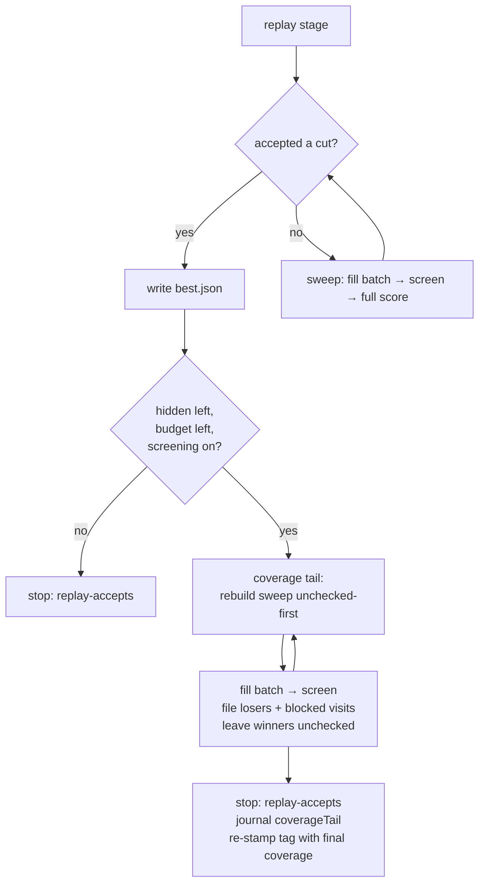

# An accept ends the search, not the run's coverage duty (Issue #91)

## Summary

Nine consecutive GRQ-sampler check-ins reported `progress: 0 newly screened
this run` while `checked` sat at 1,417–1,419 of ~6,950. Closes #91.

Two independent causes, both in this crate:

1. **Every one of those runs accepted before it screened anything.** A replayed
   known win — and the last accept `--max-accepts 1` allows — ended the run the
   moment it landed. Of the 41 Ockham check-ins on 2026-09-01/02, **30** are
   `replay` / `replay-bundle` runs — the replay stage runs before the first
   batch is ever filled, so those runs screened nothing at all
   (`winners: 0 screened`) — and the other 11 stopped after two or three
   batches on `--max-accepts 1`. The accept
   now ends the **search** only: `best.json` is written exactly as before, and
   nothing after it replays, full-scores or accepts, but what remains of the
   budget goes to screening, batch after batch, over a sweep rebuilt against the
   creature the accept just changed so unchecked-first selection (#38) applies
   to it.
2. **The sweep could not afford the batches anyway.** `cleanup_cascade` asked
   "has this neuron any outgoing synapse?" by scanning every synapse, once per
   neuron, on every iteration — O(neurons × synapses) — and `ablate_mean` cloned
   the whole incumbent *before* the checks that reject the ~79% of forest
   neurons feeding an aggregate squash. On a 7,041-neuron creature that was
   **316ms per visited neuron**: one batch of 100 candidates cost ~2.6 minutes
   of CPU before the scorer was called at all. Both are fixed; the walk is now
   **10ms per visit**.

Three things keep the tail honest:

- **A sampled winner the tail finds is left unchecked.** Nothing in the run will
  score it, and filing it as checked would bury it — the record would be the
  freshest in the store, so `oldest_screened_first` sorts it last and
  unchecked-first defers it behind every never-screened neuron. Left unchecked,
  the next run screens *and* full-scores it. Only losers and the visits the
  razor could propose nothing for are filed: finished business.
- **The tail's own end is journalled.** The run's stop reason still names the
  accept, because that is what ended the search, so a new `coverageTail` record
  carries the tail's batches, the candidates it screened and what ended it
  (`timeout`, `max-experiments`, `no-candidates`, or a fault). `report`
  surfaces it as `coverage_tail_batches`. A stop reason that answers three
  questions with one word is how a plateau hides.
- **The re-stamped tag keeps the accept's batch count.** The `ockham` tag is
  stamped again at the end of the run so the commit subject's `checked X/Y` is
  the coverage the run finished on rather than the figure at the cut — but
  `N accepts / M batches` keeps the *search* batch count, because the tail's
  batches bought no accept and would inflate the fleet's own health signal.



**The judgement call.** A replay accept used to stop immediately "so the prune
can check in" (`docs/population-entry.md`), and the tail delays that check-in by
whatever is left of the soft hour limit. That is the trade the issue asks for —
"we get a number of loops within the soft hour limit, so that would be multiples
of ~100" — and the accepted creature is already on disk before the tail starts,
so nothing about the prune itself is at risk. With `--screen-sample-rate 0`, or
without `--learnings-dir`, no tail is opened at all: the only check available
without a sampled screen is a full-corpus cohort — the search the accept just
ended — and with no store the records would not outlive the run.

## Evidence

Backend/CLI only — no web interface to screenshot. The evidence is the
benchmark, the regression tests and the fleet commit log.

**Before, from the fleet** (`gh api repos/stSoftwareAU/GRQ-sampler/commits`):

```text
2026-09-02T19:20Z 🪒 Ockham · replay · 1 cuts · checked 1417/6969 (20.3%)
2026-09-02T20:29Z 🪒 Ockham · replay · 1 cuts · checked 1417/6981 (20.3%)
2026-09-02T22:02Z 🪒 Ockham · search individual · 1 accepts / 3 batches · checked 1417/6994
2026-09-02T23:23Z 🪒 Ockham · search bundle · 1 accepts / 2 batches · checked 1416/7005

🪒 Ockham neuron screening coverage
checked:   1416 of 7005 hidden (20.2%)
progress:  0 newly screened this run
winners:   7 screened · 2 confirmed · 2 applied · 0 carried
```

**Throughput, before and after** —
`cargo run --release --example sweep_fill_bench`, the same benchmark on the same
machine, on a 7,041-neuron / 49,040-synapse forest creature where 8 in 10 hidden
neurons feed an aggregate squash (the shape #93 measured at 78.8% on a real GRQ
creature):

| | 400 sweep visits | per visit |
|---|---:|---:|
| before | 126.596s | 316.49ms |
| after | 3.996s | 9.99ms |

**31.7× faster.** Filling one batch of 100 candidates on that creature falls
from ~2.6 minutes of CPU to ~5 seconds, which is what lets several loops fit
inside the soft hour limit.

**After, from the run log** (the new test's own output, the shape a fleet run
now takes):

```text
✓ accepted local win score=0.8 Δ=3.000e-1 hidden=4
● replay-accepts: the search is over; spending the remaining 29s screening for coverage (#91)
● coverage: 4 unchecked first, 0 already screened deferred
● batch 0: 2 candidates, 0 skipped, 2 hidden left, 29s remaining
● coverage tail: 3 batch(es), 6 candidate(s) screened after the accept; 4 newly checked this run; ended max-experiments (#91)
● checked 4 of 4 hidden (100.0%), 1 cut
● stop reason=replay-accepts  accepts=1  experiments=4  newlyScreened=4  restarts=1  Δ=3.000e-1
```

**Verified against #93's symptom.** #93's fix (counting every visit as coverage)
is untouched: all of its regression tests still pass, and nothing here changes
how `checked` is counted — the tail can only add records, never remove them. The
two changes compose: #93 made a visit count, #91 makes the visits happen.

**Quality gate.** `./quality.sh` stops at its codespell preflight because
codespell cannot be installed in this container (no `pip`, no `ensurepip`, no
root) — the same blocker recorded in `pr-summary-93.md`; CI runs that stage for
real. Every other stage was run in the foreground and passed: bash syntax,
shellcheck, the neat-core version gate, markdownlint (0 issues), actionlint,
`cargo deny check` (advisories/bans/licenses/sources ok), `cargo fmt --check`,
`cargo clippy --workspace --all-targets --all-features -D warnings`,
`cargo test --workspace --all-features` (259 + 34 tests, 0 failures) and
`cargo doc` with `RUSTDOCFLAGS=-D warnings`.

## Reproduction

- **symptom** — an Ockham run that accepts a replayed known win reports
  `progress: 0 newly screened this run` and leaves `checked` where it found it,
  however much budget was left
- **status** — `verified` — `a_replay_accept_still_spends_the_rest_of_the_budget_on_coverage`
  was run against the unfixed loop and failed with the fleet's exact log line
  (`⚠ no progress: 0 newly checked uuid(s) this run while 4 hidden neuron(s)
  remain unchecked`, `newlyScreened=0`); it passes on the fixed tree with
  `newlyScreened=4`. The throughput half has its own red/green:
  `one_ablation_costs_the_creature_not_its_square` fails at `9.4x` against the
  unfixed scans and passes at `4.4x` after the fix
- **regression test** — `ockham/src/run.rs::run::tests::a_replay_accept_still_spends_the_rest_of_the_budget_on_coverage`

## Acceptance Criteria

<!-- vibe-spec-review inputs="diff+issue-body" -->

- **met** — "Diagnose why an Ockham run reports '0 newly screened this run'
  instead of ~100, then fix what lives in NEAT-AI-Ockham" — evidence:
  `ockham/src/run.rs::open_coverage_tail` wired at the three accept sites, and
  `ockham/src/ablation.rs:255` / `:379-410` — reviewer: met
- **partial** — "Done = Ockham check-in commits on GRQ-sampler show 'checked'
  rising by ~100 per completed loop … with before/after commit-log evidence" —
  evidence: the *before* commit log and the before/after benchmark above, plus
  `run::tests::a_replay_accept_still_spends_the_rest_of_the_budget_on_coverage`
  — reviewer: partial — reason: the *after* half is a GRQ-sampler commit that
  can only exist once the fleet runs this build; the crate version is bumped to
  `0.1.34` so it will.
- **met** — "Unchecked-first ordering demonstrably honoured … verified in the
  run log or journal" — evidence:
  `run::tests::the_coverage_tail_screens_the_unchecked_neuron_first`, the
  `coverage: N unchecked first, M already screened deferred` log line, and the
  journal's `unchecked_first` on the `start` record — reviewer: met — reason:
  the reviewer noted the tail itself journalled nothing; it now writes a
  `coverageTail` record, so the journal half holds too.
- **partial** — "The fix is also verified against #93's symptom (the counter
  falling)" — evidence: #93's regression tests all still pass, and the tail only
  ever adds records — reviewer: partial — reason: the argument is sound but the
  falling-counter case has no test of its own here; #93 owns that test, and this
  change adds no path that removes a record.
- **unrequested** — `ockham/examples/sweep_fill_bench.rs`, a checked-in
  benchmark — reviewer: unrequested — reason: it is the measurement behind the
  316ms → 10ms claim, and the repo already keeps `activation_stats_bench.rs`
  for the same purpose; a performance claim with no rerunnable benchmark is
  the thing the standards forbid.
- **unrequested** — the `coverageTail` journal record and its `report` field —
  reviewer: unrequested — reason: added *because* of the review — without it
  the accept's stop reason answered three questions with one word.

Three further review findings were fixed rather than argued: the tail no longer
files its sampled winners as checked (they would have been buried by their own
freshness), the re-stamped tag keeps the accept's batch count, and the
`--max-accepts` CLI help now matches the README.

One was accepted and left standing: **the tail delays an accepted prune's
check-in by the rest of the budget**, and there is no cap or opt-out beyond
`--screen-sample-rate 0`. That delay is what the issue asks for ("a number of
loops within the soft hour limit … multiples of ~100"), the run budget already
bounds it, and `best.json` is written before the tail starts, so the prune
itself is never at risk.

## Standards Review

<!-- vibe-standards-review inputs="diff+CODING-STANDARDS.md" -->

- **violation** — `--max-accepts` CLI help contradicted the re-specified
  behaviour — evidence: `ockham/src/main.rs:72` — reason: fixed in this diff.
- **violation** — the `max-accepts` tail site and the tail's refusal conditions
  shipped untested — evidence: `ockham/src/run.rs:1376`, `:1596` — reason:
  fixed — `the_last_allowed_search_accept_still_screens_for_coverage` and
  `no_tail_without_a_screen_store_or_a_sampled_screen` cover them.
- **violation** — hedged assertion accepting a journal key the code cannot emit
  — evidence: `ockham/src/run.rs:2578` — reason: fixed; it asserts
  `"newly_screened":4` and the `coverageTail` record.
- **violation** — `open_coverage_tail` re-implemented the post-accept restart
  already inline in the search path — evidence: `ockham/src/run.rs:1603` —
  reason: fixed; both call one `restart_after_accept`, which also removed a
  seed-derivation mismatch between them.
- **violation** — `wide_creature` duplicated between the new test and
  `activation_stats_bench.rs` — evidence: `ockham/src/ablation.rs:511` —
  reason: fixed; it lives in `fixtures.rs`, the repo's "Shared creature
  fixtures". The bench's `forest_creature` stays separate — it is a different
  shape (aggregate hubs), not a copy.
- **violation** — dead `i % inputs` in the benchmark's input naming — evidence:
  `ockham/examples/sweep_fill_bench.rs:30` — reason: fixed.
- **violation** — sampled winners the tail finds are absent from
  `winners: N screened` — evidence: `ockham/src/run.rs:1269` — reason: stands.
  `Winners::screened` is documented as "sampled winners promoted to full
  scoring", and the tail promotes none, so counting them there would make the
  field mean two things. What the tail did is reported instead by the
  `coverageTail` journal record, the `progress:` line and the tail log.
- **violation** — the feature landed in `run.rs`, already the repo's largest
  file — evidence: `ockham/src/run.rs:4423` — reason: stands. Every sibling
  loop helper (`fresh_sweep`, `prefer_unchecked`, `file_batch_screens`,
  `apply_local_win`) lives there, and the tail is loop state; a module holding
  three functions that borrow the loop's locals would split one mechanism
  across two files.
- **violation** — the 17-line tail-entry block is repeated at three accept
  sites — evidence: `ockham/src/run.rs:931`, `:982`, `:1376` — reason: stands.
  The logic is already one function; what repeats is the call, and folding the
  sites together would mean threading a dozen loop locals through a wrapper.
- **clean** — Australian English throughout; `cargo fmt --check` and the
  project's clippy gate pass; the new tests drive `establish_run` end to end and
  assert on the real `best.json`, journal and screen store rather than on source
  text; the ratio timing test carries no wall-clock budget; faults
  (cancellation, `scorer-failures`) still override the accept's stop reason
  inside a tail; the `ablation.rs` hot-path change is behaviour-preserving; docs
  were updated where the behaviour moved; no hidden files or secrets staged.

## Deliberate test changes

None. No existing test was modified, removed or disabled; every test that
passed before this change still passes.

## Test Plan

Added:

- `run::tests::a_replay_accept_still_spends_the_rest_of_the_budget_on_coverage`
  — end to end over a five-neuron creature whose replay accepts one cut: the
  stop reason is still `replay-accepts`, every remaining hidden neuron is
  screened, `newlyScreened` is 4, and the re-stamped check-in tag reads
  `checked 4/4`.
- `run::tests::the_coverage_tail_screens_the_unchecked_neuron_first` — with
  three of the four survivors already screened, the tail's single batch screens
  the never-checked one, so unchecked-first (#38) is honoured by the tail and
  not just by the opening sweep.
- `run::tests::an_accept_that_leaves_no_hidden_neurons_stops_at_once` — an
  accept that cuts the last hidden neurons opens no tail and screens nothing.
- `run::tests::the_coverage_tail_leaves_its_sampled_winners_unchecked` — a tail
  whose whole batch wins the screen files no coverage at all, so the leads it
  found are still unchecked for the next run to score, and it still journals
  what it did.
- `run::tests::the_last_allowed_search_accept_still_screens_for_coverage` — the
  `--max-accepts 1` stop GRQ actually runs opens a tail too, journals a
  `coverageTail` record, and `report` counts its batches.
- `run::tests::no_tail_without_a_screen_store_or_a_sampled_screen` — both
  refusal conditions, each driven to a real accept first so the assertion
  cannot pass vacuously.
- `ablation::tests::one_ablation_costs_the_creature_not_its_square` — a ratio,
  not a wall-clock budget: the same ablation timed at 400 and 1,600 hidden
  neurons must not cost sixteen times as much, so the quadratic scans cannot
  come back. The small reading is taken either side of the large one and the
  larger used, so load arriving mid-test cannot fail a correct tree.
- `ockham/examples/sweep_fill_bench.rs` — the benchmark behind the numbers
  above, alongside the existing `activation_stats_bench`.

Docs updated in the same change: the README's *Every run advances the checked
count* section (a fifth rule and its flowchart), the feature list and the
`--max-accepts` row of the options table; the `--max-accepts` CLI help in
`ockham/src/main.rs`; `docs/population-entry.md` step 2; and the *Commit
message* section of `docs/grq-integration.md`, which now records that the
`ockham` tag is stamped twice on a run with a tail.
