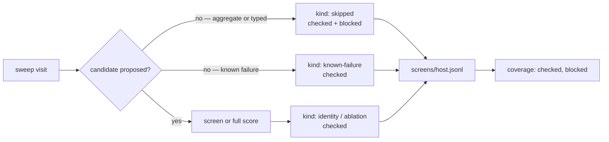

# Count every sweep visit as coverage (Issue #93)

## Summary

`checked X of Y hidden` went **backwards** on the fleet — `1417/6969` on one
check-in, `1416/7005` on the next — while every run reported
`progress: 0 newly screened this run`. Closes #93.

The cause is not the reporting arithmetic. A neuron the razor could propose no
candidate for filed **no screen record at all**, so it stayed in `unchecked`
forever:

- `ablate_mean` fails closed on a neuron whose downstream target carries an
  aggregate squash (`IF`, `MEAN`, `MINIMUM`, `MAXIMUM`, `HYPOT`), on an
  aggregate neuron itself, and on any typed (`condition` / `positive` /
  `negative`) synapse — the shape forests build.
- Measured on a real GRQ creature committed in that repo
  (`GRQ/docs/evidence/recurrent-synapse-5809bad99229.json`): **1320 of 1675
  hidden neurons — 78.8% — can never produce a candidate** (1256
  aggregate-target, 52 typed-outgoing, 12 self-aggregate). The remaining 21.2%
  matches the fleet's frozen `1417/6969 = 20.3%` almost exactly.

So the numerator was pinned to the prunable minority. It could only *fall* —
one neuron per accepted cut — and the sweep spent every batch re-visiting the
same neurons, which is why `progress` was 0 while `winners: 15 screened` said
the scorer had been busy.

The fix makes coverage measure what it claims to measure — *how far the sweep
has got through this creature*:

- **Every visit files coverage.** A visit with no candidate to score is filed
  with `kind: skipped`; one a standing full-corpus verdict suppressed is filed
  with `kind: known-failure`. Both are ordinary `Screened` records carrying
  `outcome: loser`, so an **older host in the mixed-version fleet reads them as
  plain coverage** rather than failing to deserialise the whole shared screen
  history — the same reason `Learning::full_delta` is a field and not a new enum
  variant.
- **`Coverage::blocked` keeps it honest.** A uuid whose every record is a
  skipped visit is counted as checked *and* reported as blocked, so a rising
  percentage never claims a screen that never happened. A single real screen
  anywhere in fleet history clears the flag permanently.
- **Only the first such visit is filed.** Nothing was scored, so a repeat record
  carries no new fact — just another line in a log every host reads end to end
  on every run.
- **A batch with nothing to file journals nothing**, so an empty `screened`
  record never claims coverage work that did not happen.



The rendered block gains one line, and `progress:` now says *newly checked*
because it counts visits, not screens:

```text
🪒 Ockham neuron screening coverage
checked:   1204 of 5013 hidden (24.0%)
cut:       7 this run
unchecked: 3809 remaining (~39 runs at 100/run)
blocked:   412 checked but structurally unprunable
tagged:    42 carry tags, screened like any other
progress:  100 newly checked this run
```

`coverage.json` gains an additive `blocked` key; a pre-#93 file still
deserialises, and GRQ relays `coverage.txt` verbatim without parsing it.

## Evidence

Backend/CLI only — there is no web interface to screenshot. The evidence is the
regression tests and the measurement above.

**Red before, green after.** `a_visit_the_razor_cannot_propose_for_is_still_recorded_as_checked`
was run against the unfixed filing path (the visit list emptied, everything else
in place). It failed exactly as the fleet behaves:

```text
● batch 0: 1 candidates, 2 skipped, 0 hidden left
  screens: filed 1 screen record(s)
assertion `left == right` failed: one batch visited every hidden neuron, so every one is checked
  left: ["h_cut"]
 right: ["h_agg", "h_cut", "h_fed"]
```

`a_known_failure_skip_is_checked_without_being_called_unprunable` failed on the
same tree with `the suppressed visit must still be coverage: [("h_b", "identity")]`.
Both pass on the fixed tree, and the second run in the first test asserts the
count **holds at 3 rather than falling**, with no duplicate visit records.

**Quality gate.** `./quality.sh` stops at its codespell preflight because
codespell cannot be installed in this container (no `pip`, no `ensurepip`, no
root); CI runs that stage for real. Every other stage was run in the foreground
and passed: bash syntax, shellcheck, the neat-core version gate, markdownlint,
actionlint, `cargo deny check` (advisories/bans/licenses/sources ok),
`cargo fmt --check`, `cargo clippy -D warnings`, `cargo test --workspace
--all-features` (249 + 34 tests, 0 failures) and `cargo doc` with
`RUSTDOCFLAGS=-D warnings`.

## Deliberate test changes

Three existing assertions changed because the behaviour they pin genuinely
changed. No test was removed or disabled.

- `coverage::tests::the_winners_block_renders_exactly_as_grq_will_paste_it`,
  `a_run_with_no_winners_renders_exactly_todays_block`,
  `a_run_that_advanced_nothing_still_renders_its_zero_progress` and
  `cli::a_run_that_screens_nothing_warns_that_it_advanced_no_coverage` — the
  `progress:` line and the zero-progress warning now say *newly checked*,
  because the figure counts visits rather than screens.
- `run::tests::a_creature_that_can_never_propose_stops_instead_of_looping` —
  `newly_screened` was `0`, now `2`. The barren pass still stops with
  `no-candidates`; what changed is that the two visits it made are now recorded
  as the coverage they are. Pretending otherwise is what pinned `checked`.

## Test Plan

Added:

- `run::tests::a_visit_the_razor_cannot_propose_for_is_still_recorded_as_checked`
  — end-to-end over a creature whose hidden neurons are two-thirds unprunable
  (a `MEAN` aggregate and the neuron feeding it): every uuid is checked, the
  kinds are right, `blocked` is 2, the block renders both new lines, and a
  second run neither duplicates records nor loses ground.
- `run::tests::a_known_failure_skip_is_checked_without_being_called_unprunable`
  — a suppressed visit is checked but never counted as blocked.
- `coverage::tests::a_visit_with_no_candidate_is_checked_and_reported_as_blocked`
- `coverage::tests::one_real_screen_clears_blocked_however_many_visits_surround_it`
- `coverage::tests::a_blocked_uuid_no_longer_on_the_creature_counts_for_nothing`
- `coverage::tests::the_description_reports_the_blocked_share_of_the_checked`
- `coverage::tests::the_description_omits_the_blocked_line_when_nothing_is_blocked`
- `coverage::tests::a_pre_93_coverage_json_reads_as_nothing_blocked`

Docs updated in the same change: the README's *Screen coverage*, *How far
Ockham has got* and *GRQ commit-description contract* sections (including their
Mermaid diagrams), and the `coverage.txt` / `coverage.json` rows of the GRQ
contract table in `docs/grq-integration.md`.

## Related

Issue #91 tracks the other half of the same root cause — a run that ends on a
replay accept screens nothing, and the sweep still spends a full `propose()`
attempt (a whole-creature clone) on every unprunable neuron of every pass. This
change makes that waste visible in the artefacts rather than fixing it.
