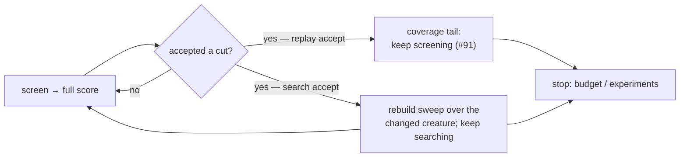

# Remove `--max-accepts` entirely; a run stops only on its budget

## Summary

`--max-accepts` is gone from the ockham CLI — the flag, its `OckhamConfig`
field, its validation, its `ConfigReport` entry and the `max-accepts` stop
reason. A **search** accept no longer ends anything: it rebuilds the sweep over
the creature the cut just changed and the run keeps searching and screening
until its wall-clock budget (or `--max-experiments`) ends, so a run checks in
every cut it landed rather than the first one.

The **replay** accept path from #91 is untouched and deliberately so: a replayed
known win still ends the search and turns the rest of the budget over to screen
coverage. The issue's accepted scope is the flag and its plumbing, not #91's
replay behaviour.

The fleet stops passing the flag in the same change — a binary built from this
release exits non-zero on the unknown flag, so GRQ must land first (see
**Sequencing**). Closes #96.

## Evidence

CLI-only change; there is no web interface to screenshot. The observables the
issue names are asserted by tests that run the real binary and the real run
loop:

```text
$ cargo test --workspace --all-features -- --test-threads=2
test result: ok. 273 passed  (lib)
test result: ok. 11 passed   (cli)
test result: ok. 10 passed   (readme_contract)
… 0 failed across every target

$ bash worker/shared/test_ockham.sh      # in the GRQ branch
=== summary: 93 passed, 0 failed ===
```

The GRQ assertions were watched red before the fleet script changed
(`90 passed, 2 failed`) and green after, so the argv change is genuinely
covered.

What the loop does after an accept now:



### Sequencing

The GRQ change must merge **before** this one reaches the fleet's build, because
`grq_ockham_ensure_binary` rebuilds from the sibling `NEAT-AI-Ockham` HEAD and
the new binary rejects the flag. The GRQ branch is safe against both binaries:
it only ever removes an optional flag from the argv.

- GRQ branch: `ockham-96-drop-max-accepts` (`worker/shared/ockham.sh`,
  `docs/ockham-pruning.md`, the stub-output fixtures).
- `GRQ_OCKHAM_MAX_ACCEPTS` is retired rather than silently obeyed: a node that
  still exports it gets a loud stderr warning naming the retirement, asserted by
  `worker/shared/test_ockham.sh`.

## Acceptance Criteria

<!-- vibe-spec-review inputs="diff+issue-body" -->

- **met** — remove the flag and its plumbing from `config.rs`, `main.rs`,
  `run.rs`, `report.rs` — evidence: `ockham/src/config.rs` (field, default,
  validate and `ConfigReport` entry all gone), `ockham/src/main.rs` (clap arg
  gone), `ockham/src/run.rs` (cap branch and `search_accepts` gone) — reviewer:
  met
- **met** — observable: `--help` no longer lists it, and passing it exits
  non-zero with an unknown-flag error — evidence:
  `ockham/tests/cli.rs::max_accepts_is_gone_from_the_cli` — reviewer: met
- **met** — update every doc that mentions it (`README.md`,
  `docs/grq-integration.md`, `docs/population-entry.md`) — evidence:
  `README.md` (features list, the accept/tail section, the loop diagram, the
  options table), `docs/grq-integration.md:110,136`,
  `docs/population-entry.md:18,55`; machine-checked by
  `ockham/tests/readme_contract.rs::readme_mentions_no_unknown_flags` —
  reviewer: partial — reason: the reviewer saw a loop diagram that still routed
  every accept into the coverage tail and a stale `--max-full` rationale; both
  were fixed after the review (`README.md:527-533`, `README.md:49`)
- **met** — stop the fleet passing `--max-accepts 1`
  (`worker/shared/ockham.sh`, `docs/ockham-pruning.md`) — evidence: GRQ branch
  `ockham-96-drop-max-accepts`, `worker/shared/ockham.sh` (flag and local
  removed), `worker/shared/test_ockham.sh` (two assertions that the flag never
  reaches argv, one that the retired knob is reported) — reviewer: met
- **met** — sequenced so no fleet run fails on an unknown flag — evidence: the
  GRQ commit only removes an optional flag, so it is safe against both the old
  and the new binary; merge order is stated above and in
  `docs/grq-integration.md:136` — reviewer: met
- **partial** — "an accept no longer ends the search or the run" — evidence:
  `ockham/src/run.rs::an_accept_keeps_the_search_going` and
  `::a_search_accept_keeps_searching_instead_of_opening_a_tail` — reviewer:
  partial — reason: true for search accepts; a **replay** accept still ends the
  search and names the stop reason (`run.rs:977`, `run.rs:1029`), which is #91's
  behaviour and outside this issue's accepted scope of "the flag and its
  plumbing"
- **unrequested** — crate version bumped `0.1.35 → 0.1.36`
  (`ockham/Cargo.toml:3`, `Cargo.lock:241`) — reviewer: unrequested — reason:
  the unattended machines rebuild only on a version change
  (`scripts/auto-version.sh`), so a behaviour change that does not bump ships
  nothing
- **unrequested** — GRQ warns on the retired `GRQ_OCKHAM_MAX_ACCEPTS` and the
  stub fixtures stop emitting `"stopReason": "max-accepts"` — reviewer:
  unrequested — reason: dropping the flag would otherwise ignore an exported
  knob silently, which the fail-loud standard forbids

## Standards Review

<!-- vibe-standards-review inputs="diff+CODING-STANDARDS.md" -->

- **violation** — the README loop diagram routed a search accept into the
  `sweepRestart` node, documenting a journal record that path never writes —
  evidence: `README.md:531` — reason: fixed here; the diagram now shows a
  distinct "rebuild sweep, keep searching" step returning to the loop top
- **violation** — comments left claiming "an accept ends the search" after only
  the replay accept still does — evidence: `ockham/src/run.rs:732`,
  `ockham/src/journal.rs:95`, `ockham/src/report.rs:64` — reason: all three
  swept in this diff
- **violation** — `assert_ne!(run.stop_reason, "max-accepts")` is vacuous now
  that the literal cannot be produced — evidence: `ockham/src/run.rs:2335`,
  `ockham/src/run.rs:3023` — reason: both replaced with `assert_eq!` on the stop
  reason the run actually reaches (`no-hidden`)
- **violation** — GRQ would silently ignore an exported
  `GRQ_OCKHAM_MAX_ACCEPTS`, and six stub fixtures still emitted a stop reason
  the binary can no longer produce — evidence:
  `/tmp/grq-96/worker/shared/ockham.sh:437`,
  `/tmp/grq-96/worker/shared/test_forests.sh:233` — reason: fixed in the GRQ
  branch — the knob now warns loudly, the fixtures say `timeout`
- **violation** — the `!has_store` guard in `open_coverage_tail` is unreachable
  from the remaining call sites and its test leg was dropped — evidence:
  `ockham/src/run.rs:1656` — reason: it **stands**. `file_verdicts` grows
  `known` in-run even with `store: None` (`ockham/src/learnings.rs:768`), so a
  storeless replay accept is not provably impossible; the guard is defence in
  depth and removing it was flagged by the spec reviewer as unrequested. Its
  test leg drove the refusal through a *search* accept, a path that no longer
  exists — recorded in the test's doc comment rather than silently dropped
- **violation** — GRQ's doc deleted the cap's stated purpose (bounded check-in
  latency) without naming what bounds it now — evidence:
  `/tmp/grq-96/docs/ockham-pruning.md:60` — reason: fixed — the bullet now names
  `GRQ_OCKHAM_TIMEOUT_SECONDS` as the knob that decides check-in latency
- **clean** — Australian English throughout (`journalled`, `artefact`,
  `prioritise`); markdownlint clean over all 27 files; the version bump follows
  `CONTRIBUTING.md`; the flag, its validation, its report field and its default
  are removed together with no orphans; the new CLI test drives the real binary
  and asserts an exit code and stderr rather than grepping source; every
  renamed or trimmed test carries a doc comment naming the test it replaces and
  Issue #96; no hidden or credential files staged; no new input-handling or
  injection surface

## Test Plan

Added:

- `ockham/tests/cli.rs::max_accepts_is_gone_from_the_cli` — `--help` does not
  list the flag, and passing it exits non-zero with `--max-accepts` named on
  stderr. Watched red before the removal (clap accepted the flag), green after.
- `ockham/src/run.rs::an_accept_keeps_the_search_going` — replaces
  `max_accepts_still_stops_new_discoveries`: the run cuts both hidden neurons in
  one pass and stops with `no-hidden`, not on an accept.
- `ockham/src/run.rs::a_search_accept_keeps_searching_instead_of_opening_a_tail`
  — replaces `the_last_allowed_search_accept_still_screens_for_coverage`: a
  search accept opens no `coverageTail` record, the run accepts more than once
  and still advances screen coverage.
- GRQ `worker/shared/test_ockham.sh` — `--max-accepts` never reaches argv, with
  the retired env knob exported and with it unset; the retirement warning is on
  stderr. Watched red against the unmodified `ockham.sh` (2 failures), green
  after.

Modified (documented, not deleted):

- `replay_applies_every_known_win_ignoring_max_accepts` →
  `replay_applies_every_known_win` — the cap it ignored no longer exists; the
  replay assertions are unchanged.
- `no_tail_without_a_screen_store_or_a_sampled_screen` →
  `no_tail_without_a_sampled_screen` — the "no store" leg drove the refusal
  through a search accept, which no longer opens a tail. The guard it covered
  stands; the reason is recorded in the test's doc comment.
- `an_accept_stamps_coverage_into_the_ockham_tag` and
  `an_accept_without_a_learnings_dir_leaves_the_tag_coverage_free` — `accepts`
  is now `>= 1` rather than exactly 1, because the run no longer stops at the
  first cut. Both still assert the tag shape they were written for.
- `report.rs` journal fixture — `"max-accepts"` → `"timeout"`, a reason the
  binary can still emit. No code branches on the string.

Full gate: `cargo fmt --check`, clippy with the CONTRIBUTING flags,
`cargo test --workspace --all-features`, `cargo doc` with `-D warnings`,
`cargo deny check`, markdownlint and actionlint all pass. `codespell` could not
run in this container (no `pip`, no root to install it); CI runs it for real.
