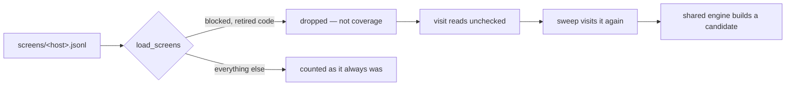
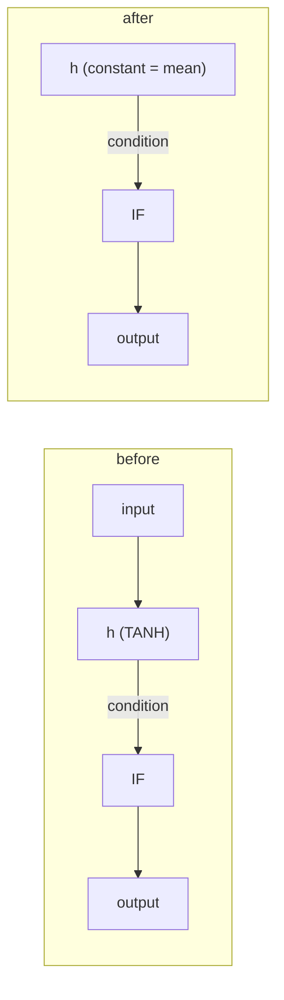
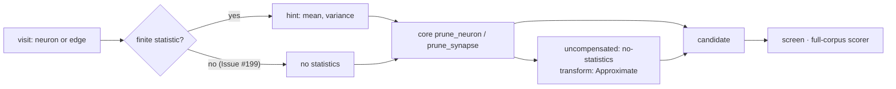

# Blocked visits, by reason — and what to do about each (Issue #103)

`blocked` counts the visits the sweep has made and could propose no cut for. It
has never meant *not pruneable forever*: it means the current proposal mechanism
does not know how to test that visit safely. Since Issue #137 a **synapse
visit** is counted here beside a hidden neuron, because synapse visits are in
the coverage population — a typed edge is visited, blocked, and therefore
checked.

Until Issue #103 it was one number, and one number cannot be attacked. Every
blocked visit now carries a **reason code**, the code rides on the screen record
in `screens/<host>.jsonl`, and every reporting surface counts by it.

## The codes

| Code | What it means | Can the razor build a candidate? |
|---|---|---|
| `aggregate-squash` | The neuron, or something a bias fold would touch, uses an aggregate squash (`IF`, `MEAN`, `MINIMUM`, …) that does not sum its inputs. Since #135 a synapse visit into an aggregate target is counted here: the bias fold is not a sum. | **Yes, since #103** — constant substitution. The code is still recorded where no substitution was reachable, chiefly an IDENTITY collapse blocked by an aggregate target with no activation statistic to fall back on. |
| `unsafe-topology` | **Retired (Issue #192) — no current binary files it.** It meant "the transform cannot treat the neuron as an ordinary hidden unit", and on a real creature it was almost the whole blocked population: an edge out of an implicit `input-N`, and a typed role into an `IF`, were refused outright by Ockham's own rewrite. There is no such thing. Every hidden neuron the incumbent carries and every edge it lists is a target the shared NEAT-AI-core engine builds (#182), so what stops a visit is either the value the razor was missing (`missing-activation`) or a request naming structure the incumbent does not carry — a defect, counted under `other`. The code is still **read**, so fleet history deserialises; a **blocked** record carrying it is dropped at load, because it was filed by a razor that no longer exists and the visit deserves to be tried again. | Yes — it is an ordinary candidate now. |
| `missing-activation` | A statistic Ockham handed core is not a number core can use — a non-finite mean, a negative variance, a proxy that does not hold up. Since Issue #199 an **absent** statistic is no longer one of these: an unmeasured neuron, and an edge whose source resolves to no fold value, go to core carrying no statistics at all, are pruned uncompensated under `no-statistics` and are screened as ordinary scored candidates. What is left under this code is a caller defect. | Not applicable — a run should never file it. A record carrying it names a fault to fix, not a category to build a path for. |
| `validation-failed` | A candidate was built and NEAT-AI-core `creature.validate()` rejected it. | No — failing closed is the point. |
| `no-output-path` | The neuron feeds nothing, so no candidate could be built around it. | Not reachable on a valid incumbent (rule 18). |
| `other` | An explicit reason outside the codes above, including a code written by a newer binary than the one reading it. Since #109 a merge that failed its own growth-unit invariant is counted here: it is a fault to report, not a category to build a path for. Since #192 the same is true of a request naming structure the incumbent does not carry — an unknown neuron, a protected one, an edge that is not there — and of a shape one particular transform does not model (a typed edge out of an IDENTITY collapse, a merge that would run backwards) where the neuron itself is still prunable. | Case by case. |
| `unrecorded` | The record was filed before #103 and carries no reason. | Unknown — it is counted separately rather than guessed at. |

The counts are over visit keys and **sum to the `blocked` total exactly**, so
the breakdown is a partition of the blocked population rather than a sample of
it. That invariant holds across a mix of blocked neuron and blocked synapse
visits (#137).

## What a synapse visit can report (Issue #138)

Since #138 the run walks the edge half of the pool as well as the neuron half,
so these codes are the ones an operator will actually see against a visit key
rather than a neuron UUID. A synapse visit reports exactly four of the codes
above, and no others:

| Code | When a synapse visit reports it |
|---|---|
| `missing-activation` | Never in normal operation. Since Issue #199 a source that resolves to no fold value — an unmeasured hidden source, an unparsable constant, an output as a source — no longer stops the visit: the request goes to core with no statistic, the edge is cut, and the target core could not compensate is named `no-statistics` on the candidate's own report. The code is reachable only when Ockham hands core a statistic that is not a usable number, which is a defect to fix. |
| `unsafe-topology` | Never. Retired by Issue #192 — see the table above. A request naming an edge the incumbent does not carry is a defect, counted under `other`. |
| `aggregate-squash` | Reserved for a neuron visit. An aggregate destination no longer refuses an **edge** cut: since Issue #182 the shared engine removes the term and the scorer judges the result. Since Issue #196 it also *compensates* a destination the cut leaves with **no inward edge** — a zero-edge `MINIMUM`, `MAXIMUM`, `MEAN` or `HYPOT` evaluates to its bias, so the term folds there like any point-wise one; a destination that keeps an inward edge is still named on the core report as uncompensated. `IF` is never folded, whatever it is left with. |
| `validation-failed` | The cleanup could not repair the cut into a valid canonical form, or the creature it returned failed Ockham's own validation. Following a *supported* core prune that is a rewrite-engine defect, not a normal outcome — see [pruning-ownership.md](pruning-ownership.md). |

Since Issue #182 an edge out of an implicit `input-N`, and a typed role into an
`IF`, are **ordinary candidates**: the shared engine names an edge by its
`(from, to, role)` triple, so an observation-incident edge is cut rather than
refused, and typed structure is rewritten rather than failed closed. Both used
to be the common `unsafe-topology` case on a real creature, which is why that
code is retired (#192). `no-output-path` is a neuron path and is never reported
for an edge; `other` is reported for an edge only as a defect — a request naming
a pair the incumbent does not carry — and never as a category; `unrecorded`
belongs to records filed before #103 and pre-dates synapse visits entirely.

Nothing weighs the edge. No weight, magnitude or contribution threshold decides
whether a synapse visit is proposed, because the full-corpus scorer is the sole
acceptance gate — a refusal here is always structural or a missing value, never
a judgement that the edge was too small to bother with.

## Retired codes, and why a retired record is not coverage (Issue #192)

A code is **retired** when no current binary can file it. `unsafe-topology` is
the first, and so far the only one.

It was the dominant category on a live GRQ creature. A check-in on 9 September
2026 reported `blocked: 44046 checked with no cut proposed` with
`unsafe-topology 44003 (99.9%)` against a creature of 7576 hidden neurons and
48515 edges — almost every edge in the pool refused. Every one of those refusals
came from Ockham's own rewrite failing closed on an `input-N` source or a typed
role, and every one of them is a candidate the shared engine builds. Runs on the
same creature after Issue #182 landed blocked **nothing**: `funnel: neurons …
0 blocked · synapses … 0 blocked`.

That leaves a record problem. A blocked screen record is what makes a visit
*checked*, and 44003 of them were filed by a razor that no longer exists — so
the epoch read 100% checked while tens of thousands of candidates sat untried
and the `reasons:` line kept reporting a category the binary could no longer
produce.

So [`LearningsStore::load_screens`] drops a **blocked** record carrying a retired
code. The file is untouched — nothing rewrites fleet history — the record simply
stops being evidence about the razor in hand, and the visit goes back in front of
the sweep. A real screen on the same visit is unaffected: it clears the blocked
state permanently, exactly as it always did.

`BlockedReason::from_code` still reads `unsafe-topology`, so a journal, a
`coverage.json` or a `blockedEpochs` row from before the retirement deserialises
unchanged and still says what that epoch measured.

[`LearningsStore::load_screens`]: ../ockham/src/learnings.rs

## The dominant category, and the path built for it

On a forest-heavy GRQ creature roughly four hidden neurons in five feed an
aggregate squash or carry a typed synapse, so `aggregate-squash` (with
`unsafe-topology` behind it) dominated the blocked population. That is the
measurement #93 recorded and the code paths agree with it: before #103 every one
of those visits ended at the aggregate or typed-synapse check in Ockham's own
rewrite (`ablation::ablate_mean`, retired by Issue #182). A run against live GRQ data will now print the figure
under the codes themselves — the `reasons:` line — which is the first time the
split is measured rather than reasoned about. Those were the neurons worth a new
proposal path, and `ockham/src/substitute.rs` is it.

The half of that population filed under `unsafe-topology` no longer exists at
all: the shared engine takes those visits, and the code is retired (#192).

The mean-activation ablation removes the neuron and folds its mean into every
downstream **bias**. That is only valid where the target sums its inputs. An
aggregate target does not sum, and a bias cannot stand in for a synapse role, so
the fold fails closed.

Constant substitution keeps the **edge** and replaces the **source**:

- the hidden neuron becomes a `constant` neuron emitting its measured mean;
- its **incoming** synapses go, and whatever upstream structure that leaves
  feeding nothing cascades away with it — that is the pruning;
- its **outgoing** synapses stay untouched, weights and roles included, so the
  aggregate target still reads a value on the same edge, `MEAN` still averages
  the same arity and an `IF` still has one edge of each role (NEAT-AI-core
  rule 12).

The claim being made is the razor's usual one — *this neuron's output is close
enough to its mean* — and nothing downstream is rewritten. It is not, however,
a *weaker* claim than the bias fold: folding a mean into a summing target is
linear, whereas pinning a `MEAN`, `MINIMUM` or `IF` **condition** input to its
mean can change which branch the target takes. That is why this is a proposal
and not a simplification: the sampled screen and the full-corpus scorer are what
decide whether the approximation held. Where the neuron really is constant, the
substitution is exact.

It remains a **proposal**. Every substituted candidate passes
`creature.validate()`, the sampled screen and the authoritative full-corpus
scorer like any other, and only the scorer accepts a cut.

### What it counts as

A substituted candidate is scored under a third kind, `constant`, beside
`identity` and `ablation`, in `screens/<host>.jsonl` and in the journal. An
accepted one removes a hidden neuron and the structure that fed it, and leaves a
`constant` neuron in its place — so `cut:` counts it as a cut (the hidden neuron
is gone) while `neurons.len()` falls by one less than the cut count. The growth
proxy Ockham reports, `hidden + synapses / 10`, moves the same way the scorer's
own cost of growth does, and the scorer is what accepts the trade.

### What it costs

A blocked visit used to be nearly free: the sweep rejected it before cloning the
creature (#91), so a batch of 100 candidates could walk five hundred neurons.
Every one of those neurons now produces a candidate instead, so a batch reaches
fewer neurons per sampled screen call — the same one screen call per batch, over
more useful work. That is the trade Issue #103 asks for: coverage per hour buys
less, and scorer-verified cuts per hour buys more, because the neurons being
screened are ones nothing was ever going to prune before.

## The unmeasured visit (Issue #199)

An absent statistic used to be a wall. If the sampled scan never reached a
hidden neuron, or an edge's source resolved to no fold value, Ockham filed
`missing-activation` and the visit was recorded as checked-and-blocked forever
— on a creature whose statistics cache did not cover it, that was the whole
razor stopping on a number it did not have.

It is not a wall, because the compensation was never Ockham's to withhold.
NEAT-AI-core's `prune_neuron` and `prune_synapse` both take `stats: None`: they
run every rewrite provable from the structure alone, fold what a source the
creature itself fixes is worth, and name whatever target is left carrying the
removal on `PruneResult::uncompensated` with the reason `NO_STATISTICS`. The
result is a valid canonical creature — an **approximate** transform, honestly
labelled — and the full-corpus scorer is what says whether losing that term was
worth it.

So no Ockham code path files `missing-activation` for an **absent** statistic
any more. The neuron ladder still tries the exact IDENTITY collapse and the
correlated merge first — both are better candidates when they are available —
and it skips only the constant-substitution rung, which needs a mean to write
into the constant it creates. The code itself stays live for the one thing it
still means: a statistic Ockham supplied that core refused as unusable, which
is a caller defect rather than a category.

## The categories with no path yet

`missing-activation` used to head this list. It does not any more — an
unmeasured visit is a scored candidate, see
[The unmeasured visit](#the-unmeasured-visit-issue-199).

- **`validation-failed`** — a candidate was built and NEAT-AI-core rejected it.
  This is the razor failing closed, and it is reported rather than retried: a
  candidate that cannot validate must never be silently replaced by a different
  transform, because the rejection is information about a shape the razor does
  not model. That reading covers Ockham's **own** rewrites; once a capability
  moves to the canonical NEAT-AI-core engine (#182), the same code after a
  supported core prune is an engine bug to raise there rather than a category
  to count — see [pruning-ownership.md](pruning-ownership.md).
- **`no-output-path`** — NEAT-AI-core rejects a hidden neuron with no outgoing
  edge (rule 18), so a validated incumbent never holds one. The code exists so a
  transform that would leave one refuses rather than emitting a candidate that
  cannot validate.

## Where to read the breakdown

| Surface | What it carries |
|---|---|
| `screens/<host>.jsonl` | `blockedReason` per visit — hidden neuron or synapse — per screening epoch. |
| `coverage.txt` | The `reasons:` line under `blocked:`, commonest first with each category's share. |
| `coverage.json` | `blockedByReason`, one fixed key per code. |
| `experiments.jsonl` | The `coverage` record carries `blockedByReason` beside `blocked`. |
| `report` | `blockedByReason` and `dominantBlockedReason` for the latest snapshot, plus `blockedEpochs` — one row per screening epoch, holding that epoch's freshest breakdown as counts and as a rendered `reasons` string with each category's share. |

`blockedEpochs` is the historical half: a corpus change opens a new screening
epoch, and the series says whether a category is growing, shrinking, or was
solved by a new proposal path. The rows appear in the order the journals name
the epochs, and a journal that carries a blocked total with no reasons — every
journal written before #103 — has the difference filed as `unrecorded`, so the
sum invariant holds on the replay path too rather than only on the live one.

Every artefact is additive. A `coverage.json`, journal or screen record written
before #103 still deserialises — as no reasons, and as the `unrecorded`
category — and a reason code from a newer host reads as `other` rather than
failing the load of every record beside it.
