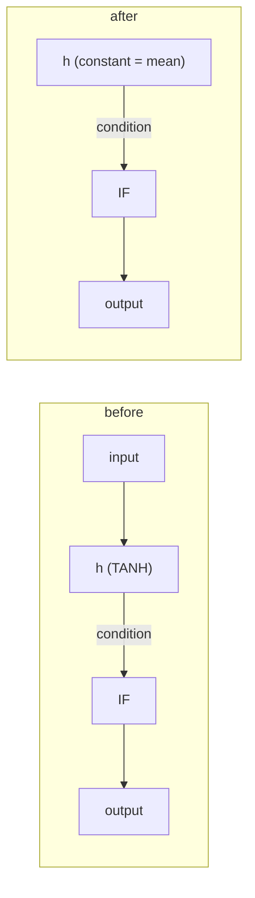

# Blocked neurons, by reason — and what to do about each (Issue #103)

`blocked` counts the hidden neurons the sweep has **visited** and could propose
no cut for. It has never meant *not pruneable forever*: it means the current
proposal mechanism does not know how to test that neuron safely.

Until Issue #103 it was one number, and one number cannot be attacked. Every
blocked visit now carries a **reason code**, the code rides on the screen record
in `screens/<host>.jsonl`, and every reporting surface counts by it.

## The codes

| Code | What it means | Can the razor build a candidate? |
|---|---|---|
| `aggregate-squash` | The neuron, or something a bias fold would touch, uses an aggregate squash (`IF`, `MEAN`, `MINIMUM`, …) that does not sum its inputs. | **Yes, since #103** — constant substitution. |
| `unsafe-topology` | A typed (role-carrying) synapse, or a neuron the transform cannot treat as an ordinary hidden unit. | **Yes, since #103** — constant substitution keeps the role-carrying edge. |
| `missing-activation` | No finite sampled activation statistic for the neuron. | No — there is no value to substitute. See below. |
| `validation-failed` | A candidate was built and NEAT-AI-core `creature.validate()` rejected it. | No — failing closed is the point. |
| `no-output-path` | The neuron feeds nothing, so no candidate could be built around it. | Not reachable on a valid incumbent (rule 18). |
| `other` | An explicit reason outside the codes above, including a code written by a newer binary than the one reading it. | Case by case. |
| `unrecorded` | The record was filed before #103 and carries no reason. | Unknown — it is counted separately rather than guessed at. |

The counts are over UUIDs and **sum to the `blocked` total exactly**, so the
breakdown is a partition of the blocked population rather than a sample of it.

## The dominant category, and the path built for it

On a forest-heavy GRQ creature roughly four hidden neurons in five feed an
aggregate squash or carry a typed synapse, so `aggregate-squash` (with
`unsafe-topology` behind it) dominated the blocked population. Those were the
neurons worth a new proposal path, and `ockham/src/substitute.rs` is it.

The mean-activation ablation removes the neuron and folds its mean into every
downstream **bias**. That is only valid where the target sums its inputs. An
aggregate target does not sum, and a bias cannot stand in for a synapse role, so
the fold fails closed.

Constant substitution keeps the **edge** and replaces the **source**:

- the hidden neuron becomes a `constant` neuron emitting its measured mean;
- its **incoming** synapses go, and whatever upstream structure that leaves
  feeding nothing cascades away with it — that is the pruning;
- its **outgoing** synapses stay untouched, weights and roles included, so the
  aggregate target still reads a value on the same edge, `MEAN` still averages
  the same arity and an `IF` still has one edge of each role (NEAT-AI-core
  rule 12).

The approximation is exactly the one the razor already makes — *this neuron's
output is close enough to its mean* — and nothing downstream is rewritten, so it
is no stronger a claim than the bias fold it replaces. Where the neuron really
is constant, the substitution is exact.

It remains a **proposal**. Every substituted candidate passes
`creature.validate()`, the sampled screen and the authoritative full-corpus
scorer like any other, and only the scorer accepts a cut.

### What it costs

A blocked visit used to be nearly free: the sweep rejected it before cloning the
creature (#91), so a batch of 100 candidates could walk five hundred neurons.
Every one of those neurons now produces a candidate instead, so a batch reaches
fewer neurons per sampled screen call — the same one screen call per batch, over
more useful work. That is the trade Issue #103 asks for: coverage per hour buys
less, and scorer-verified cuts per hour buys more, because the neurons being
screened are ones nothing was ever going to prune before.

## The categories with no path yet

- **`missing-activation`** — there is no finite measured mean, so neither the
  bias fold nor a constant has a value to stand in for the neuron. A safe path
  would need a different statistic (a median, or a scan that reaches the neuron
  at all), and inventing a substitute value would be exactly the guess the razor
  must not make. Note that NEAT-AI-core clamps every activation to a finite
  range, so this is rare in practice; it is what a visit reports when a cached
  statistics scan does not cover the neuron.
- **`validation-failed`** — a candidate was built and NEAT-AI-core rejected it.
  This is the razor failing closed, and it is reported rather than retried: a
  candidate that cannot validate must never be silently replaced by a different
  transform, because the rejection is information about a shape the razor does
  not model.
- **`no-output-path`** — NEAT-AI-core rejects a hidden neuron with no outgoing
  edge (rule 18), so a validated incumbent never holds one. The code exists so a
  transform that would leave one refuses rather than emitting a candidate that
  cannot validate.

## Where to read the breakdown

| Surface | What it carries |
|---|---|
| `screens/<host>.jsonl` | `blockedReason` per neuron, per screening epoch. |
| `coverage.txt` | The `reasons:` line under `blocked:`, commonest first with each category's share. |
| `coverage.json` | `blockedByReason`, one fixed key per code. |
| `experiments.jsonl` | The `coverage` record carries `blockedByReason` beside `blocked`. |
| `report` | `blockedByReason` and `dominantBlockedReason` for the latest snapshot, plus `blockedEpochs` — one row per screening epoch, holding that epoch's freshest breakdown. |

`blockedEpochs` is the historical half: a corpus change opens a new screening
epoch, and the series says whether a category is growing, shrinking, or was
solved by a new proposal path.

Every artefact is additive. A `coverage.json`, journal or screen record written
before #103 still deserialises — as no reasons, and as the `unrecorded`
category — and a reason code from a newer host reads as `other` rather than
failing the load of every record beside it.
