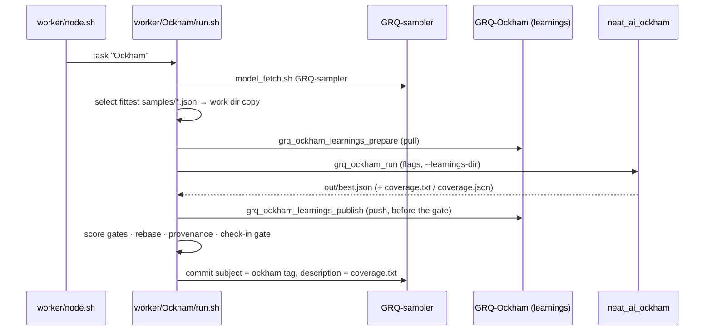

# How GRQ drives Ockham today

This is an **audit**, not a proposal. It records how the GRQ fleet actually
invokes `neat_ai_ockham` right now, so that anyone reading this public repo can
see which of Ockham's surfaces are load-bearing before changing them.

Every claim below cites the GRQ file and function it came from, so it can be
re-verified. All citations are against `stSoftwareAU/GRQ` `Develop` at commit
`6ad319f` (2026-08-30). GRQ is a private repository; the paths are given in full
so a reader with access can check each one.

Two things in this document correct assumptions that were true earlier and are
not true at `6ad319f` — the commit **description** (section 5) and the meaning
of **exit code 2** (section 6). Both are flagged where they appear.

## At a glance



## 1. Invocation

**Dispatch.** `worker/node.sh` runs the general-population worker from its
`"Ockham")` case (`./Ockham/run.sh`), and the island variant from its
`"team-ockham")` case (`./teams/team-ockham.sh`).

**The worker.** `worker/Ockham/run.sh`:

| Value | Source |
|---|---|
| `SAMPLER_REPO` | `${GRQ_SAMPLER_DIR:-<parent>/GRQ-sampler}` |
| `SAMPLES_DIR` | `${SAMPLER_REPO}/samples` |
| `WORK_DIR` | `${GRQ_OCKHAM_WORK_DIR:-${REPO_DIR}/.ockham-sampler}` |
| `OCKHAM_OUT_DIR` | `${WORK_DIR}/out` — Ockham's `--output-dir` |
| `HOST` | `uname -n`, first dot-separated label |
| `OUT_REL` | `samples/${HOST}-ockham.json` |

Order of operations, all in `worker/Ockham/run.sh`:

1. `worker/model_fetch.sh GRQ-sampler` runs to completion **before** selection —
   a concurrent clone empties the working tree, so selecting during it would
   pick from a half-populated `samples/`.
2. Training data: `GRQ_OCKHAM_DATA_DIR` when set; otherwise
   `worker/trainDataStocks.sh --mode=ockham --current` followed by
   `grq_terminal_resolve_data_dir` (`worker/shared/terminal.sh`). Failure to
   resolve is fatal.
3. Scorer: `ensure_neat_ai_native_scorer`
   (`worker/shared/ensure_neat_ai_native_scorer.sh`) when
   `NEAT_AI_RUST_SCORER_BINARY_PATH` is unset.
4. `grq_ockham_select_fittest_sample` (`worker/shared/ockham.sh`) walks
   `samples/*.json`, reads each `score` tag with `grq_ockham_read_score`, and
   prints `"<abs-path>\t<score>"` for the highest. No scored sample is fatal.
5. The work dir is deleted and recreated, and the winner is copied to
   `${WORK_DIR}/source.json`.

**Ockham never writes the source creature and never runs git.** It reads the
copy under the work dir; `worker/Ockham/run.sh` owns every commit. This is
stated in the script's own header comment and holds throughout — the only `git`
calls in the Ockham path are in `worker/Ockham/run.sh` and
`worker/shared/ockham_learnings.sh`.

**The binary.** `grq_ockham_ensure_binary` (`worker/shared/ockham.sh`) honours
`GRQ_OCKHAM_BINARY` when it is executable; otherwise it syncs the sibling
`NEAT-AI-Ockham` and `NEAT-AI-core` checkouts through `grq_ockham_fetch_repo`
(which calls `worker/model_fetch.sh`) on **every** call, and rebuilds with
`cargo build --release -q -p neat_ai_ockham` unless the marker
`target/release/.neat_ai_ockham.version` already equals the stamp
`v<crate version>+<NEAT-AI-Ockham HEAD>+<NEAT-AI-core HEAD>`
(`_grq_ockham_build_stamp`). The resolved binary's `--version` is logged by
`_grq_ockham_log_binary_version`, so a run's log names the build it used.

## 2. Flags

The full argument vector is built in `grq_ockham_run`
(`worker/shared/ockham.sh`). Positional first, then:

| Flag | Value GRQ passes | Env override |
|---|---|---|
| *(positional 1)* | `${WORK_DIR}/source.json` | — |
| *(positional 2)* | resolved 100% training data dir | `GRQ_OCKHAM_DATA_DIR` |
| `--output-dir` | `${WORK_DIR}/out` | `GRQ_OCKHAM_WORK_DIR` |
| `--timeout-seconds` | `grq_ockham_timeout_seconds` | see below |
| `--candidates` | `100` | `GRQ_OCKHAM_CANDIDATES` |
| `--screen-sample-rate` | `0.01` | `GRQ_OCKHAM_SCREEN_SAMPLE_RATE` |
| `--max-accepts` | `1` | `GRQ_OCKHAM_MAX_ACCEPTS` |
| `--max-full` | **not passed**; the companion GRQ change unsets `GRQ_OCKHAM_MAX_FULL` | `GRQ_OCKHAM_MAX_FULL` |
| `--learnings-dir` | `${GRQ_OCKHAM_LEARNINGS_DIR}` | set by section 3 |
| `--learnings-host` | `grq_ockham_learnings_host` | `GRQ_OCKHAM_LEARNINGS_HOST` |
| `--learnings-replay` | only when set | `GRQ_OCKHAM_LEARNINGS_REPLAY` |
| `--seed` | only when set | `GRQ_OCKHAM_SEED` |
| `--max-experiments` | only when set | `GRQ_OCKHAM_MAX_EXPERIMENTS` |
| `--scorer` | arg 4, else `NEAT_AI_RUST_SCORER_BINARY_PATH` | both must be executable |
| `--scorer-arg` | `--gpu=<value>` only when set | `GRQ_OCKHAM_SCORER_GPU` |

Notes that matter to anyone changing Ockham's CLI:

- **`--global-champion` is never passed** — deliberate. Ockham checks in a local
  prune of this run's own source even when Forests is ahead, because breeding
  reads every `samples/*.json`.
- **`--ordering`, `--ordering-random-quota` and `--unchecked-first` are never
  passed today.** `grq_ockham_run` builds no such arguments, so Ockham's own
  defaults apply. For unchecked-first that means
  `OckhamConfig::unchecked_first_enabled` (`ockham/src/config.rs`) decides, and
  it follows `--learnings-dir` — so in production the flag is **on** whenever
  the shared cache is reachable, and off when it is not.
- **`--max-full` caps individual scoring only.** Since Issue #54 it no longer
  gates bundle construction: every screened winner reaches `bundle_plans`
  whatever the cap, so setting `GRQ_OCKHAM_MAX_FULL` again cannot re-create the
  state Issue #45 was raised about, where 30 of 38 winners were discarded before
  any combination was built. The companion GRQ change unsets the variable, so
  production runs with no cap at all.
- The three `--learnings-*` flags are only appended when
  `GRQ_OCKHAM_LEARNINGS_DIR` is non-empty; an unreachable cache means the whole
  block is absent, not empty.
- The scorer path is checked with `-x` before `--scorer` is added. A
  non-executable path is silently not passed, and Ockham falls back to its own
  scorer resolution.

**Budget.** `grq_ockham_timeout_seconds` (`worker/shared/ockham.sh`) starts at
`GRQ_OCKHAM_RUN_TIMEOUT_SECONDS`, else `GRQ_OCKHAM_TIMEOUT_SECONDS`, else
`2700` (45 minutes). When `GRQ_TASK_DEADLINE_EPOCH` is set it is trimmed to the
remaining task time less `GRQ_OCKHAM_CHECKIN_RESERVE_SEC` (default 180); under
120 seconds remaining it returns 1, and `grq_ockham_run` turns that into rc 2 —
a clean skip (section 6). On top of Ockham's own `--timeout-seconds`, GRQ wraps
the process in `timeout`/`gtimeout` `-s SIGTERM` at `timeout_sec + 120` as a
hard backstop; rc 124/143/137 are tolerated and `best.json` is used if present.

**Stdout discipline.** The binary is invoked with `>&2`. `grq_ockham_run`'s own
stdout *is its return value* — the caller reads the `best.json` path out of a
command substitution — so anything Ockham prints to stdout must not be mixed
into it. This is the `#4463` regression, where a run summary on stdout made
`BEST` a 51,000-line string and every accepted prune on the fleet was discarded.

## 3. Learnings cache

`worker/shared/ockham_learnings.sh` is the whole GRQ side of the shared cache.
The optimiser never runs git; GRQ moves the files.

- **Repo** — `grq_ockham_learnings_repo`: `${GRQ_OCKHAM_LEARNINGS_REPO}`, else
  `<parent>/GRQ-Ockham` beside the other data repos.
- **Directory** — `grq_ockham_learnings_dir`: `learnings` for the general
  population, `learnings-team-<island>` for an island. An island name that is
  not `^[A-Za-z0-9][A-Za-z0-9._-]*$` is refused, because the name reaches both a
  directory path and a `git add` pathspec.
- **Prepare** — `grq_ockham_learnings_prepare "" "Ockham"`, called from
  `worker/Ockham/run.sh`, syncs the clone via `grq_ockham_learnings_sync` →
  `grq_ockham_fetch_repo` → `worker/model_fetch.sh`, creates the directory, and
  prints it. The worker exports it as `GRQ_OCKHAM_LEARNINGS_DIR`. Every fault
  prints nothing, warns loudly, and the run continues **without** the cache.
- **Health** — each outcome is recorded against the `ockham-learnings`
  capability (`grq_ockham_learnings_capability`, `grq_capability_degraded` /
  `grq_capability_available` in `worker/shared/capability_health.sh`), so a
  cache that is off on every run stops being a warning nobody reads.
- **Publish** — `grq_ockham_learnings_publish` commits the run's appended
  records as `🪒 Ockham learnings from <host> (<rel>) (#4401)` and pushes,
  retrying `git_push_safe` / `git_pull_safe --rebase` up to
  `GRQ_OCKHAM_LEARNINGS_PUSH_ATTEMPTS` (default 5) times. Nothing staged is a
  silent success; a git fault is a warning and never a stage failure.

**Publish happens before the improvement gate.** `worker/Ockham/run.sh` calls
`grq_ockham_learnings_publish` immediately after `grq_ockham_run` returns and
*before* it inspects the score, so **REFUSED verdicts are published too** — a
refused cut is exactly as valuable to the fleet as an accepted one, because it
is a full-corpus scorer call nobody has to pay again.

**Layout.** From the file's own header:

```text
learnings/corpus-<identity>/<host>.jsonl                general population
learnings-team-<island>/corpus-<identity>/<host>.jsonl  one island
```

Append-only, and **each host appends only to its own `<host>.jsonl`**, so two
hosts never touch the same file: no merge driver is needed and a concurrent push
resolves as a fast-forward or a clean rebase. A record names a **neuron UUID**,
not a portable patch, so a replayed verdict is only useful while that UUID is
still on the incumbent — the crate's own store does that filtering, and GRQ
changes nothing about it.

Islands are `CLOSED_BIOSPHERE=1` by design and therefore get their own
directory: an island stops paying twice for its own refusals without ever seeing
a verdict the general population discovered.

## 4. Check-in path

In `worker/Ockham/run.sh`, in order. Every "discard" below is `exit 0` — a clean
no-improvement outcome is a success, not a host failure.

1. **Run outcome.** rc 2 → `skipped (budget too small)`, exit 0. Any other
   non-zero → `grq_fail_loud_fatal`.
2. **Path guard.** `grq_assert_candidate_path "Ockham" "${BEST}"`
   (`worker/shared/candidate_path.sh`) — `BEST` must be a readable regular file,
   checked before anything can mistake a run summary for a filename.
3. **Pre-rebase improvement gate (`#4528`).** `grq_ockham_read_score "${BEST}"`
   must beat `SOURCE_SCORE` under `grq_ockham_score_beats` (strict `>`, awk
   float). A readable losing score discards here, before the rebase's cargo
   build, sampler pull and full-corpus scoring are paid for. An *unreadable*
   score falls through to the existing post-rebase fatal.
4. **Rebase re-entry (`#4431`).** When `grq_rebase_enabled`
   (`worker/shared/rebase.sh`), the sampler is pulled and `grq_rebase_candidate`
   runs with direction **`onto-candidate`** — not `onto-champion`. Ockham's
   contribution is *removed* neurons, which NEAT-AI-Rebase v1 cannot harvest out
   of a published creature, so `BEST` must be the base or the run's work is
   silently dropped. On rc 0 with a file, `BEST` becomes the rebased creature and
   `REBASE_BASE` / `REBASE_BASE_SCORE` are read from `grq_rebase_base_path` /
   `grq_rebase_base_score`. Every other outcome keeps `BEST`.
5. **Score readable.** `CANDIDATE_SCORE` empty → fatal
   (`Ockham best.json has no numeric score tag`).
6. **Gate baseline (`#4532`).** The improvement gate judges against the rebase
   base's score when it is readable, otherwise against the source, with a
   warning. A rebased creature was never scored against the sample the run
   opened on, and judging it there discarded creatures the scorer had just
   preferred to the fleet champion.
7. **Provenance guard.** `grq_creature_guard_checkin_lineage "Ockham" <source>
   <candidate-before-rebase> <best> <rebase-base>`
   (`worker/shared/creature_provenance_guard.sh`) walks the publication lineage
   one hop at a time: creature-level tag *names* must survive (except `score`
   and `dataSha`, which NEAT-AI sheds at the mutation site), per-neuron `tags`
   must survive, and `uuid` / `memetic` must be absent. For a pruning optimiser
   this is exactly the "a TAGGED neuron was cut" case. A refusal is a **skipped
   check-in**, exit 0 — not a stage failure.
8. **Check-in gate.** `grq_ockham_validate_for_checkin` (`worker/shared/ockham.sh`)
   delegates to `grq_validate_for_checkin <file> ockham 🪒`
   (`worker/shared/validate_for_checkin.sh`), which asks the TypeScript engine —
   `src/IntelligentDesign/ValidateForCheckin.ts` — whether the general
   population can read the creature: `Creature.validate()` passes, and
   `fromJSON` → `exportJSON` returns every neuron and synapse. It **refuses; it
   never repairs**, because repair rewrites the creature that was measured. A
   refusal is `exit 1`.
9. **Publish subshell**, inside `SAMPLER_REPO`: `enforce_never_merge_json`,
   `sampler_pull_with_auto_resolve "ockham-sampler" "ours"`, then the second
   half of the tip gate — the candidate must also beat the score on the current
   tip `samples/${HOST}-ockham.json`, or it is discarded. Then
   `format_creature_json` writes `OUT_REL`, `grq_ockham_verify_written_score`
   reads the score back and refuses a mismatch, `safe_git_add` stages,
   `scan_json_merge_markers` refuses merge markers, `grq_ockham_git_commit`
   commits, and `git_push_safe` pushes with up to 12 pull-rebase-recommit
   retries (the retry subject gains `, attempt N` and carries the same
   description).

`GRQ_OCKHAM_SAMPLER_CHECKIN_HOOK` short-circuits the whole check-in for
hermetic tests, as `GRQ_OCKHAM_TEST_MODE=1` + `GRQ_OCKHAM_HOOK` does for the
binary.

## 5. Commit message

**The subject is the creature's `ockham` tag.** `grq_ockham_read_message`
(`worker/shared/ockham.sh`) reads
`[.tags[]? | select(.name == "ockham") | .value] | .[0]` out of `best.json` and
`worker/Ockham/run.sh` uses it verbatim as `MSG`, the first `-m` of the commit.
GRQ deliberately reads no other program's tag — Forests, Lamarck and Intelligent
Design stamp their own.

That tag is written by `CreatureMeta::stamp_acceptance` in `ockham/src/tags.rs`,
which upserts `score`, `error` and `ockham`, the last rendered by
`ockham_progress_message` in the same file.

GRQ adds exactly two things to the subject:

- the razor prefix `🪒` (with a trailing space) when the tag does not already
  start with it; and
- the rebase outcome marker from `grq_rebase_commit_note`
  (`worker/shared/rebase_message.sh`) — `[🪢 rebase: applied, …]`, `attempted`,
  or `failed (rc N)`, and **no marker at all** when the rebase block never ran.

When the tag is empty (a creature with no `ockham` tag), the worker falls back
to `🪒 Ockham improvement of ${OUT_NAME}, ${SCORE_MSG}` with `SCORE_MSG` from
`grq_format_score_message`. GRQ never appends a second score clause to a real
tag subject — the tag already carries one.

**Correction to the premise of this audit's issue.** Issue #34 asked this
document to record that "there is no commit description assembly today —
`git commit -m "${MSG}"` is subject-only". That was true when #34 was written;
it is **not** true at GRQ `6ad319f`. GRQ `#4525` wired the description:

- `grq_ockham_read_coverage "${OCKHAM_OUT_DIR}"` (`worker/shared/ockham.sh`)
  reads `coverage.txt` from Ockham's `--output-dir`;
- `grq_ockham_git_commit "${MSG}" "${COVERAGE}"` (same file) issues
  `git commit -m "<subject>" -m "<coverage block>"`, one helper shared by the
  first commit and the push-retry commit so the two can never disagree.

GRQ computes nothing here — Ockham does all the measuring and renders the block
(`ockham/src/coverage.rs::write_files`), and GRQ relays it verbatim, **beside**
and never inside the `ockham` tag subject. Absent or whitespace-only
`coverage.txt` — an older binary, or a run with no learnings dir — prints
nothing, returns 0, and produces the byte-identical subject-only commit GRQ made
before. The gap that sub-issues of #33 exist to close is therefore closed on the
GRQ side; what remains is Ockham's own reporting quality, not the relay.

## 6. Surface contract

What GRQ reads out of Ockham. Changing any row breaks a live fleet worker.

| Surface | Read by | Contract |
|---|---|---|
| `<output-dir>/best.json` | `grq_ockham_run` | Must exist after the run, or the helper returns 1. It is the helper's printed return value. |
| `score` creature tag | `grq_ockham_read_score` | Numeric (`^-?\d+(\.\d+)?([eE][-+]?\d+)?$`). Drives both score gates and `grq_ockham_verify_written_score`. |
| `ockham` creature tag | `grq_ockham_read_message` | The commit **subject**, used verbatim. Must already carry its own single score clause. |
| Other creature tag *names* | `grq_creature_guard_checkin_lineage` | Every source tag name must survive on the candidate, except `score` / `dataSha`. `error` is stamped by `stamp_acceptance` and matters here as a name. |
| Per-neuron `tags` | `grq_creature_guard_checkin_lineage` | Must survive the prune. Cutting a tagged neuron loses provenance that cannot be recovered from the checked-in file. |
| `uuid` / `memetic` keys | `grq_creature_guard_checkin_lineage` | Must be **absent** from the written creature. |
| `<output-dir>/coverage.txt` | `grq_ockham_read_coverage` | Line-oriented block relayed verbatim as the commit description. Since Issue #59 it may carry `winners:` / `bundles:` / `dropped:` lines after the coverage lines; each is omitted when it has nothing to report, and a run that screened nothing renders the pre-#59 block byte for byte. Absent or blank is a supported no-op. |
| `<output-dir>/coverage.json` | *nothing in GRQ today* | Written by Ockham; GRQ reads only `coverage.txt`. Since Issue #59 it carries an additive `winners` object beside the existing coverage fields, which are unchanged. |
| Process stdout | *nothing* | Redirected to stderr by `grq_ockham_run`. `grq_ockham_run`'s **own** stdout must carry the `best.json` path and nothing else. |
| Exit code 0 | `grq_ockham_run` | Success; `best.json` must be present. |
| Exit code 124/143/137 | `grq_ockham_run` | OS wall-clock backstop — warned, and `best.json` is used if present. |
| Any other non-zero | `grq_ockham_run` | Reported as `neat_ai_ockham exited <rc>` and turned into helper rc **1**, a fatal run fault. |

**Correction: exit code 2.** `worker/Ockham/run.sh` treats rc 2 from
`grq_ockham_run` as "budget too small; nothing to check in". That rc 2 is
generated **inside `grq_ockham_run`** when `grq_ockham_timeout_seconds` reports
under 120 seconds left — it is not the binary's exit code. The binary's own
`ExitCode::from(2)` (`ockham/src/main.rs`, config validation failure) reaches
GRQ through the "any other non-zero" row above and is a **fault**, not a clean
skip. An invalid flag is therefore reported loudly rather than mistaken for a
budget skip.

## The island variant

`worker/shared/island_ockham.sh::grq_island_ockham_run`, dispatched by
`worker/teams/team-ockham.sh`, is the same optimiser wired for one island. It
shares `grq_ockham_run`, `grq_ockham_learnings_prepare` / `_publish` and the
same rc-2 skip, and differs in four ways:

- it runs only for an island with `ISLAND_OCKHAM=1`
  (`grq_island_ockham_enabled`, `worker/shared/island_select.sh`);
- the source is the island-wide fittest `*-100.json`
  (`grq_island_select_fittest`), not a GRQ-sampler sample;
- the wall clock is fitted into the remaining task hour through the one-shot
  `GRQ_OCKHAM_RUN_TIMEOUT_SECONDS` override
  (`grq_island_task_fit_budget_seconds`), never the durable default; and
- acceptance goes through `grq_island_accept_candidate <team> ockham …`
  (`worker/shared/island_accept.sh`) to `${HOST}-ockham-100.json`, so there is
  no GRQ-sampler commit and none of section 5 applies.

`GRQ_OCKHAM_LEARNINGS_DIR` is exported for the island's own
`learnings-team-<island>` directory and unset again immediately after the run,
so one island's cache can never bleed into the next island of the same dispatch.
