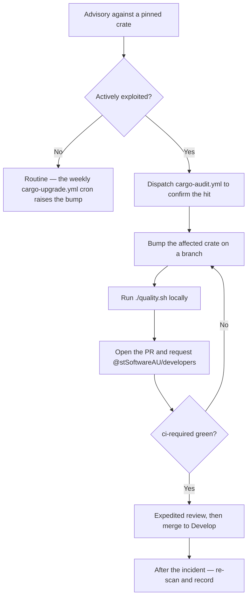

# Emergency dependency fix — the fast lane (Issue #129)

Routine dependency work has two documented paths: the weekly
[`cargo-upgrade.yml`](../.github/workflows/cargo-upgrade.yml) cron (Mondays
06:00 UTC) and an ordinary pull request that clears `ci-required`. Both assume
there is time to wait.

This runbook is for the case where there is not: a RUSTSEC advisory lands
against a crate this repository pins, and it is being actively exploited. It
names the override so a maintainer does not have to improvise the procedure
under pressure.

## When to use this

Use the fast lane when **all** of the following hold:

- an advisory exists against a dependency in `Cargo.lock` — usually surfaced by
  `cargo-audit.yml`, or reported through the private channels in
  [SECURITY.md](../SECURITY.md);
- exploitation is active, or a public proof of concept exists; and
- waiting for the next Monday cron, or for an unprioritised review queue, is
  itself the risk.

Anything else is routine: let the weekly cron raise the bump and let CI judge
it. Over-using the fast lane spends the maintainer attention it depends on.



## The fast lane

Every workflow below is manually dispatchable — **Actions** tab → the workflow
→ **Run workflow** — or from the CLI with
`gh workflow run <file> --ref Develop`. This is the override the normal cadence
otherwise hides.

| Workflow | Dispatch it to |
|---|---|
| `cargo-audit.yml` | Re-run the RustSec advisory scan against the current `Cargo.lock` immediately, instead of waiting for the Monday cron, to confirm the advisory hits this repository. |
| `cargo-upgrade.yml` | Raise the automated dependency-bump PR now. Use it when the fix is already released and a compatible `cargo upgrade` picks it up. |
| `ci.yml` | Re-run the full gate on `Develop` (or a branch) after an out-of-band change, without pushing an empty commit. |

Then, in order:

1. **Confirm the hit.** Dispatch `cargo-audit.yml`. An advisory that does not
   name a crate in `Cargo.lock` is not an incident here.
2. **Bump the crate directly.** Branch from `Develop` and edit
   `ockham/Cargo.toml` / `Cargo.lock` for the affected crate alone — a targeted
   `cargo update -p <crate>` beats a whole-lockfile refresh, because a smaller
   diff reviews faster. Where the fix lives in the sibling
   [`NEAT-AI-core`](https://github.com/stSoftwareAU/NEAT-AI-core), fix it there
   first; this repository consumes it as a path dependency.
3. **Run the gate locally**, so review is the only thing left to wait for:

   ```bash
   ./quality.sh < /dev/null
   ```

4. **Open the PR and say why it is urgent.** Put the advisory ID (e.g.
   `RUSTSEC-YYYY-NNNN`) in the title, and in the body state the affected crate,
   the fixed version, and the evidence of exploitation.
5. **Request expedited review.** `@stSoftwareAU/developers` owns review under
   [`.github/CODEOWNERS`](../.github/CODEOWNERS); ping the team directly rather
   than waiting for the queue. A same-day review is the part of this path that
   cannot be automated.

## What the fast lane does not shorten

The override buys time on the **cadence**, never on the **gate**:

- `ci-required` still has to be green. It aggregates quality, security, shell,
  spell and version checks, and a security fix that breaks the build is not a
  fix.
- `./quality.sh` still has to pass locally — see
  [CONTRIBUTING.md](../CONTRIBUTING.md).
- Review still happens. Expedited means *sooner*, not *skipped*; the
  `CODEOWNERS` requirement stands.
- Nothing here sanctions `--no-verify`, an admin merge, or disabling a required
  check. If the gate itself is what blocks the fix, fix the gate in the same PR
  and say so in the body.

## After the incident

Once the fix is on `Develop`:

1. Confirm a clean scan — dispatch `cargo-audit.yml` once more against
   `Develop`.
2. If the advisory was reported privately, close the loop with the reporter as
   [SECURITY.md](../SECURITY.md) describes, and coordinate disclosure.
3. Let the weekly cadence resume; no cron or branch protection is disabled by
   this procedure, so there is nothing to restore.
4. If the response was slowed by something this runbook does not cover, raise
   an issue and amend this file. A runbook that was wrong once under pressure
   will be wrong again.
