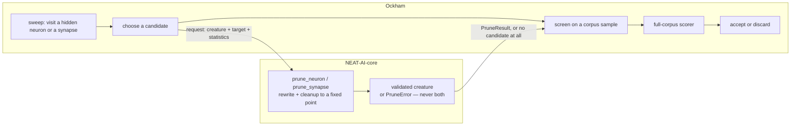

# Where pruning rewrites live (Issue #172)

Ockham does not own the semantics of a structural rewrite. The canonical
pruning engine lives in
[NEAT-AI-core](https://github.com/stSoftwareAU/NEAT-AI-core), so every member of
the NEAT-AI family prunes a creature the same way, and a rewrite bug is fixed
once rather than in each optimiser that grew its own copy.

This document is the checked-in design reference for that decision. The
decision itself was taken in Ockham issue #172; the engine was built under the
core project [stSoftwareAU/NEAT-AI-core#587](https://github.com/stSoftwareAU/NEAT-AI-core/issues/587)
(parity fixtures #588, fixed-point cleanup and constant invariants #589,
hidden-neuron pruning #590, synapse pruning with `IF`/typed-role rewrites #591,
WASM exposure #592). Ockham's own consumption of that engine — and the
retirement of the duplicate rewrite code it still carries — is issue #182.

Ockham issues #173 to #180 remain useful as scenario and design history. They
are superseded by the core project: none of them is an Ockham implementation
task any more.

## The boundary

Ockham decides **what to try and whether it was worth it**. Core decides
**what the graph becomes**. A candidate that core will not build is not a
candidate: nothing partially rewritten is passed on to be screened or scored.

## The preserved design principles

These are the principles the engine was built to, recorded here so they survive
the issue thread that stated them:

- hidden neurons and synapses are pruning candidates;
- observation/input and output neurons are protected from direct deletion;
- constants are support nodes, not direct optimisation targets;
- at most three constants, all bias=1; remove them automatically when unreferenced;
- graph rewrites must run to a valid fixed point before screening/scoring;
- invalid candidates never reach the scorer;
- `validation-failed` after a supported prune is a rewrite-engine bug, not a
  normal outcome;
- Ockham owns candidate choice/scoring, not structural-rewrite semantics.

Each one is enforced by named structure in core rather than by convention, and
`ockham/tests/pruning_ownership.rs` asserts them against the sibling neat-core
this repository compiles against — so a core release that dropped one fails
here rather than in a reviewer's memory:

| Principle | What enforces it in core |
|---|---|
| Hidden neurons and synapses are candidates | `prune_neuron` and `prune_synapse` — a synapse is named by its `(from, to, role)` `SynapseKey`, so an edge out of an observation is a candidate even though the observation neuron is not. |
| Observation and output neurons are protected | `PruneError::Protected { kind }`, with `ProtectedKind::Observation` / `ProtectedKind::Output`. |
| Constants are support nodes | `ProtectedKind::Constant` — a constant is removed as dead structure by the cleanup once nothing references it, never as a requested target. |
| At most three, all bias 1 | `MAX_SUPPORT_CONSTANTS` (3) and `SUPPORT_CONSTANT_BIAS` (1.0), applied by `cleanup_creature`. |
| A valid fixed point before screening | `cleanup_creature` runs to a fixed point; `PruneResult::passes` reports how many passes it took. |
| Invalid candidates never reach the scorer | Every `PruneError` variant returns **no** creature; a returned `PruneResult` carries a canonical, validated one. |

## What this means for Ockham today

Ockham still carries its own rewrite code — `ablation.rs`, `canonical.rs`,
`collapse.rs`, `substitute.rs` and `merge.rs`. That code predates the core
engine, and #182 retires it one capability at a time: prove core parity for a
capability, cut that capability over, delete the Ockham implementation in the
same migration. There are to be no runtime fallbacks and no dual ownership of
the same semantics.

Until then, the rule for new work is the simple half of the boundary: **a
change to what a prune does structurally belongs in core**, and a change to
which candidate is tried, how it is screened, scored, bundled, replayed or
reported belongs here. If core cannot yet express a rewrite Ockham needs,
improve core rather than growing a second implementation in Ockham.

## `validation-failed`, before and after the migration

[docs/blocked-reasons.md](blocked-reasons.md) counts `validation-failed` as a
blocked visit: a candidate was built, NEAT-AI-core `creature.validate()`
rejected it, and the razor failed closed. That is the right reading of
**Ockham's own** rewrites, which are known to be approximate about shapes they
do not model.

It is not the right reading of a core prune. Once a capability has moved to
core, a `validation-failed` following a *supported* core prune is a bug in the
rewrite engine: core promised a canonical validated creature or no creature at
all. Raise it in NEAT-AI-core with the creature and the request that produced
it — do not count it and move on.
